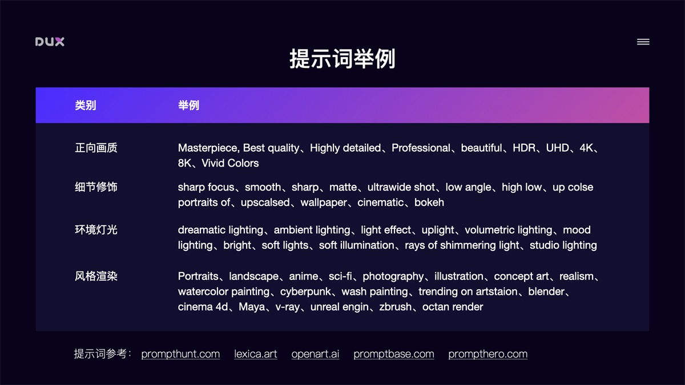

# Stable Difussion

## 云盘部署

[AI 绘画神器 Stable Diffusion 基础教程](https://zhuanlan.zhihu.com/p/617971918)
[Stable Diffusion云端部署攻略](https://www.uisdc.com/stable-diffusion-2)
[https://github.com/camenduru/stable-diffusion-webui-colab](https://github.com/camenduru/stable-diffusion-webui-colab)

## 插件

[汉化插件](https://github.com/VinsonLaro/stable-diffusion-webui-chinese)

- 安装中文扩展插件：点击 Extensions 选择 Install from URL，输入 https://github.com/VinsonLaro/stable-diffusion-webui-chinese ，点击 Install，并重启 WebUI
- 切换到中文模式：在 Settings 面板中，将 User interface 中的 Localization 设置成 Chinese 中文模式，重启 WebUI 即可切换到中文界面

[Prompt 中文输入](https://github.com/butaixianran/Stable-Diffusion-Webui-Prompt-Translator)

- 下载提示词中文扩展插件： https://github.com/butaixianran/Stable-Diffusion-Webui-Prompt-Translator ，将项目作为 zip 文件下载，解压后放到 stable-diffusion-webui/extensions 目录中，重启 WebUI
- 调用百度翻译 API：去 api.fanyi.baidu.com 申请一个免费 API Key，并将翻译服务开通。在管理控制台的开发者信息页中确认 APP ID 和 密钥
- 在 Stable Diffusion WebUI 的 Prompt Translator 面板中，选择百度翻译引擎，并将申请的 APP ID 和 密钥填写进去，点击保存
- 使用：在 Stable Diffusion WebUI 页面顶部会出现一个翻译工具栏，我们在提示词输入框中输入中文，点击工具栏中的翻译就能自动把提示词替换成英文

## 参数说明

- Sampling Method：取样的方法，会影响照片产生的细节
- Sampling Steps：取样次数，次数越高，花费的时间越久，细节当然也越好
- Restore faces：修正脸部问题
- Hires.fix：修正高取样的情况下，背景变得很奇怪的状况
- Width：图片的宽度
- Height：图片的高度
- Batch count：生成几张图
- Batch size：同时算几张图片
- CFG Scale：要 AI 多么听从你的指令去生成图，这个值越低的话，生成图可能不一定会照你的要求，但可能会有惊喜
- Seed：种子值，可以看作是随意值，在同样的参数下，这个值不同就会产生不同的样子

## Prompt 语法技巧

Prompt 提示词可以分为 4 段式结构：画质画风 + 画面主体 + 画面细节 + 风格参考

- 画面画风：主要是大模型或 LoRA 模型的 Tag、正向画质词、画作类型等
- 画面主体：画面核心内容、主体人/事/物/景、主体特征/动作等
- 画面细节：场景细节、人物细节、环境灯光、画面构图等
- 风格参考：艺术风格、渲染器、Embedding Tag 等

### 提示词语法

- 提示词排序：越前面的词汇越受 AI 重视，重要事物的提示词放前面
- 增强/减弱：(提示词:权重数值)，默认 1，大于 1 加强，低于 1 减弱。如 (doctor:1.3)
- 混合：提示词 | 提示词，实现多个要素混合，如 [red|blue] hair 红蓝色头发混合
- 和 AND：用于连接短提示词，AND 两端要加空格
- 分步渲染：[提示词 A:提示词 B:数值]，先按提示词 A 生成，在设定的数值后朝提示词 B 变化。如\[dog:cat:30\] 前 30 步画狗后面的画猫，\[dog:cat:0.9\] 前面 90%画狗后面 10%画猫
- 正向提示词：masterpiece, best quality 等画质词，用于提升画面质量
- 反向提示词：nsfw, bad hands, missing fingers……, 用于不想在画面中出现的内容
- Emoji：支持 emoji，如 😍 形容表情，🖐 修饰手

### 常用提示词举例

