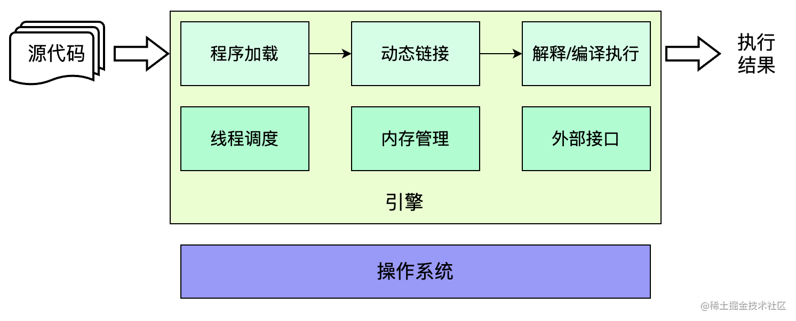
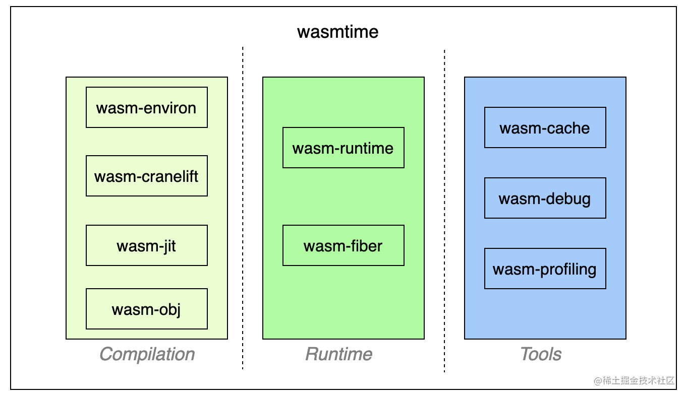

# WebAssembly 常见引擎简介

## 引擎通用架构

在这里，我们要谈论的引擎总是与某种语言绑定，也可称之为虚拟机。那么一个引擎如何驱动一段程序运行，并得到结果呢

- 第一步，我们需要将程序文件加载到内存中，并解析符号，将其中的符号转化为具体的、可访问的内存地址。这一步需要一个加载器和一个链接器
- 第二步，我们需要执行目标程序，完成其中的每一条指令。如果是js这类脚本程序，我们还需要一个编译组件，将程序文本编译为指令序列。而面对指令序列，引擎可以解释执行，也可以进一步编译为物理机器可执行的指令后执行。这一步需要一个能够解释或者编译执行的执行器
- 第三，目标程序可能是单线程执行，也可能是并发执行，为了支持并发，要求存在一种调度机制来管理线程，这一步需要一个线程调度器
- 第四，一般的程序总是会要求动态内存的分配，用于存储动态数据，那么就要有组件负责分配内存。考虑到内存资源的有限性，不能无限制增长，那么就要有组件负责回收内存。这一步需要一个内存管理器
- 最后，目标程序可能要求获得各种外部资源，如访问文件系统、监听网络端口等，引擎必须提供访问这些资源的通道。这一步需要语言扩展或者外部访问接口

## 常见的WebAssembly引擎

### wasmtime

wasmtime总体分为编译、运行和工具三部分

#### 编译

这一部分包含四个组件，从上到下分别是 wasm-environ wasm-cranelift wasm-jit wasm-obj

从内部视角来看，wasm-environ是编译的入口，但实际上wasm-cranelift会负责执行函数级别的即时编译，为每一个函数生成 JIT 代码。得到 JIT 代码之后，需要存储在可执行内存区域才能被实际执行，这一步依赖wasm-jit对引擎内部可执行内存的管理。另外，wasm-obj会根据编译过程中产生的各类信息，生成 ELF（Executable and Linkage Format）映像，其中包括所有的编译得到的函数以及跳板（Trampoline）函数、用于链接阶段的重定位记录等内容。如果 wasm 模块中存在 DWARF 信息，则会被写入对应模块 ELF 映像的.dwarf段

#### 运行时

这部分主体是wasm-runtime，它将维护wasm模块在运行时的各类数据结构，为程序运行提供必要的支持。wasm-runtime组件负责维护两类重要的实体 `Store`和`InstanceHandle`

- Store 作为实际存储wasm模块各类数据结构的容器，包括func、memory、table、element等；作为隔离的基本单元，不同store中的数据结构不允许互操作，类似于V8引擎的Isolate
- InstanceHandle 作为wasm模块实例的底层表示，但也用于宿主定义的对象；归属于某个Store，同时也包含一个VMContext用于维护一个wasm模块实例所有的数据结构

除了wasm-runtime外，运行时部分还存在组件wasm-fiber用于支持一部功能，主要处理栈的切换

#### 工具

- wasm-cache 用于管理文件的缓存，但默认只会在wasmtime提供的CLI中启用
- wasm-debug 实现从 WASM-DWARF到原生DWARF的映射，考虑到wasmtime将所有wasm函数都编译为原生函数，要实现源码调试，两种调试信息之间的转换非常关键
- wasm-profiling 实现对生成的JIT代码进行分析

### wasm3

wasm3是一款基于解释器执行的轻量级WebAssembly引擎，使用C语言开发，拥有比较完善的wasm运行时系统

wasm3的最大特点就是依靠纯解释器执行所有的WebAssembly指令，没有引入JIT/AOT编译。

这里有两个关键的设计

- 指令线索化(threaded code)。与平凡的switch-case模式不同，线索化的解释器并不存在一个外层的控制结构。相反，线索化指令总会在自身解释程序的最后位置进行下一条指令的调用，从而自驱动地执行所有命令。也正是由于指令解释函数总是以对下一条指令的调用结束，编译器可以对大部分的指令操作进行尾调用（tail-call）优化，以减少函数调用栈帧的压入和弹出操作
- 寄存器指令转义 基于寄存器的指令运行速度会更快，因此 wasm3 也将 wasm 指令序列转译成了更直接和高效的寄存器指令序列（简称 M3 指令）。M3 指令的解释函数，都有一个固定的、共同的函数签名

美中不足的是，目前 wasm3 对于社区标准规范的支持还有待完善，包括已被纳入核心规范的多线性内存、引用类型、异常处理等提案

### WasmEdge

与 wasmtime 一样，WasmEdge 也是一种编译型的 wasm 引擎，可以按照 JIT/AOT 两种模式对 wasm 指令进行编译，并最终执行。不同之处在于，WasmEdge 使用 LLVM 作为编译器后端，利用了 LLVM 出色的优化编译能力。因此，相比于使用 Cranelift 的 wasmtime，WasmEdge 生成的指令更优，执行速度更快

除了卓越的性能表现之外，WasmEdge 的一个最为显著的特点就是社区提供丰富的扩展能力。比如，在云原生的使用场景中，很多开发者使用 JavaScript 语言开发应用。为此，WasmEdge 以 wasm 模块形式（名为 wasmedge_quickjs.wasm）提供了 QuickJS 引擎能力, 以便在 wasm 环境中执行 JavaScript 代码。在此基础上，WasmEdge 社区提供了一揽子基于 JavaScript 的能力扩展

- Node.js Compatibility
- Tensorflow
- React SSR
- Networking APPs

### wasm-micro-runtime

wasm-micro-runtime 也简称为 WAMR，与 wasmtime 一样是隶属于 Bytecode Alliance 的开源 WebAssembly 引擎项目，适用于嵌入式平台、各类 IoT 设备、智能合约和云原生等场景。名字中的 micro 也正是它的特点之一： WAMR 的二进制产物很轻量，纯 AOT 配置的产物体积只有约50KB，非常适合资源受限的宿主

与上述三款引擎只支持解释执行或编译后执行不同，WAMR 同步支持解释与编译两种方式执行 wasm 程序，因此兼有两种执行方式低冷启延迟、高峰值性能的优点。使用编译模式时，宿主可以选择使用 JIT 或 AOT 方式执行目标程序。与 WasmEdge 相同，WAMR 的编译器也基于 LLVM 构建。根据官方数据，JIT 或 AOT 的执行方式可以得到接近原生的速度，表现十分亮眼。而援引最新的2023年 wasm runtime 的性能测试数据，wamr 是运行速度最快的引擎

| 引擎 | 关键特性 | 介绍 |
| --- | ---- | ------ |
| wasmtime | 高性能编译 字节码联盟项目 应用于Serverless等场景 |
| wasm3 | 高性能解释器 跨平台, iOS 等平台通用 轻量级引擎 |
| WasmEdge | 在 Docker 中集成 使用 LLVM 编译后执行 社区提供了非常丰富的扩展能力 |
| wasm-micro-runtime | 解释 & 编译两种运行模式 使用 LLVM 作为编译后端 运行速度最快的引擎 适用于 IoT 设备等资源受限的场景 |
| V8 | 使用 TurboFan/LiftOff 后端编译 支持各种实验性的提案 适用于 Web/JavaScript 环境 |
