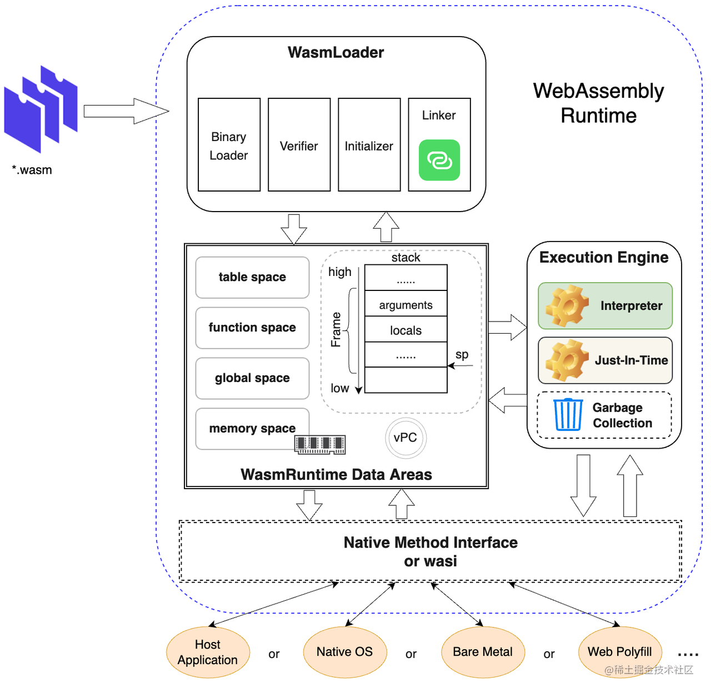

# WebAssembly 原理

WebAssembly运行时由模块加载和解析器、执行引擎以及与宿主地系统交互接口(WASI)等关键部分组成

WasmLoader 主要完成WebAssembly标准二进制文件地加载、解码、格式校验，初始化和多模块链接等多个阶段
当文件加载完成后 WebAssembly运行时会为二进制文件生成对应地WebAssembly模块实例对象，并初始化运行时环境中数据区(WasmRuntime Data Areas)，包括全局数据(global space)、方法区(function space)、间接对象引用区(table space)以及线性内存区(memory space)
完成以上两个阶段后。运行时会调度执行引擎 (Execution Engine) 来执行对应 WebAssembly 方法区中函数的字节码，不同的执行引擎会采用不同的技术来执行字节码，其中最典型的是解释执行和运行期编译执行两种类型；此外，执行引擎还需要调度内存管理器来完成内存分配，并利用垃圾回收机制进行运行期复杂对象的管理



## WebAssembly 解析器

### 模块加载和解码

WebAssembly 模块的二进制格式是其抽象语法的压缩线性编码，格式由属性文法定义，其唯一的终结符号是字节，当且仅当它是由语法生成时，字节序列才是模块的格式良好的编码；WebAssembly 运行时首先需要加载二进制文件，按照属性文法解析函数将字节流转换为内存中虚拟机可以识别和使用的数据结构

与常用的二进制格式(例如ELF)类似，WebAssembly的二进制格式以段(Section)编码为模块文件(Module)。大多数段对应于模块记录的一个组件，此外，各段之间通过依赖关系共享数据

### 模块验证

### 实例化

## 执行引擎

执行引擎是一个运行环境的"心脏"，它负责目标指令的执行和运行时状态的管理；针对 WebAssembly 基于栈的概念模型，我们从解释器、线性内存管理和垃圾回收这三个维度对执行引擎的原理进行介绍

### 栈解释器

### 线性内存管理

WebAssembly 线性内存是结构化的连续内存区域，线性内存的布局是由编译器来定的，而且，现在 WebAssembly 支持作为多种前端语言的编译产物，在每个编译器有自己的内存布局的时候，会导致不同语言模块之间静态和动态链接的技术挑战

LLVM 作为众多 WebAssembly 编译工具链的后端，其内存布局的实现主要借助链接器 wasm-ld 实现。wasm-ld 链接器将线性内存分为4个区域，包括全局静态数据区 (data area)、未初始化数据区 (bss data)、辅助栈区 (stack) 以及堆区 (heap)

wasm-ld 默认将全局静态数据区 (data area) 作为 WebAssembly 线性内存空间的第一个内存区域，但在提供了 "--stack-first" 链接选项的情况下，wasm-ld 会强制将辅助栈区 (stack) 作为线性内存空间的第一个内存区域来布局

```js
;; default-memory-layout.wat ;;
(memory (;0;) 1 2)
(global $__sack_pointer (mut i32) (i32.const 4096))
(global (;1;) i32 (i32.const 1024))
(global (;2;) i32 (i32.const 3072))
(global (;3;) i32 (i32.const 1024))
(global (;4;) i32 (i32.const 4096))
(global (;5;) i32 (i32.const 0))
(global (;6;) i32 (i32.const 1))
(export "memory" (memory 0))
(export "__data_end" (global 2))
(export "__global_base" (global 3))
(export "__heap_base" (global 4))
(export "__memory_base" (global 5))
```

### 垃圾回收器(GC)

主流的内存管理方式主要包括手动内存管理 (C/C++) 和垃圾收集器内存管理 (Java, JavaScript 等)两大类

手动内管理方式在进行对象动态创建和销毁时，需要手动分配和释放内存，而在大型的软件中手动调用 malloc 和 free，很容易出现内存重复释放导致的非法内存访问，或者忘记释放导致的内存泄露

使用垃圾收集器的编程语言所分配的内存会由垃圾收集器来统一管理，每隔一段时间，垃圾回收器会对内存对象进行扫描，自动识别出来到底哪些内存区域可以被释放。简而言之，垃圾收集器（GC）让开发人员无需过多考虑内存管理，他们可以管理对象引用、传递对象、在函数/变量之间共享对象，并且在不再使用这些对象时依靠 GC 来清理它们；当然，垃圾收集器的问题也是显而易见的，垃圾收集器需要间歇性地扫描内存中可释放的内存区域并回收垃圾，这会产生不受代码控制的 "stop the world" 现象；由于垃圾收集器有比较大的开销只能在特定情况下触发，因此无法即时释放空闲内存区域，导致内存平均水位偏高；此外，垃圾收集器需要完全掌控内存使用情况，这导致处理异构环境或语言边界的对象回收时总是需要更多内存拷贝操作，编程语言之间交互的代码更加繁琐。尽管如此，现在很多编程语言仍然带有垃圾回收器，而系统编程语言或者为解决性能问题的编程语言或者执行环境，一般不使用垃圾回收器来进行内存管理

对 WebAssembly 而言，初期的主要设计目标是提供一个底层的高效二进制格式及其对应的运行环境，并将静态强类型语言 (C/C++) 直接静态编译到字节码，避免在语言层面的额外开销，从而提升性能；而目标编程语言没有采用垃圾收集器，例如 C/C++，Rust等，因此，WebAssembly 没有垃圾收集器，它只提供了一块可以按字节寻址的线性内存，而没有任何可用于内存管理的工具。对于i32、f32、i64、f64 等基础数据类型，WebAssembly 可以在内存中高效的访问、传递，而对于 Struct、Array 等复杂的数据结构，需要手动负责对象创建和回收对象(类似于 C/C++ )或者采用优化的内存分配器来完成内存的管理工作，例如，dlmalloc、tcmalloc、jemalloc等

作为面向所有语言的一个底层的字节码规范，WebAssembly 在内存管理机制上仅支持现有手动管理方式，还是增加垃圾收集器进行自动管理一直存在不同的观点

- 采用垃圾收集器，WebAssembly 可以以更快的执行性能，更小的体积支持更广泛的现代高级语言
- 垃圾收集器 (GC) 解放了开发人员对内存管理，提高了内存的安全性
- WebAssembly 很多场景本质上是一个异构的多语言环境，统一的垃圾收集器可以实现多种语言之间无缝互操作

## WebAssembly系统接口(WASI)
