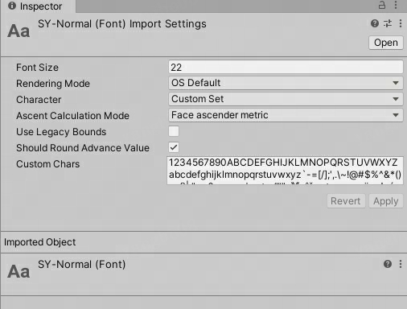

# 其他资源

## TrueTypeFontImporter

支持TTF和OTF字体文件格式导入

- Rendering Mode 告诉unity使用字体渲染的哪种平滑模式
  - smooth 动态字体使用最快的模式
- Character 指定字符集
  - Dynamic 表示在运行时渲染字体字符集
  - Custom Set 可以在导入的字体中选择想要的字符
- include Font Data 一般和动态字体配合使用
  - 勾选后导入的字体文件会随App一起输出
  - 如果时使用系统字不勾选此选项可节省包体和内存
- Font Names 类似于Fall Callback 如果找不到对应字符会在这个列表的字体寻找
- References To Other Fonts In Project: 选择项目内的其他字体作为后备字体
- 可以使用TMP工具和Custom Font创建自定义静态字体资源

