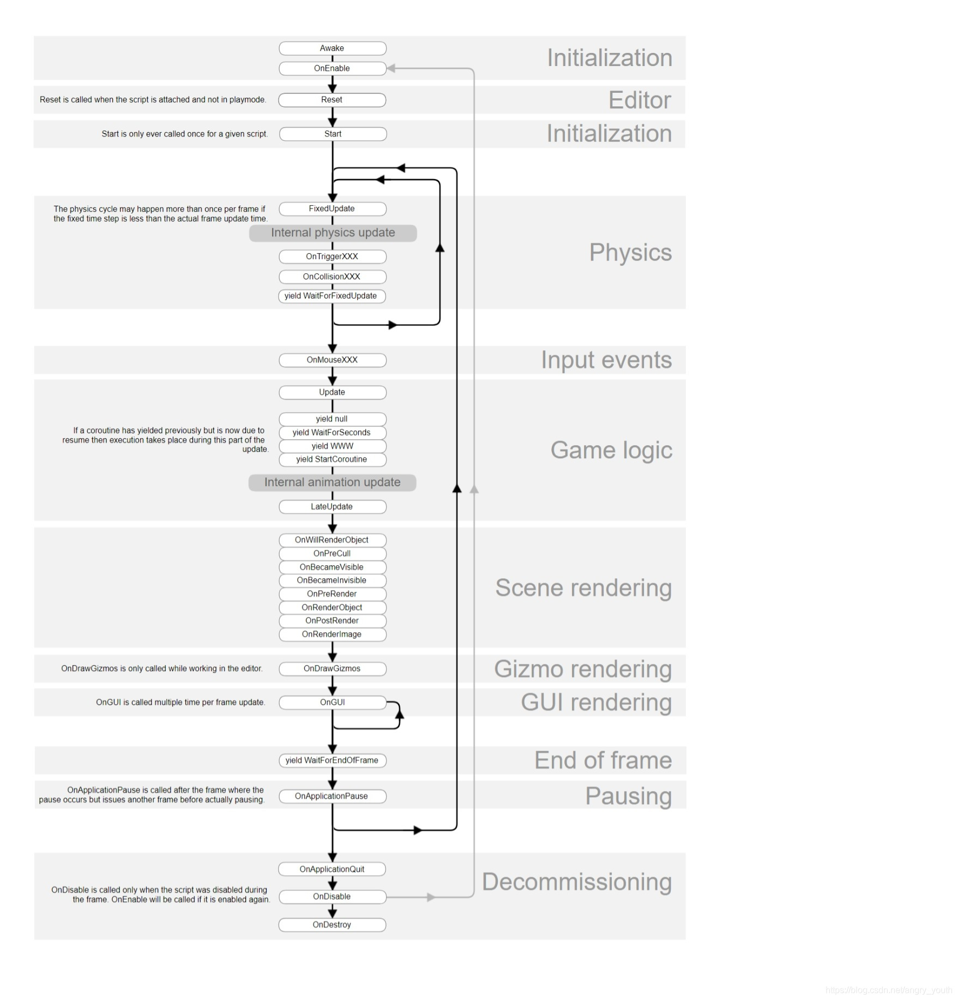

### 脚本生命周期
- 初始化：
  - Awake 唤醒 立即执行
  - OnEnable 当脚本对象启用时调用
  - OnApplicationPause(bool pause)  这个函数主要发生在 “切后台”，当你打开别的 app 时，这个函数会自动调用，并且 “pause 为 true”，当你再切回来的时候，这个函数自动调用，并且 “pause 为 false”
  - Start 脚本启用 才执行 一般用于给脚本字段初始值使用
- 物理更新
  - FixedUpdate  固定更新（物理阶段） // 渲染时间不固定（每帧渲染量不同、机器性能不同）
- 输入事件 （这里与其相关函数事件较多，不做特别分析）
- 逻辑更新
  - Update 渲染帧更新 执行间隔不固定 处理游戏逻辑
  - LateUpdate Update执行后再执行，同一帧执行
- 场景渲染
  - OnDrawGizmos 在 Scene 视图打开的时候每一帧更新，和在 编辑器模式下调用的频率不同
- GUI 渲染
  - OnGUI() 图形绘制函数，绘制系统UI界面，每秒执行多次，每一帧更新多次
- 结束阶段
  - OnApplicationQuit 在退出应用时调用
  - OnDisable 当不可用 禁用事件
  - OnDestory 销毁事件
- 其他
  - OnMouseXXX 鼠标事件
  - OnBecameVisible 当可见，在渲染器被任何相机可见时调用
  - OnCollisionXXX
  - OnCollisionXXX

#### 图片说明
 
