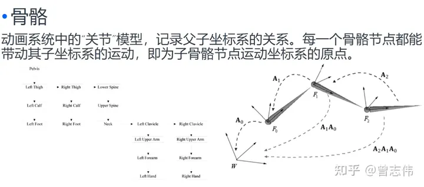
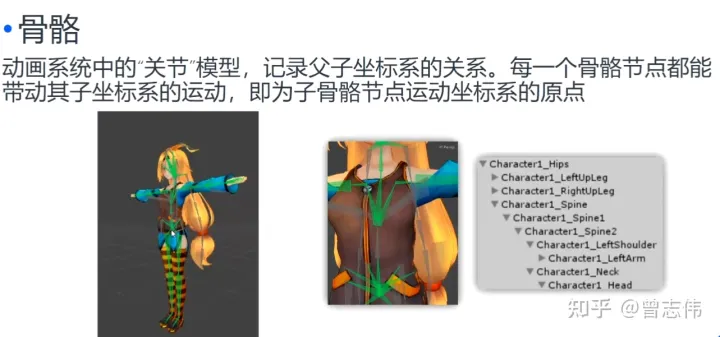
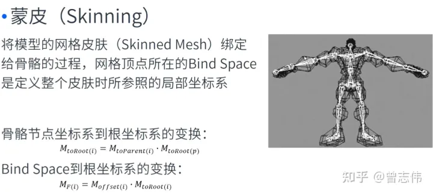
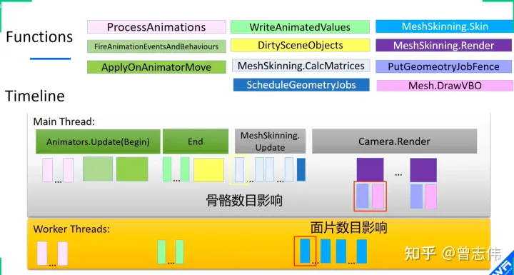

# Unity动画系统汇总

## 简介

Untiy现存的动画系统：Legacy、Mecanim（其余辅助动画系统的有Animation Rigging、 Timeline）

|  动画系统   |  概述  |
|  ----  | ----  |
| Legacy Animation System  | Legacy Animation System：是 Unity 3D 中的传统动画系统，主要基于关键帧动画。在 Legacy Animation System 中，动画数据存储在 Animation Clip 中，可以通过 Animation 组件来播放。这个系统已经逐渐被废弃，但仍然可以用于部分项目 |
| Mecanim  | 是 Unity 5 中引入的新一代动画系统，主要基于状态机动画。在 Mecanim 中，动画数据存储在 Animator Controller 中，可以通过 Animator 组件来播放。Mecanim 支持多层混合、过渡动画、IK、可重用的状态机和 Blend Tree 等功能，可以实现更加丰富和复杂的动画效果 |
| Animation Rigging  | 是 Unity 2019 中引入的动画绑定系统，主要用于在运行时对角色进行模拟和变形。Animation Rigging 支持多种约束类型，包括 Transform、Rotation、Scale、Parent 等，可以实现更加灵活和自然的动画效果 |
| Timeline  | 是 Unity 2017 中引入的时间轴系统，主要用于制作游戏剪辑和动画序列。在 Timeline 中，可以创建和编辑时间轴，将不同的动画片段组合在一起，并在游戏中播放。Timeline 支持多层混合、过渡动画、曲线编辑和事件触发等功能，可以实现更加复杂和多样化的动画效果 |

## Mecanim系统

Unity的Mecanim动画系统，是一套基于状态机的动画控制系统，是一个面向动画应用的动画系统

### 骨骼和蒙皮动画简介

- 骨骼 动画系统中的“关节”模型，记录父子坐标系的关系，每一个骨骼节点都能带动其子坐标系的运动，即为子骨骼节点运动坐标系得圆点


- 蒙皮 将模型得网格皮肤（Skinned Mesh）绑定给骨骼得过程。网格顶点所在的Bind Space是定义整个皮肤时所参照的局部坐标系


### 角色模型动画的创建与应用工作流程

3dMax/Maya/Blender -> FBX -> Unity

### AnimationClip 动画片段

1. 通过剪辑FBX中的整段动画生成的动画切片（Clip）
2. 由Animation窗口创建出的动画片段（Clip）

### Animator

- Controller
- Avatar 人形动画（如果没有使用Avatar，animator组件会严格按照动画片段里记录的path执行动画，与动画复用有关，通过适配Avatar，实现不同FBX模型之间的动画复用）
- Apply Root Motion（动画的位移应用到游戏对象上）
- Update Mode（动画刷新模式，重新计算每个骨骼节点的位置、转向和缩放的数值）
  - normal 指和帧率同步（Update方法同步刷新）
  - Animate Physic 指与物理引擎同步（Fixed Update同步刷新）
  - Unscale Time （和normal一样，Update方法同步刷新，与normal不同的是会忽略当前的时间标尺time scale，所谓时间标识就是整个游戏的运行速度比例）
- Culling Mode（剔除模式）
  - Always Aniamte（不剔除，无论物体是否被摄像机可见，总是计算所有节点的运动，完整的进行动画播放）
  - Cull Update Transforms（如果该游戏对象并没有被摄像机看到，animator还是会计算当前的动画状态，和Always Animate没有区别，但是会剔除诸如IK之类的；当物体不被摄像机可见时，仅计算根节点的位移植入，保证物体位置上的正确）
  - Cull Complately （完全停止动画，等被看到时重新播放动画）

### AniamtorController

#### Transitions

- 条件控制or
- 条件控制and
- 想要重复触发自身动画需要加两个相同的动画片段==》可优化为一个动画片段自己切换

#### Has Exit Time

勾选时上一个状态对于的动画片段必须被播放到末尾，才允许这个过渡被触发，不勾选可以在任意时刻进行过渡

#### Interruption Source

打断来源，允许该过度被来自CurrentState或NextState的其它过度打断
被CurrentState打断则发生了跳转，NextState的指向被改变（例如受击打断了攻击）
被NextState打断则发生了跃进，动画迅速完成了两个状态的过度（例如从站立状态快速过度到冲刺态，奔跑状态被越过）

#### Ordered Interruption

针对CurrentState出发的过渡，是否只允许比当前过渡优先级高的过渡打断该过渡

- Solo 勾选时，该State只能进行该过度，其他过度将无效
- Mute 勾选时，这个过度将无效（类似与Disable）
- 这个功能通常被用于调试，进行一些单向的过渡，或禁止向某个状态进行过渡，从而在限制性的范围内，观测状态机的运行

### AnimatorOverrideController

动态修改State里的AnimatorClip 不支持，只能用 AnimatorOverrideController 去实现 clip 动态替换
方法：运行时生成 AnimatorOverrideController 类，动态换掉动画状态机

```C#
Animator animator = GetComponent<Animator>();
AnimatorOverrideController overrideController = new AnimatorOverrideController();
overrideController.runtimeAnimatorController = animator.runtimeAnimatorController;
overrideController["name"] = newAnimationClip;
animator.runtimeAnimatorController = overrideController;
```

注意:

1. 注意1：Override操作的时候，消耗的性能会随着AnimatorController里State数量的增加而增加，即是我们并不去使用它们。这个问题就是Override存在的性能热点
[视频 王江荣：Unity中Animator Override的性能问题](https://zhuanlan.zhihu.com/p/371397382)
[笔记：[Unity 活动]-Unity X 永劫无间「Unity大咖作客」线上分享会 — 动作动画专场【回放】](https://www.bilibili.com/video/BV1QN411f7WJ/?t=197)从45分钟开始，高川的Animator动画分享
2. 使用AnimatorControllerOverride覆盖AnimationClips时，Animator的状态被重置：使用AnimatorControllerOverride的[坑](https://blog.csdn.net/chqj_163/article/details/107714859)
3. 编辑器所见并不一定是所得，要以 .overrideController记录的实际信息为主(出现过没有Ctrl+S，m_Clips 字段为0，但是编辑器表现正常，看到的引用也都是对的，深坑，记住了 ！！！)

### Apply Root Motion

- 不勾选 原地运动
- 勾选 向前运动
- 脚本中实现了OnAnimatorMove，相当于勾选了ApplyRootMotion，可以在脚本中控制位置和旋转

```C#
deltaPosition：相对上一帧的位置变化量（必须允许根运动才能被计算）
deltaRotation：相对上一帧的角度变化量（必须允许根运动才能被计算）
void OnAnimatorMove()
{
    var transform1 = transform;
    transform1.position += animator.deltaPosition;
    transform1.rotation *= animator.deltaRotation;
}
```

### StateMechineBehavior

### 动画分层

#### 使用Mask进行上下分层

动画分层我的理解有点像PS的画布、Unity的Canvas，一层又一层，通过叠加模式进行叠加，最后表现出混合后的动画

1. 人物动画状态涉及分部并行逻辑，例如枪战游戏，腿部动作由键盘控制，而上半身动作需要由鼠标控制进行IK瞄准，以及武器切换
2. 存在状态的融合/叠加效果，例如在正常走动的基础上，搬运物品时，上半身需要持握物品并进行IK绑定，下半身仍是正常走动
3. 动作游戏中，为减轻动画师工作量，取用不同动作的部分进行组合

#### 参数

- Weight 混合权重
- Mask 混合蒙版
- Blending 混合模式
  - Override 绝对坐标重写模式，根据权重，Override会令下层节点的位置逐渐替换商城节点位置（节点位置按照Weight的Lerp插值效果）
  - Additive 相对运动叠加模式，根据权重，将该层节点的相对运动效果叠加到上层节点。如果上层节点在动画中没有运动，将完全表现下层的动画效果，如果上层有运动将与下层节点的运动组成和运动表现出来，如果下层节点不具有相对运动，那么就不对上层产生影响
- Sync  
  - 有时，能够在不同层中复用同一状态机是很有用的。例如，如果想要模拟“受伤”行为，并生成“受伤”状态下的行走/奔跑/跳跃动画，而不是“健康”状态下的动画，您可以单击其中一个层上的 Sync 复选框，然后选择要同步的层。随后状态机的结构便会相同，但状态使用的实际动画剪辑不同。
  - 这意味着同步的层根本没有自己的状态机定义，而是同步层状态机的一个实例。在同步层视图中对状态机的布局或结构所做的任何更改（例如，添加/删除状态或过渡）都是针对同步层的源进行的。同步层的唯一独特更改是每个状态内使用的选定动画。（我的理解是Override？）

### BlendTree混合树

BlendTree的作用是将多个动画状态混合成为一个动画状态，并通过动画参数来影响状态的输出结果
使用BlendTree的目的是应对状态机的高耦合导致的低扩展缺点，尤其是在人物运动相关的动作（前后左右的行走奔跑）这类繁多的动作

#### 参数 BlendType

- 1D 1个参数
- 2D 2个参数 3种配置方法都是相同的，不同的混合模式区别在于动画位点之间的差值过渡方式不同
  - 2D Simple Directional 整个二维平面的两个维度都被用于区分运动速度/方向的不同，每个动画都应拥有自己独特的运动方向，或者说从原点指向某个动画位点的单位向量各不相同
  - 2D FreeForm Direction 与前一种类似，但允许出现两个及以上动画同向异速，不过这种模式也要求在原点（0,0）点处应有一个站立/静止状态的动画，从而根据到原点的距离来区分融合同向异速的动画
  - 2D FreeForm Cartesian 用于融合单一方向运动以及其它非线速度效果，要求所有动画的运动方向应相同，并通过二维平面的一个维度进行速度区分，而另一个维度应是转向，转头等一些非线速度效果的动画

### [Aniamtor IK](https://docs.unity3d.com/ScriptReference/MonoBehaviour.OnAnimatorIK.html)

IK (inverse kinematics) 反向动力学，用来解决模型动作跟随问题。
比如人物骑在一个马上面，手要随着马律动
Unity提供OnAnimatorIK() 回调，用来设置IK位置和权重，IK支持左右脚和左右手

```C#
public enum AvatarIKGoal{
  LeftFoot,
  RightFoot,
  LeftHand,
  RightHand
}
```

条件：

- Model的Animation Type设置为Humanoid。
- 回调方法OnAnimatorIK(int layerIndex)所在脚本挂载的游戏对象上的Animator文件中的层，需要打开IK Pass设置。

```C#
using UnityEngine;

public class TestAnimatorIK : MonoBehaviour
{
    [Range(0, 1)]
    public float weight = 1; // IK权重
    public Transform rightHandFollowObj; // IK跟随的物体
    public Transform leftHandFollowObj;
    public Animator animator;
    
    private void SetIK(AvatarIKGoal iKGoal, float weight, Transform trans)
    {
        if (trans)
        {
            animator.SetIKPositionWeight(iKGoal, weight);
            animator.SetIKRotationWeight(iKGoal, weight);

            animator.SetIKPosition(iKGoal, trans.position);
            animator.SetIKRotation(iKGoal, trans.rotation);
        }
    }

    private void OnAnimatorIK(int layerIndex) {
        if (animator)
        {
            SetIK(AvatarIKGoal.RightHand, weight, rightHandFollowObj);
            SetIK(AvatarIKGoal.LeftHand, weight, leftHandFollowObj);
        }
    }
}
```

### [Animator.MatchTarget](https://docs.unity3d.com/cn/2023.2/ScriptReference/Animator.MatchTarget.html)

通常在游戏中可能出现一下情况：角色必须以某种方式移动，使得手或脚在某个时间落在某个地方（例：角色可能需要跳过脚踏式或跳跃并抓住顶梁）

```C#
using UnityEngine;
using System;

[RequireComponent(typeof(Animator))]
public class TargetCtrl : MonoBehaviour {
  protected Animator animator;

  public Transform jumpTarget = null;

  void Start()
  {
    animator = GetComponent<Animator>();
  }

  void Update()
  {
    if (animator)
    {
      if (Input.GetButton("Fire1"))
      {
        animator.MatchTarget(jumpTarget.position, jumpTarget.rotation, AvatarTarget.LeftFoot, new MatchTargetWeightMask(Vector3.one, 1f), 0141f, 0.78f);
      }
    }
  }
}
```

自动调整GameObject的位置和旋转。

调整GameObject的位置和旋转，以便当前状态处于指定的进度时，AvatarTarget 到达 matchPosition。目标匹配仅适用于基础层（索引 0）。 一次只能排队一个匹配目标，并且必须等待第一个匹配目标完成，否则将丢弃目标匹配。 如果调用MatchTarget的开始时间小于剪辑的当前标准化时间并且剪辑可以循环，MatchTarget将调整时间以匹配下一个剪辑循环。例如：开始时间 = 0.2，当前标准化时间 = 0.3，则开始时间将为 1.2。必须启用Animator.applyRootMotionMatchTarget 才会有效。

### 性能优化

[角色模型性能优化](https://docs.unity3d.com/cn/2023.2/Manual/ModelingOptimizedCharacters.html)

- 导入人形动画时，如果不需要 IK（反向动力学）目标或手指动画，请使用 Avatar 遮罩 (class-AvatarMask) 将它们移除
- 实现一个小的 AI 层来控制 Animator。您可以让它为 OnStateChange、OnTransitionBegin 和其他事件提供简单回调。
- 并禁用蒙皮网格渲染器的Update When Offscreen属性。这样即可在角色不可见时让 Unity 不必更新动画。

### [重定向人形动画](https://docs.unity3d.com/cn/2023.2/Manual/Retargeting.html)

### GPU Skinning

### [GPU Instancing](https://zhuanlan.zhihu.com/p/356211912)

### Animation时序

- ProcessAnimations 读取骨骼信息
- FireAnimationEventsAndBehaviours 读取动画事件
- ApplyOnAnimatorMove 根节点应用动画信息
- WriteAnimatedValues 动作数值写入
- DirtySceneObjects 对骨骼的transform进行更新写入
- MeshSkinning.CalcMatrices 计算蒙皮矩阵
- ScheduleGeometryJobs 子线程处理
- MeshSkinning.Skin 计算模型，网格顶点位置
- MeshSkinning.Render 渲染
  - PutGeometryJobFench 几何计算
  - Mesh.DrawVBO DrawCall调用


### Playables API

Playables API 是动画系统底层接口，Animator是基于 Playables API 的封装。

#### 使用 Playables API 的优势

- Playables API 允许动态动画混合。这意味着对象在场景
可以提供自己的动画。例如，武器、箱子和陷阱的动画可以动态添加到 PlayableGraph 并使用一定的持续时间。
- Playables API 允许您轻松播放单个动画，而无需创建和管理 AnimatorController 资产所涉及的开销。
- Playables API 允许用户动态创建混合图并直接逐帧控制混合权重。
- PlayableGraph 可以在运行时创建，根据需要添加可播放节点。与启用和禁用节点的巨大“一刀切”图不同，PlayableGraph 可以进行定制以适应当前情况的要求。

#### 使用注意事项

在短平快的开发上，基本不需要用到 Playables API。Animator 就基本够用了。

Playables API 灵活度很高，但是有一定开发门槛和学习成本。

除非是动作游戏，射击游戏等有丰富的动画需求的项目，Animator无法满足需求，或者项目有高度定制动画需求倾向，或者动画性能瓶颈，才会去基于 Playables API 去定制针对项目的动画系统。

#### 学习链接

可视化插件：[Unity - Manual: The PlayableGraph](https://docs.unity3d.com/Manual/Playables-Graph.html)
[Unity - Manual: Playables API](https://docs.unity3d.com/Manual/Playables.html)
官方实例：[Unity - Manual: Playables-Examples](https://docs.unity3d.com/cn/2023.2/Manual/Playables-Examples.html)
[Playable API：定制你的动画系统](https://mp.weixin.qq.com/s?__biz=MzkyMTM5Mjg3NQ==&mid=2247535622&idx=1&sn=b96a2d8ac55b49e74261d91bbffa944c&source=41#wechat_redirect)
[Playable API_弹吉他的小刘鸭的博客-CSDN博客](https://blog.csdn.net/alexhu2010q/article/details/113921119)

### 其他问题

#### 人物手部与目标位点匹配的偏移问题

由于射线检测位置是从人物的中心，而高度我们只能获取到BoxCollider的Size高度，因此从中心到人物左手，从Box顶部到手真正需要放的位置，我们使用了两个偏移量保证左手位置的正确

#### 动画状态机，多个trigger同时满足，如何选择想要的transtion

1. 自己维护好 Trigger 列表，如果我们的实际需求中，不存在需要多个 Trigger 同时被触发的情况，那么记得在设置新的 Trigger 之前（当然也可以考虑优先级和权重值）将其他已经设置过但是还没有被 Animator 应用的 Trigger Reset 掉。

#### 角色被隐藏后，恢复显示，状态异常问题

角色被隐藏后，状态机也完全停止了，这个时候对状态机的参数修改会失效，因此需要一个列表用来记录需要恢复的参数。

#### Optimize Transform Hierarchy

Hierarchy上的一个选项，Optimize Transform Hierarchy，可以删除transform节点，减少CPU计算，这个优化可以在CPU瓶颈下，进行优化
