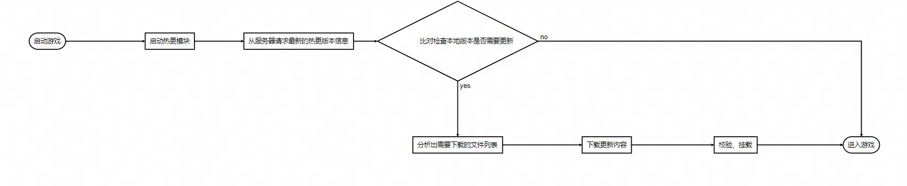

# 热更新

## 核心需求分析

根据上述流程图可以把热更新的具体任务拆分成以下几个要解决的问题

- 哪些内容可以热更新
- 如何打包可以热更新的内容和管理热更
- 如何使用热更下载下来的资源包
- 如何对比本地和服务器最新版本
- 热更文件的下载和校验

### 哪些内容可以热更新

首先，从程序角度来看，UE官方提供C++和蓝图作为引擎提供的开发语言和脚本，而C++是编译型语言，所有的变动都需要执行编译操作，所以C++代码无法热更。
而蓝图本质上是资产(uasset)**，资产的更新并不需要重新安装，所以使用蓝图的游戏逻辑是可以热更的

但是，蓝图毕竟是资源，这就要求当每改动一点点蓝图逻辑，都需要执行Cook才可以打包，更新起来很不方便，而且蓝图项目协同开发很难管理，所以需要继承一种文本化的脚本语言

游戏开发以集成Lua为业务脚本居多，也有一些开源继承插件 [sluaunreal](https://github.com/Tencent/sluaunreal)和[Unlua](https://github.com/Tencent/UnLua)，可以在UE内集成Lua的脚本来替代蓝图写业务逻辑

其次，工程内的所有uasset资源（地图、蓝图、模型、动画、贴图、UMG、音频、字体等等）也是可以更新的，UE的uasset在打包之前都需要Cook，而Cook的含义是把UE中平台无关的虚幻内部格式转化为特定平台的格式，因为各个平台使用自己的转有格式或者各个平台上具有性能更好的存储格式

### 如何打包热更内容和管理版本

### 如何使用热更下载下来的资源包

### 如何对比本地和服务器最新版本

### 热更文件的下载和校验

## 方案设计
