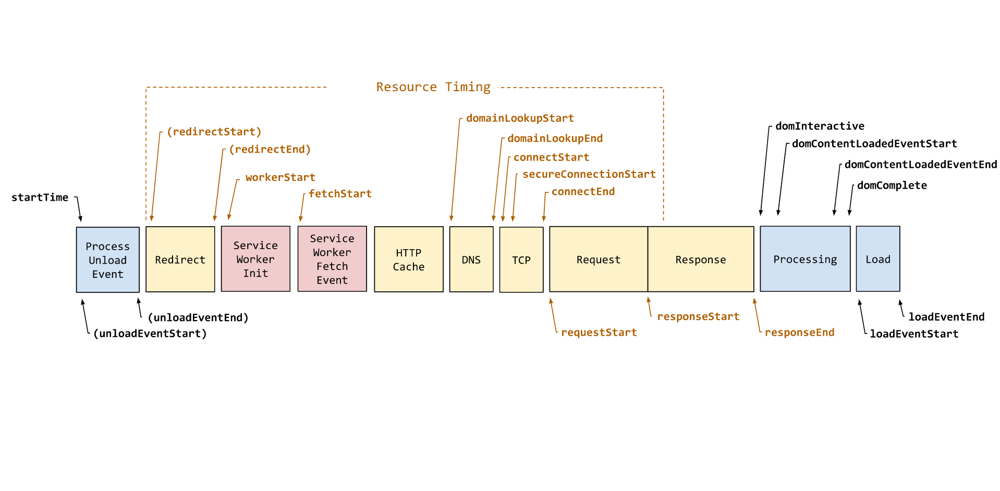
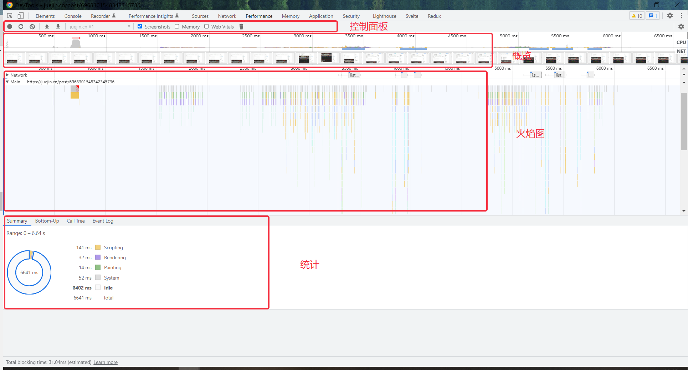

# js 性能监控和分析

下图是 [Navigation Timing Level 1](https://www.w3.org/TR/navigation-timing/) 的处理模型，从当前浏览器窗口卸载旧页面开始，到新页面加载完成，整个过程一共分为 9 个模块：**提示卸载旧文档、重定向/卸载、应用缓存、DNS 解析、TCP 握手、HTTP 请求处理、HTTP 响应处理、DOM 处理、文档装载完成**


[Navigation Timing Level 2](https://www.w3.org/TR/navigation-timing-2/) 给出了新的时间线，新版的时间线将描述资源加载的时间用 PerformanceResourceTiming 对象封装了起来。如下图所示：


## 指标说明

|  指标   |  说明  |
|  ----  | ----  |
| navigationStart  | 表示从上一个文档卸载结束时的unix时间戳，如果没有上一个文档，这个值将和 fetchStart 相等。 |
| unloadEventStart  | 表示前一个网页(与当前页面同域)unload的时间戳，如果无前一个网页unload或者前一个网页与当前页面不同域，则值为0。 |
| unloadEventEnd  | 返回前一个页面 unload 时间绑定的回调函数执行完毕的时间戳 |
| redirectStart  | 第一个HTTP重定向发生的时间。如果没有跳转，或者不是同一个域名内部的跳转，则返回值为0 |
| redirectEnd  | 最后一个HTTP完成的时间。如果没有跳转，或者不是同一个域名内部的跳转，则返回值为0 |
| fetchStart  | 返回浏览器准备使用HTTP请求读取文档时的Unix毫秒时间戳。该事件在网页查询本地缓存之前发生。 |
| domainLookupStart  | 返回域名查询开始时的Unix毫秒时间戳。如果使用持久连接，或者信息是从本地缓存获取的，则返回值等同于fetchStart属性的值。 |
| domainLookupEnd  | 返回域名查询结束时的Unix毫秒时间戳。如果使用持久连接，或者信息是从本地缓存获取的，则返回值等同于fetchStart属性的值。 |
| connectStart  | 返回HTTP请求开始向服务器发送时的Unix毫秒时间戳。如果使用持久连接（persistent connection），则返回值等同于fetchStart属性的值。 |
| connectEnd  | 返回浏览器与服务器之间的连接建立时的Unix毫秒时间戳。如果建立的是持久连接，则返回值等同于fetchStart属性的值。连接建立指的是所有握手和认证过程全部结束。 |
| secureConnectionStart  | 返回浏览器与服务器开始安全链接的握手时的Unix毫秒时间戳。如果当前网页不要求安全连接，则返回0。 |
| requestStart  | 返回浏览器向服务器发出HTTP请求时（或开始读取本地缓存时）的Unix毫秒时间戳。 |
| responseStart  | 返回浏览器从服务器收到（或从本地缓存读取）第一个字节时的Unix毫秒时间戳。 |
| responseEnd  | 返回浏览器从服务器收到（或从本地缓存读取）最后一个字节时（如果在此之前HTTP连接已经关闭，则返回关闭时）的Unix毫秒时间戳。 |
| domLoading  | 返回当前网页DOM结构开始解析时（即Document.readyState属性变为“loading”、相应的readystatechange事件触发时）的Unix毫秒时间戳。 |
| domInteractive  | 返回当前网页DOM结构结束解析、开始加载内嵌资源时（即Document.readyState属性变为“interactive”、相应的readystatechange事件触发时）的Unix毫秒时间戳。 |
| domContentLoadedEventStart  | 返回当前网页DOMContentLoaded事件发生时（即DOM结构解析完毕、所有脚本开始运行时）的Unix毫秒时间戳。 |
| domContentLoadedEventEnd  | 返回当前网页所有需要执行的脚本执行完成时的Unix毫秒时间戳。 |
| domComplete  | 返回当前网页DOM结构生成时（即Document.readyState属性变为“complete”，以及相应的readystatechange事件发生时）的Unix毫秒时间戳。 |
| loadEventStart  | load事件发送给文档，也即load回调函数开始执行的时间。 |
| loadEventEnd  | load 事件的回调函数执行完毕的时间。 |

```javascript
(function () {
  if (window.performance || window.webkitPerformance) {
    const perf = window.performance || window.webkitPerformance;
    let timing = perf.timing; // 即将弃用
    // 优先使用 navigation v2  https://www.w3.org/TR/navigation-timing-2/
    // window.PerformanceNavigationTiming
    if (typeof window.PerformanceNavigationTiming === 'function') {
      timing = window.performance.getEntriesByType('navigation')[0]
    }

    /**
     * 根据货币类型转换价格
     * @param onload 【重要】页面加载完成的时间
     * @param domReady 【重要】解析 DOM 树结构的时间/首屏时间
     * @param domReadyTime domReadyTime树结构的时间
     * @param redirect 【重要】重定向的时间
     * @param lookupDomain 【重要】DNS 查询时间
     * @param ttfb 【重要】读取页面第一个字节的时间
     * @param request 【重要】内容加载完成的时间
     * @param loadEvent 【重要】执行 onload 回调函数的时间
     * @param appcache  DNS 缓存时间 查询缓存数据时间
     * @param unloadEvent  卸载页面的时间
     * @param blankTime  页面白屏时间
     * @param connect  TCP 建立连接完成握手的时间
     */
    var timer = setInterval(function () {
      if (0 !== timing.loadEventEnd) {
        clearInterval(timer);
        var data = {
          url: window.location.href,
          userAgent: window.navigator.userAgent,
          lookupDomain: timing.domainLookupEnd - timing.domainLookupStart,
          request: timing.responseEnd - timing.requestStart,
          ttfb: timing.responseStart - timing.navigationStart,
          redirect: timing.redirectEnd - timing.redirectStart,
          domReadyTime: timing.domContentLoadedEventEnd - timing.fetchStart,
          domready: timing.domComplete - timing.domInteractive,
          blankTime: (timing.domInteractive || timing.domLoading) - timing.fetchStart,
          onload: timing.loadEventEnd - timing.fetchStart,
          unloadEvent: timing.unloadEventEnd - timing.unloadEventStart,
          loadEvent: timing.loadEventEnd - timing.loadEventStart,
          appcache: timing.domainLookupStart - timing.fetchStart,
          connect: timing.connectEnd - timing.connectStart,
          platform: commonInfo.platform,
          windowScreen: commonInfo.window_screen,
          networkType: commonInfo.network_type,
          canvasId: commonInfo.canvas_id,
          ip: commonInfo.ips,
          cookie: commonInfo.cookie,
        };
        requestList.performance.add(data);
      };
    })
  }
}());
```

### Chrome Performance面板

Performance 是 Chrome 提供给我们的开发者工具，用于记录和分析我们的应用在运行时的所有活动。它呈现的数据具有实时性、多维度的特点，可以帮助我们很好地定位性能问题。

使用 Performance 工具时，为了规避其它 Chrome 插件对页面的性能影响，我们最好在无痕模式下打开页面。
面板分为4个部分：

| 面板区域 | 说明  |
| ----     |  ---- |
| 控制面板 | 开始记录，停止记录和配置记录期间捕获的信息  |
| 概览面板 | 对页面表现（行为）的一个概述。  |
| 火焰图面板 | 可视化 CPU 堆栈(stack)信息记录。  |
| 统计面板 | 以图表的形式汇总数据。  |


#### 概览面板

| 数据类型 | 说明  |
| ----     |  ---- |
| FPS | 绿色的柱越高， FPS 值也越高，红色则说明可能出现了卡顿。  |
| CPU | 表明了哪些事件在消耗 CPU 资源。  |
| NET | 蓝色 代表 HTML 文件，黄色 代表 Script 文件，紫色 代表 Stylesheets 文件， 绿色 代表 Media 文件，灰色 代表其他资源。  |

#### 火焰图面板

- 从不同的角度分析框选区域 。例如：Network，Frames, Interactions, Main等
- 在 Flame Chart 面板上你可以看到三条线，蓝线代表 DOMContentLoaded 事件，绿线代表渲染开始的时间( time to first paint)，红线代表 load 事件

#### 统计面板

- Summary面板：概括了浏览器加载的总时间。
- Bottom-Up面板：展示事件各个阶段耗费的时间。
- Call Tree面板：查看事件的调用栈。
- Event Log面板：事件日志信息。

#### 从用户角度分析

##### 页面何时开始渲染 - FP & FCP

- FP, first paint, 表示页面开始首次绘制的时间点，值越小约好。在 FP 时间点之前，用户看到的是导航之前的页面
- FCP, first contentful paint, lighthouse 面板的六大指标之一，表示首次绘制任何文本、图像、非空白 canvas 或者 SVG 的时间点，值越小约好

这两个指标，我们可以通过 performance.getEntry、performance.getEntriesByName、performanceObserver 来获取。

```js
performance.getEntries().filter(item => item.name === 'first-paint')[0];  // 获取 FP 时间
performance.getEntries().filter(item => item.name === 'first-contentful-paint')[0];  // 获取 FCP 时间
performance.getEntriesByName('first-paint'); // 获取 FP 时间
performance.getEntriesByName('first-contentful-paint');  // 获取 FCP 时间
// 也可以通过 performanceObserver 的方式获取
var observer = new PerformanceObserver(function(list, obj) {
    var entries = list.getEntries();
    entries.forEach(item => {
        if (item.name === 'first-paint') {
            ...
        }
        if (item.name === 'first-contentful-paint') {
            ...
        }
    })
});
observer.observe({type: 'paint'});
```

##### 页面何时渲染主要内容 - FMP & SI & LCP

- FMP，first meaningful paint, 首次完成有意义内容绘制的时间点，值越小约好。官方资料: [FMP](https://web.dev/first-meaningful-paint)。
- SI, speed index, 速度指标, lighthouse 面板中的六大指标之一，用于衡量页面加载期间内容的绘制速度，值越小约好。官方资料: SI。
- LCP， lagest contentful paint， lighthouse 面板中的六大指标之一，完成最大内容绘制的时间点，值越小约好。官方资料: LCP。

FMP, 是一个已经废弃的性能指标。在实践过程中，由于 FMP 对页面加载的微小差异过于敏感，经常会出现结果不一致的情况。此外，该指标的定义依赖于特定于浏览器的实现细节，这意味着它不能标准化，也不能在所有 Web 浏览器中实现。目前，官方并没有提供有效的获取 FMP 的接口，因此性能分析的时候不再使用这个指标。

SI 和 FMP 一样，官方也没有提供有效的获取接口，只能通过 lighthouse 面板来查看，不作为 Sentry 等工具做性能分析的指标。

LCP，和 FMP 类似，但只聚焦页面首次加载时最大元素的绘制时间点，计算相对简单一些。通过 performanceObserver 这个接口，我们可以获取到 LCP 指标数据。

```js
new PerformanceObserver((entryList) => {
  for (const entry of entryList.getEntries()) {
    console.log('LCP candidate:', entry.startTime, entry);
  }
}).observe({type: 'largest-contentful-paint', buffered: true});
```

##### 何时可以交互 - TTI & TBT

- TI, time to ineractive, 可交互时间， lighthouse 面板中的六大指标之一, 用于测量页面从开始加载到主要资源完成渲染，并能够快速、可靠地响应用户输入所需的时间, 值越小约好。 官方资料: TTI。
- 和 FMP、SI 一样，官方并没有提供获取 TTI 的有效接口，只能通过 lighthouse 面板来查看，不会作为 Sentry 做性能分析的指标。

计算TTI方式

1. 先进行 First Contentful Paint 首次内容绘制；
2. 沿时间轴正向搜索时长至少为 5 秒的安静窗口，其中，安静窗口的定义为：没有长任务且不超过 2 个正在处理的网络请求;
3. 沿时间轴反向搜索安静窗口之前的最后一个长任务，如果没有找到长任务，则在 FCP 步骤停止执行。
4. TTI 是安静窗口之前最后一个长任务的结束时间（如果没有找到长任务，则与 FCP 值相同）。

- 收集 long task

```js
let longTask = [];
new PerformanceObserver((entryList) => {
  for (const entry of entryList.getEntries()) {
    // 收集每一个 long task 结束的时间
    longTask.push({
      startTime: entry.startTime,
      duration: entry.duration,
      endTime:entry.startTime + entry.duration
    });
  }
}).observe({type: 'longtask', buffered: true});

```

- 计算安静窗口

```js
// 安静窗口的计算就有点复杂了。如何知道在 5s 的时间内请求数不超过 2 次呢 ？
// 关于这一点，我们可以通过拦截网络请求加一个请求 pool 实现。
// 我们先来实现一个请求 pool :

// 请求池
let pool = [];
//定時器
var timer = null;
// TTI
var tti;
// 将发起的请求添加到请求池中
function push(id) {
    if(pool.length < 3 && !tti)
        timer = setTimeout(() => {
            // 如果 timer 的 callback 能顺利执行，说明连续 5 s 的请求数没有超过 2 次
            let fcp = performance.getEntriesByName('first-contentful-paint');
            TTI = longTask.length ? longTask[longTask.length - 1].endTime - fcp[0].startTime : fcp[0].startTime;
        }, 5000)
    else {
      clearTimeout(timer);
    }

}
// 结束的请求从请求池中移除
function pop(id) {
  pool = pool.filter(item => item !== id);
    if(pool.length < 3 && !tti)
        timer = setTimeout(() => {
            // 如果 timer 的 callback 能顺利执行，说明连续 5 s 的请求数没有超过 2 次
            let fcp = performance.getEntriesByName('first-contentful-paint');
            TTI = longTask.length ? longTask[longTask.length - 1].endTime - fcp[0].startTime : fcp[0].startTime;
        }, 5000);
    else {
      clearTimeout(timer);
    }
}

let uniqueId = 0;

// 接下来，再实现网络请求拦截。通常，网络请求可以分为三类: xhr 请求、fetch 请求、静态资源请求。为了拦截这些网络请求，我们可以做一些拦截覆写和监听操作。
// 拦截 xhr 请求
const proxyXhr = () => {
  const send = XMLHttpRequest.prototype.send;
  XMLHttpRequest.prototype.send = function(...args) {
    const requestId = uniqueId++;
    // 将请求添加到请求 pool 中
    push(requestId);
    this.addEventListener('readystatechange', () => {
      if (this.readyState === 4) {
        // 将请求从请求池中移除
        pop(requestId);
      }
    });
    return send.apply(this, args);
  };
}
// 拦截 fetch 请求：
function patchFetch() {
  const originalFetch = fetch;
  fetch = (...args) => {
    return new Promise((resolve, reject) => {
    const requestId = uniqueId++;
    // 将请求添加到请求 pool 中
    push(requestId);
    originalFetch(...args).then(
      (value) => {
        // 将请求从请求 pool 中移除
        pop(requestId);
        resolve(value);
      },
      (err) => {
        // 将请求从请求 pool 中移除
        pop(err);
        reject(err);
      });
    });
  };
}
// 静态资源请求的处理最为麻烦。我们可以通过 mutationObserver 对静态资源请求做监听，然后通过 PerformanceOberserver 来检测请求是否完成。
const requestCreatingNodeNames = ['img', 'script', 'iframe', 'link', 'audio', 'video', 'source'];

function observeResourceFetchingMutations() {
    const mutationObserver = new MutationObserver((mutations) => {
        for (const mutation of mutations) {
            if (mutation.type == 'childList' && mutation.addedNodes.length && requestCreatingNodeNames.includes(mutation.addedNodes[0].nodeName.toLowerCase())) {
                // 收集静态文件链接
                push(mutation.addedNodes[0].href || mutation.addedNodes[0].src);
            } else if (mutation.type == 'attributes' && (mutation.attributeName === 'href' || mutation.attributeName === 'src') &&
                requestCreatingNodeNames.includes(
                    mutation.target.tagName.toLowerCase())) {
                push(mutation.target.href || mutation.target.src);
            }
        }
    });
    // 监听静态资源节点
    mutationObserver.observe(document, {
        attributes: true,
        childList: true,
        subtree: true,
        // img、script、link
        attributeFilter: ['href', 'src'],
    });

    new PerformanceObserver((entryList) => {
        for (const entry of entryList.getEntries()) {
            // 将完成的静态资源请求移除
            pop(entry.name);
        }
    }).observe({type: 'resource', buffered: true});
}

// 这样，我们就可以自己手动计算 TTI 了。不过要注意哈，上面代码只是根据官方提供的计算公式反推出来的，实际计算出来的数据，和 lighthouse 面板中的数据会有较大的误差，因此仅供参考，不在实际性能监控工具中使用。
// 了解完 TTI，我们再来看看 TBT。
// TBT, total blocking time，总的阻塞时间， lighthouse 面板中的六大指标之一，用于测量 FCP 到 TTI 之间的总的阻塞时间，值越小约好。官方资料: TBT。
// 和 TTI 一样，官方也没有提供获取 TBT 的有效接口，只能通过 lighthouse 面板来查看，不会作为 Sentry 做性能分析的指标。
// 不过我们既然可以手动计算 TTI，那么也可以手动计算 TBT。计算过程也很简单，就是在计算 TTI 的时候，遍历收集的 longTask, 计算总的阻塞时间。
let TBT = longTask.reduce((initial, item) => initial + item.durationg - 50, 0);
```

##### 交互是否有延迟 - FID & MPFID & Long Task

- FID，first input delay, 首次输入延迟，测量从用户第一次与页面交互（例如当他们单击链接、点按按钮或使用由 JavaScript 驱动的自定义控件）直到浏览器对交互作出响应，并实际能够开始处理事件处理程序所经过的时间。官方资料: FID。
- FID 指标的值越小约好。通过 performanceObserver，我们可以获取到 FID 指标数据。

```js
new PerformanceObserver((entryList) => {
  for (const entry of entryList.getEntries()) {
    const delay = entry.processingStart - entry.startTime;
    console.log('FID candidate:', delay, entry);
  }
}).observe({type: 'first-input', buffered: true});
```

- MPFID, Max Potential First Input Delay，最大潜在首次输入延迟，用于测量用户可能遇到的最坏情况的首次输入延迟。和 FMP 一样，这个指标已经被废弃不再使用。
- Long Task，衡量用户在使用过程中遇到的交互延迟、阻塞情况。这个指标，可以告诉我们哪些任务执行耗费了 50ms 或更多时间。官方资料: Long Task
通过 performanceObserver, 我们可以获取到 Long Task 指标数据。

```js
new PerformanceObserver(function(list) {
    var perfEntries = list.getEntries();
    for (var i = 0; i < perfEntries.length; i++) {
        ...
    }
})observe({ type: 'longtask'});
```

##### 页面视觉是否有稳定 - CLS

- CLS, Cumulative Layout Shift, 累积布局偏移，用于测量整个页面生命周期内发生的所有意外布局偏移中最大一连串的布局偏移情况。官方资料: CLS。
CLS, 值越小，表示页面视觉越稳定。通过 performanceObserver，我们可以获取到 CLS 指标数据。

```js
new PerformanceObserver(function(list) {
    var perfEntries = list.getEntries();
    for (var i = 0; i < perfEntries.length; i++) {
        ...
    }
})observe({type: 'layout-shift', buffered: true});
```

##### 性能分析关键指标

实际在做性能分析时，上面列举的性能指标并不会全部使用。

如果是本地通过 lighthouse 进行性能分析，会使用 6 大指标: FCP、LCP、SI、TTI、TBT、CLS。这些指标涵盖了页面渲染、交互和视觉稳定性情况。

如果是通过 Sentry 等工具进行性能分析，会使用 4 大指标: FCP、LCP、FID、CLS。这些指标也涵盖了页面渲染、交互、视觉稳定性情况。之所以选这四个指标，这四个指标的数据可以通过 performanceObserver 获取。
