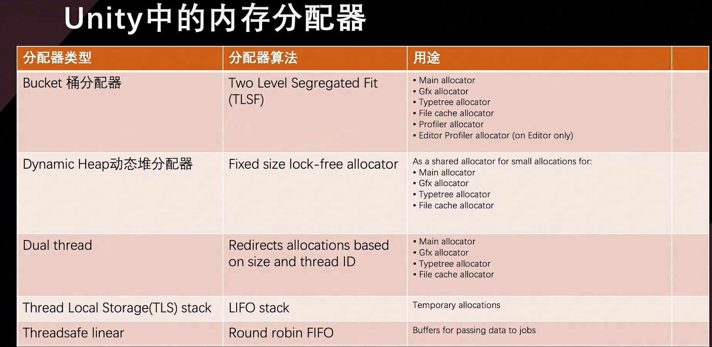
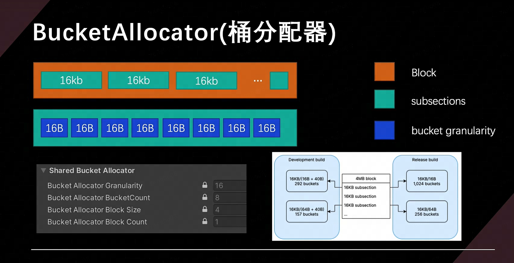
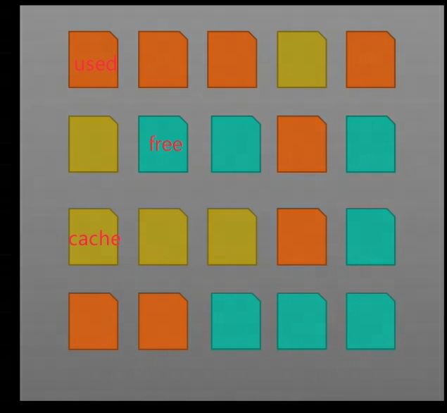
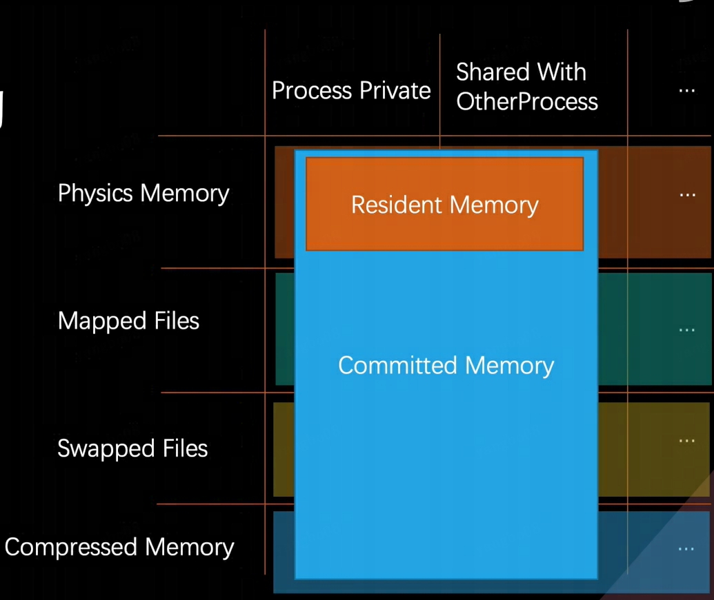
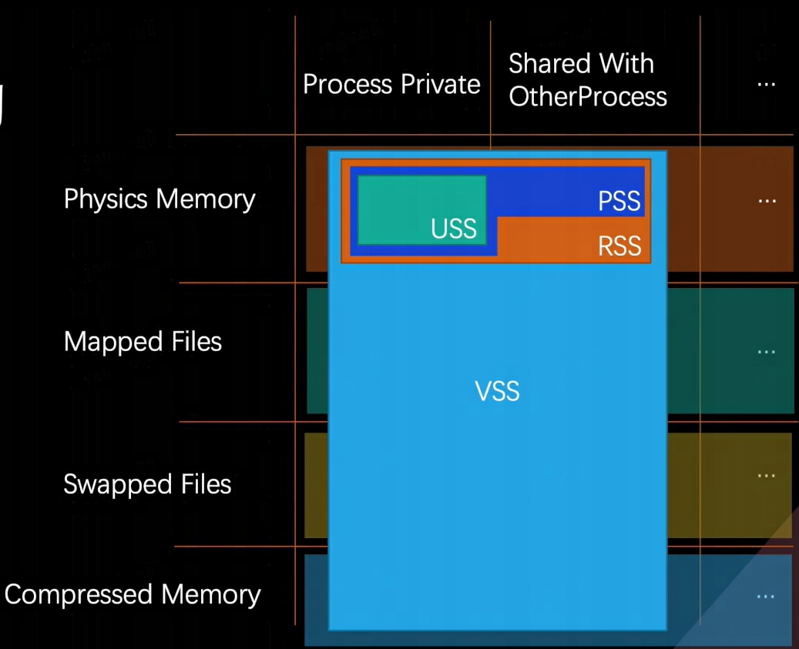
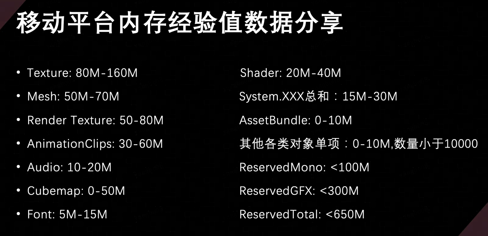

# 优化理论篇

## Culling/Simplization/Batching

### Culling 剔除

从广义上讲

- 看不见的像素，网格和对象
- 重复的，用不到的资源
- 不需要，不执行的代码

从狭义上讲

- 像素剔除： 摄像机平截头体剔除，Back-face Culling，Early-Z，Pre-Z Pass
- 网格剔除： Layer Mask， 可见距离剔除， Occlusion
- 灯光剔除： Tile-Based Deferred Rendering， Forward+
- 场景剔除： Additive Scene

### Simplization 简化

从广义上讲

- 运行效率较重的资源
- 低效，不合适的资源

unity中有的简化手段

- Quality Settings
- 通过烘焙光照简化实时光照
- 通过BoundingBox或替代碰撞代替Mesh碰撞
- 通过Local Volume代替Global Volume
- RayCast 代替 SphereCast、CapsuleCast
- 纹理文字代替系统文字
- Mesh LOD
- Shader LOD
- [HOLD](https://github.com/Unity-Technologies/HLODSystem)
- 通过Camer override代替URP管线中的一些通用设置
- 通过OnDemand更新或分级设置接口

用户扩展简化

- 场景简化数据结构
- 第三方LOD方案
- Mesh Impostor
- Animation LOD
- 2D寻路代替Navigation Mesh
- 扩展类似OnDemand接口

### Batching 合批

从广义上讲

- 资源Batching(Mesh, Texture, Shader参数,材质属性)
- Draw call Batching(Static Batching, Dynamic Batching)
- GPU Instancing(直接渲染，间接渲染，程序化简接渲染)
- Set Pass call Batching(SRP Batching)

#### 资源Batching

- Mesh
  - Mesh.CombineMesh 合并静态网格对象
  - Submeshes -> Single Mesh 合并材质和贴图，不同材质通过通道图标记
- Texture
  - AltasTextue 通过纹理坐标映射多张贴图
  - TxtureArray 纹理数组
- Shader变量与材质属性
  - Material Property Block（Build In管线）
  - Const buffer（SRP管线）

#### Draw call Batching

- Static Batching
- Dynamic Batching

#### GPU Instancing

- DrawMeshInstanced
- DrawMeshInstancedIndirect
- DrawMeshInstancedProcedural

#### Set Pass call Batching

- SRP Batcher
- Const Buffer
  - UnityPerCamera
  - UnityPerFrame
  - UnityPerPass
  - UnityPerDraw
  - UnityPerDrawRare
  - UnityPerMaterial

#### 资源优化顺序

资源Batching > SRP Batching = Static Batching > GPU Instancing > Dynamic Batching

#### Bacthing的使用限制

- Static Batching 限制
  - 额外内存开销
  - 64000个顶点限制
  - 影响Culling剔除

- Dynamic Batching 限制
  - 合批不超过900个顶点属性（注意不是900个顶点）
  - 除了渲染阴影对象外，相同材质，不同材质实例也不能合并
  - 具有光照贴图的游戏对象如果有附加渲染器参数时，如果需要动态合批这些对象，他们必须指向相同的光照贴图位置
  - 有多pass 的 shader 的游戏对象无法做动态合批
  - 受多个光照影响的游戏对象，满足动态合批条件合批后，只会受一个光源的影响
  - 延迟渲染下不支持动态合批
  - CPU开销可能会增大，需要测试开启使用

- GPU Instancing限制
  - 图形API版本要求
  - 与SRPBatcher不兼容
  - 不同绘制API的参数和绘制个数不同
  - 渲染顶点数较少的网格时，效率可能会很差

- SRP Batching 限制
  - 图形API版本要求
  - 必须是SRP渲染管线
  - 粒子对象不能合批
  - 使用MaterialPropertyBlocks的游戏对象不能合批
  - Shader必须时compatible的

#### 合批失败原因汇总

- An object is affected by multiple forward lights
- Objects have different materials
- An object is using a multi-pass shader
- An object has odd negative scaling 此物体Transform的Scale使用了负数
- Either object have different Receive Shadows settings, or some objects are within the shadow distance, while some other objects are not 此物体接收阴影的设置不同，或者物体有不同的阴影距离设置
- Objects are affected by different forward lights
- Objects are different lighting layers
- Objects have different Cast Shadows settings
- Object either have different shadow caster shaders, or have different shader properties or keywords that affect the output of the shadow caster pass 此物体有不同的投影设置或者有不同的着色器属性或者关键字影响Shadow Caster pass 的输出
- The Shader ecplicity disbales batching with the DisableBatching tag 着色器中显示设置了DisabledBatching的标记
- Objects have different MaterialPropertyBlock set
- Non-instanced properties set for instanced shader
- Objects are lightmapped 物体使用了不同的LightMap或者虽然使用相同的LightMap但使用的UV不同
- Obiects are affected by different light probes.
- Objects are shadowed by baked occlusions and have different occlusion factors
- Obiects are affected by different reflection probes
- Rendering different meshes or submeshes with GPU instancing 使用GPU实例化渲染不同的网格或子网格
- Objects have different batching-static settings
- Obiects belong to different static batches
- Dynamic Batching is turned off in the Player Settings or is disabled temporarily in the current context toavoid z-fighting. 在Player Settings中关闭了动态合批，或者在当前的环境中为了避免深度冲突而临时关闭了合批
- There are too many indices (more than 32k) in a dynamic batch. 动态合批中有太多的索引(大于32k )
- “A mesh renderer has additional vertex streams. Dynamic batching doesn 'tsupportsuchmesh renderers/  Mesh Renderer具有其他顶点流。动态批处理不支持此类网格渲染器
- A submesh we are trying to dynamic-batch has more than 300 vertices 动态合批超过300个顶点
- A submesh we are trying to dynamic-batch has more than 900 vertex attributes 动态合批超过900个顶点属性
- This is the first draw call of a new shadow cascade 新阴影级联的第一次绘制调用
- The material doesn 't have GPUinstancing enabled 材质未启用GPUInstancing功能
- Objects are rendered using different rendering functions. This can happen if the type of renderer is different (eg Mesh/Skinned Mesh) or when using different settings within the same renderersuchas SpriteMasking 使用不同的渲染。如果渲染器的类型不同(例如网格/蒙皮网格)，或者在同一染器中使用不同的设置(例如精灵遮罩)，则可能会发生这种情况
- Objects have different batching keys. This is usually caused by using different vertex streams on Particle Svstems,or by mixing Lines and Trails, or by mixing lit and unit aeometry "此对象具有不同的Batching Keys 这通常是由于在粒子系统上使用不同的顶点流，或混合线和轨迹，或混合Lit和Unlit的几何体造成的。
- Meshuses32 bitindex buffer Mesh使用了32位的索引缓冲
- Submeshhas non-zero base vertex  子网格对象有非0的基础顶点，submesh.BaseVertexLocation != 0
- The previous instanced draw call has reached its maximum instance count 先前的InstanceDrawCall已经达到了Instance的最大数量
- Motion Vector rendering doesn't support batching    Motion Vector的渲染不支持Batching
- When using late latching, children of an XR late latched GameObject do not usebatching. 使用latelatching时，XR latelatched GameObiect的子级不能合批
- Objects have different bounds and bounds instancing is disabled 对象具有不同的包裹体，那么包裹体实例化被禁用
- SRP
- SRP:Node have different shaders.  节点具有不同的着色器
- SRP:Node use multi-pass shader 节点使用了多Pass着色器
- SRP:Node use different shader keywords 节点使用了不同的着色器关键字
- SRP:End of the batch flush Batch Flush结束
- SRP:Node is not compatible with SRP batcher 节点与SRP Batcher不兼容
- SRP:Node material requires device state change 节点材质需要改变渲染设备状态
- SRP:First call from ScriptableRenderLoopJob ScriptableRenderLoopJob第一次调用
- SRP.This material has custom buffer override 材质有自定义重写的Buffer

### URP中的Settings

- Player Settings
- Graphics Settings 这两个是一般Unity工程的图形与工程设置
- Default URP Render Pipeline Asset 可以被Qulity Level 覆写，部分属性可以被每个摄像机组件覆写
- Volumn Components 可以被每个场景中摄像机根据相机位置复写

### 地形Terrain 优化

- 大地图项目地图如果使用unity的Terrain编辑器生成的地形，开销在移动端会非常大，一般我们都是通过地形mesh来替代(自己实现一套地形烘焙的工具，根据terrain data信息将mesh信息与混合后的地形纹理烘焙出来，并通过prefab生成地形快)
- assetstore地形优化工具 [Terrain To Mesh](https://assetstore.unity.com/packages/tools/terrain/terrain-to-mesh-195349)

### 主光源级联阴影优化

### 内存概述与工具方法

unity中的内存分为3类

- 托管内存：主要是指使用托管堆或者垃圾收集器自动分配和管理的内存，也包括脚本堆栈和虚拟机内存
- C#非托管内存：可以在C#下与Unity Collection名字空间和包结合使用，不使用垃圾收集器管理的内存部分
- Native内存：unity用于运行引擎的C++内存

#### Allocators

unity引擎中 C++ 层会根据内存用途不同，抽象出不同的Allocator进行内存分配，通过不同的MemoryLabel标签与ownershape的设置进行标记和追踪，通过memorymanager进行整体的管理，2021版本后可以在memeory settings中看到部分

按用途分类

- Main Allocators 绝大多数内存分配使用的的分配器，包括主线程，渲染资源相关，文件cache，typetree等不同用途下的分配器
- Fast Per Thread Temporary Allocators 线程上使用的临时分配器，包括各工作线程的栈分配器，比如音乐/渲染/预加载/烘焙等工作线程上的分配器
- Fast Thread Shared Temporary Allocators 线程间共享的临时分配器
- Profiler Allocators

按底层类型分类

- UnityDefaultAllocator
- BucketAllocator
- DynamicHeapAllocator
- DualThreadAllocator
- TLSAllocator
- StackAllocator
- ThreadSafeLinearAllocator
- ...

##### BucketAllocator 桶分配器

- 每个bucket由固定大小粒度granularity表示，如果granularity为16字节大小，则用于分配16/32/48/64/·.字节的内存，如果是development版本granularity在设置大小的基础上增加40个字节
- 分配器为分配保留内存块Block，每个块被划分为16kb的子段(subsections),并且不可配置Block块只能增长并且需要是固定16kb大小的整数倍。
- 分配是固定大小无锁的，速度快，通常作为进入堆分配器之前用来加速小内存分配的分配器
- Log日志中可以通过查看[ALLOC_BUCKET]字段来看是否有Failed Allocations. Bucket layout字段以及Peak Allocated bytes字段与Large Block size字段的利用率，来判定大小是否分配合适
- 分配失败会会退到DynamicHeapAllocator或UnityDefaultAllocator分配器上，效率变差。

##### DynamicHeapAllocator 动态堆分配器

- 所有平台都希望使用的分配器 (Mac与IOS暂时仍然使用UnityDefaultAllocator)
- 底层基于TLSF，保留tlsf块列表，并在一个块已满后，切换到另一个块,或没有时分配一个新块,关于TLSF :http://www.gii.upv.es/tlsf/files/ecrts04 tlsf.pdf
- 最棘手的部分是设置块的大小。根据不同平台，更大的块效率更高，碎片更少，但对于内存有限的平台来说灵活性差
- 最大块为256M，最小块为128k,如果64位架构使用更大的Region来保存多个块MEMORY_USE LARGE BLOCKS，如果分配失败会会退到虚拟内存分配，效率更差
- Log中[ALLOC_DEFAULT_MAIN]下关注Peak usage frame count字段，查看大多数分配内存的范围，关注内存分配峰值Peak Allocated memory字段，以及Peak Large allocation bytes没有使用TLSF分配的内存大小

##### DualThreadAllocator 双线程分配器

- 它是将2个DynamicHeapAllocator实例与1个BucketAllocator封装到一起，其中BucketAllocator负责小的共享内存分配，1个无锁的DynamicHeapAllocator用于主线程分配，另外一个DynamicHeapAllocator负责其他线程的共享分配，但是分配与回收时需要加锁
- Log中[ALLOC DEFAULT]下分别关注[IALLOC_BUCKET]、[ALLOCDEFAULT_MAIN]、[ALLOC_DEFAULT_ THREAD]字段下一个BucketAllocator与2个DvnamicHeapAllocator的分配信息，其中尤其关注Peak main deferred allocation count字段，这个字段代表需要在主线程回收的分配队列。
- 负责其他线程的共享分配的DynamicHeapAllocatord对应C#非托管内存的Allocator.Persistent

##### TLSAllocator / StackAllocator

- 用于快速临时分配的堆栈分配器。它是最快的分配器，几乎没有开销，并且可以防止内存碎片对应C#非托管内存的Allocator.Temp分配类型
- 它是基于后进先出LIFO的算法，分配的内存生命周期在一帧内。
- 如果分配器使用超过了配置的大小，Unity会增加分配块大小，但会是配置设置的2倍大小，如果线程堆栈分配器满了，分配器将会退到线程安全线性iob分配器。这时一帧内允许有1-10分配，甚至如果是加载- 期间可以允许几百次。但如果每帧的分配数字增加可以考虑增加块大小。
- Log日志[ALLOC_TEMP_TLS]下关注[ALLOC TEMP_MAIN]与[ALLOC TEMP Job.Worker xx]中的Peak usage frame count于Peak Allocated Bytes字段，也要关注Overflow Count字段，是否发生了分配器溢出会退的情况。

##### ThreadSafeLinearAllocator

- 用于快速无锁分配Job线程的缓冲区，并在Job完成后释放缓冲区，对应C#非托管内存的Allocator.TempJob
- 采用循环先进先出FIFO算法，先分配内存块，然后在这些内存块内进行线性分配内存所有可用块都会存到一个池中，当一个块满时再从池中提取一个新的可用块。当分配器不再需要块中内存时，清理该块并放回到可用池中。快速清理分配可用块非常重要因此Job的分配尽量在几帧内完成。
- 如果所有块都在使用中，或者一个分配对于一个块太大的情况下，则会退到主堆分配器，分配效率会下降
- Log日志[ALLOC_TEMP_JOB_4_FRAMES]中我们需要关注Overflow Cout(too large)与Overflow Count(full)字段，判断是否发生了分配器溢出会退。

### Memory Profiler中的内存度量与术语

- Page操作系统内存管理的最小单元
- Page的状态：
  - Used page正在被进程使用，而内存页也已经映射到物理内存中
  - Free 代表该page页可用，并且还没有映射到物理内存中
  - Cache 代表该page页被操作系统用于缓存的可用内存，虽然内存page已经映射到物理内存中，但该页可能近期没有被访问

- Region 区域
  - 状态
    - Resident 代表其中的page页已经在物理内存中
    - Dirty 代表page已修改，但未写入磁盘
    - Wired 代表永远不会交换到辅助存储的固定配置
    - Committed 代表已分配的内存区域，其地址不能被其它分配使用，是由ram磁盘上的分页文件或其它资源来支持的
    - Reserved 该状态的region保留地址空间供将来使用，地址不会被其它分配使用，也不可访问
    - Free 空闲内存区，既不会committed也不会Reserved，并且进程无法访问
  - 类型
    - Anonymous
    - Mapped
- 进程的内存结构
  - Commited Memory 是一个进程分配虚拟内存的总量
  - Resident Memory 已经被映射到虚拟内存中的物理内存，同样包括当前进程占用的内存和与其它进程共享的内存

- 进程的内存结构
  - USS 为当前进程私有的Resident内存总和
  - PSS 当前进程常驻内存与其它进程共享的Resident内存总和
  - RSS 进程可访问的resident常驻内存总和
  - VSS 总共Committed提交的内存总和

移动平台下内存经验数据(1080p)

