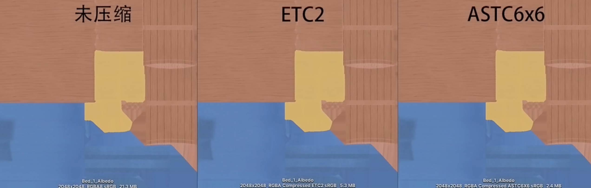
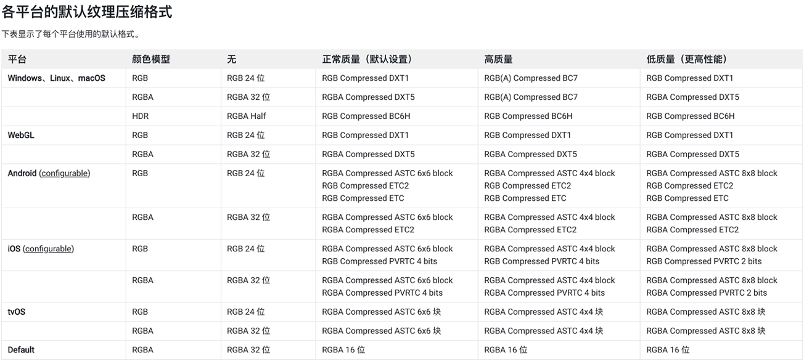

# Texture 纹理

## Texture 纹理导入设置和优化

### Texture Type

|类型（*号为常用） | 描述 |
| --- | ---- |
| *Default | 默认的纹理类型格式，绝大多数资源使用这个
| *Normal map | 法线贴图，可将颜色通道转换为适合实时法线贴图格式
| Editor GUI and Legacy GUI | 在编辑器 GUI 控件上使用纹理请选择此类型
| *Sprite(2D and UI) | 在 2D 游戏中使用的精灵(Sprite)或 UGUI 使用的纹理请选择此类型
| Cursor | 鼠标光标自定义纹理类型
| Cookie | 用于光照 Cookie 剪影类型的纹理
| *Lightmap | 光照贴图类型的纹理，编码格式取决于不同的平台（平台不支持或设置不对可能会导致精度丢失）
| *Single Channel | 如果原始图片文件只有一个通道，请选择此类型，可以节省纹理内存开销

### 纹理大小
现代显卡一般要求纹理长宽为2的幂次方，unity默认会将其转为最小2的幂次方大小。
纹理的大小会影响内存和显存的占用，以及gpu采样纹理时的性能、cpu加载和带宽造成影响

选择合适纹理大小应尽量遵循以下经验
- 不同平台，不同硬件配置选择不同的纹理大小，Unity下可以采用bundle变体设置多套资源，通过Mipmap限制不同平台加载不同level层级的贴图
- 根据纹理用途的不同选择不同的纹理加载方式，如流式纹理加载Texture Streaming、稀疏纹理Sparse Texture、虚拟纹理VirtualTexture等方式。
- 不能让美术人员通过增加纹理大小的方式增加细节，可以选择细节贴图DetailMap或增加高反差保留的方式。
- 在不降低视觉效果的情况下尽量减小贴图大小，最好的方式是纹理映射的每一个纹素的大小正好符合屏幕上显示像素的大小，如果纹理小了会造成欠采样，纹理显示模糊，如果纹理大了会造成过采样，纹理显示噪点。这一点做到完美平衡很难保障。

### 纹理压缩

纹理压缩是指图像压缩算法，保持贴图视觉质量的同时，尽量减小纹理数据的大小。默认情况下我们的纹理原始格式采用PNG或TGA这类通用文件格式，但与专用图像格式相比他们访问和采样速度都比较慢，无法通用GPU硬件加速，同时纹理数据量大，占用内存较高。所以在渲染中我们会采用一些硬件支持的纹理压缩格式，如ASTC 、ETC、ETC2、DXT等

下图为未压缩、ETC2、ASTC6x6三种格式文件大小对比，我们可以看到在质量相差不大的情况下ASTC6x6压缩下大小可以减少到接近未压缩的十分之一。合理设置可以节省极大内存和空间

### 纹理图集
纹理图集是指一系列小纹理图像的集合，Unity可以使多个网格对象对应一张纹理贴图，默认支持SpriteAtlas
- 优点
  - 采用共同纹理图集的多个静态玩个资源可以进行静态合批处理，减少DrawCall调用次数
  - 纹理图集可以减少碎纹理过多，因为小图像都打包在一个图集里，通过压缩可以更有效的利用压缩，降低纹理的内存成本和冗余数据
- 缺点
  - 美术需要合理规划模型，并且要求模型有相同的材质着色器，或需要制作通道去区分不同材质。制作和修改成本较高

### 纹理过滤
|类型  | 具体作用 |
| --- | ---- |
| point(no filter) | 该选项会将像素信息直接复制到缩放后的纹理中，不做任何过滤处理；在近距离观察时，纹理会呈现块状。(也就是锯齿和马赛克现象) |
| bilinear | 	双线性采样过滤会对临近纹素采样并插值化处理，对纹理像素进行着色。双线性过滤会让像素看上去平滑渐变，但近距离观察时，纹理会变得模糊 |
| trilinear | 三线性过滤除与双线性过滤相同部分外，还增加了Mipmap等级之间的采样差值混合，用来平滑过度消除Mipmap之间的明显变化，但是会消耗更多的性能 |
| Anisotropic | 各向异性过滤可以改善纹理在倾斜角度下的视觉效果，适合用于地表纹理 |

### 纹理Mipmap

- 逐级减低分辨率来保存纹理副本。相当于生成了纹理LOD，渲染纹理时，将根据像素在屏幕中占据的纹理空间大小选择合适的Mipmap级别进行采样。是进行Hierarchical-Z Cull的前提条件
- 优点：
  - GPU不需要在远距离上对对象进行全分辨率纹理采样，因此可以提高纹理采样性能。
  - 同时也解决了远距离下的过采样导致的噪点问题，提高的纹理渲染质量。
- 缺点
  - 由于Mipmap纹理要生成低分辨率副本，会造成额外的内存开销。多1/3
  - 可以使用unity的Mipmap streaming功能，在运行时限制只采样某个级别以下的纹理，进行不同设备的不同适配

### Texture Shape

|类型  | 具体作用 |
| --- | ---- |
| 2D | 最常用的2D纹理，默认选项 |
| Cube | 一般用于天空和与反射探针，默认支持Default、Normal、Single Channel几种类型纹理，可以通过Assets > Create > Legacy > Cubemap生成，也可以通过C#代码 Camera.RenderToCubemap 在脚本中生成 |
| 2D Array | 2D纹理数组，可以极大提高大量相同大小和格式的纹理访问效率，但需要特定平台支持或特定图形api支持，可以通过引擎 SystemInfo.supports2DArrayTextures 接口运行时查看是否支持 |
| 3D | 通过纹理位图方式存储或传递一些3D结构话数据，一般用于体积仿真，如雾效、噪声、体积数据、距离场、动画数据等信息，可以外部导入，也可运行时程序化创建 |

### Alpha Source
默认选择Input Texture Alpha就好，如果确定不使用原图中的Alpha通道，可以选择None。另外From Gray Scale我们一般不会选用
### Alpha Is Transparency
指定Alpha通道是否开启半透明，如果位图像素不关心是否要半透明可以不开启此选项。这样Alpha信息只需要占1bit。节省内存
### Ignore Png file gamma
是否忽略png文件中的gamma属性，这个选项是否忽略取决于png文件中设置不同gamma属性导致的显示不正常，一般原图制作流程没有特殊设置，这个选项一般默认就好
### Read/Write
开启此选项会导致内存量增加一倍，默认我们都是不开启，除非你的脚本逻辑中需要动态读写该纹理时需要打开此选项。
### Generate Mip Maps
- 什么时候不需要生成MipMaps？
  - 2D场景
  - 固定视角，摄像机无法缩放远近
- Border Mip Maps 默认不开启，只有当纹理是Light Cookies类型时，开启此选项来避免colors bleeding现象导致颜色渗透到较低级别的Mip Level纹理边缘上
- MipMap Filtering
  - Box 最简单，随尺寸减小，Mipmap纹理变得平滑模糊
  - Kaiser，避免平滑模糊的锐化过滤算法。
- Mip Maps Preserve Coverage，只有需要纹理在开启mipmap后也需要做Alpha Coverage时开启。默认不开启。
- Fadeout MipMaps, 纹理Mipmap随Mip层级淡化为灰色，一般不开启，只有在雾效较大时开启不影响视觉效果

## 选择合适纹理过滤的最佳经验：

- 使用双线性过滤平衡性能和视觉质量。
- 有选择地使用三线性过滤，因为与双线性过滤相比，它需要更多的内存带宽。
- 使用双线性和 2x 各向异性过滤，而不是三线性和 1x 各向异性过滤，因为这样做不仅视觉效果更好，而且性能也更高。
- 保持较低的各向异性级别。仅对关键游戏资源使用高于 2 的级别。

### 各平台的默认纹理压缩格式

### 其他可能有问题的纹理类型
- 纹理图集大小设置不合理，图集利用率低。
- 纹理生命周期不一致，应尽量将生命周期接近的打在小纹理图集中（如果纹理过大的话）
- 大量只有颜色差异的图片，避免重复纹理，可以采用分离变化区域贴图？
- UI背景贴图而不采用9宫格缩放的图，会使内存激增
- 纯色图没有使用Single Channel
- 不合理的半透明UI（粒子特效也要小心），占据大量屏幕区域，造成Overdraw开销
- 大量2D序列帧动画，而且图片大，还不打图集
- 不合理的通道图利用方案，多把通道利用上。
- 大量渐变色贴图，没有采用1像素过渡图，也不采用Single Channel, 粒子特效中较为常见。可以将贴图替换成曲线数据或采用单像素梯度纹理来减少内存开销和加载开销
