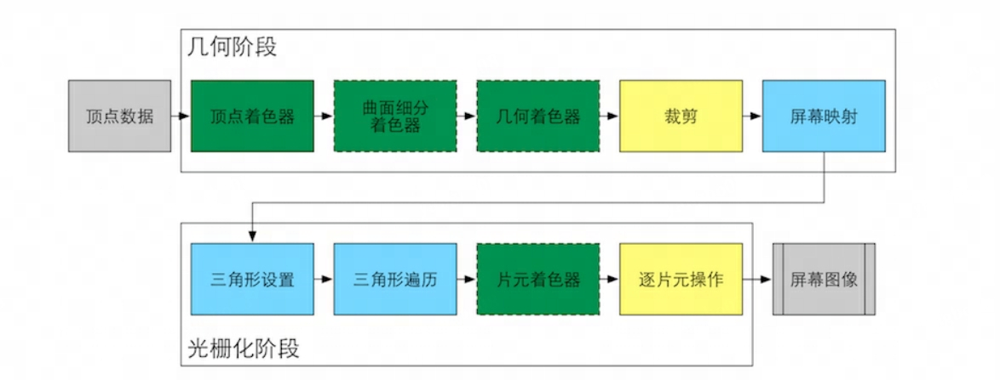

# Shader

## 概述

1. GPU流水线上高度可编程阶段。
2. 有特定类型的着色器，如顶点着色器，片元着色器。
3. 依靠着色器可以控制流水线中的渲染细节。
4. 渲染流水线，模型投影，顶点着色
5. 着色器是运行在图形处理单元上，让开发人员直接操作图形硬件渲染功能
6. UV动画，水，雾等特效，用着色器开发出来性能和效果好

### 顶点/片元

- 顶点就是点，包含了空间坐标信息
- 图元是由顶点组成的。一个顶点，一条线段，一个三角形或者多边形都可以成为图元
- 片元是在图元经过光栅化阶段后，被分割成一个个像素大小的基本单位
- 像素是最终呈现在屏幕上的包含RGBA指的图像最小单位

## GPU管道流水线

计算机从一系列的顶点数据，纹理等信息出发，将这些信息转化为图像，这个工作通常由CPU和GPU共同完成
渲染流水线是概念流水线

- 应用阶段(输出渲染图元)
  - 通常由CPU实现，主要有下面三个任务
  - 准备场景数据，相机位置、视锥体、场景模型、光源等
  - 粗粒度剔除（剔除不可见的物体，提升渲染性能）
  - 设置每个模型的渲染状态，材质、纹理、Shader等 输出渲染图元
- 几何阶段(输出屏幕空间的顶点信息)
  - 通常在GPU上进行，决定绘制的图元，怎么绘制，在哪里绘制
- 光栅化阶段
  - 通常在GPU上进行，使用上个阶段传递的数据来产生像素，渲染最终图像

### 应用阶段

- 把数据加载到显存(VRAM)中
  - 硬盘(HardDiskDrive, HDD) -> 内存(RandomAccessMemory, RAM) -> 显存(VideoRandomAccessMemory, VRAM)
- 设置渲染状态
  - 通过CPU设置渲染状态，指导GPU如何进行渲染工作，渲染状态定义了场景中网格怎么被渲染，如片元着色器，顶点着色器，光源属性，材质等。当没有更改渲染状态的时候，所有网格都使用一种渲染状态，看起来像是同一种材质
- 调用Draw Call
  - Draw Call 是一个命令，发起发CPU，接收方GPU。一次Drawcall命令指向一个需要被渲染的图元(Primitives)列表。GPU会根据渲染状态和所有输入的顶点数据进行计算，生成像素

### GPU流水线



### 几何阶段 和 光栅化阶段

GPU渲染过程就是GPU流水线，对几何阶段和光栅化阶段开发者无法拥有绝对控制权，实现载体为GPU

- 几何阶段 顶点数据
  - 顶点着色器 vertexShader 完全可编程，实现顶点的空间变换、顶点着色等
  - 曲面细分着色器 TessellationShader 可选着色器，用于细分图元
  - 几何shader GeometryShader 可选着色器，执行逐图元着色操作
  - 裁剪 Cliping 将不在相机视野内的顶点裁剪掉，可配置
  - 屏幕映射 ScreenMapping 不可配置和变成
- 光栅化阶段 光栅化就是将顶点数据转换为片元的过程。
  - 三角形设置 TriangleSet 固定函数阶段
  - 三角形遍历 TriAngleTraversal 固定函数阶段
  - 片元着色器 FragmentShader 完全可编程，实现逐片元的着色操作
  - 逐片元操作 Per-FragmentOperations 修改颜色、深度缓冲、进行混合等。可配置

#### 顶点着色器（Vertex Shader）

可以完全编程，是GPU流水线的第一个过程，输入来自CPU。处理单位是顶点

顶点着色器不能判断各个顶点间的关系，也不能创建和销毁顶点。因为这样的独立性，GPU可以利用本身的特征并行化处理每一个顶点，这个阶段处理速度很快

主要任务是：

- 坐标变换 (可以对顶点坐标进行变换，改变顶点的位置，可以通过改变顶点位置模拟水面和布料)
- 逐顶点光照

最基本工作： 将顶点坐标从模型空间转换为齐次裁剪空间，最后得到归一化的设备坐标(Normalized Device Coordinates, NDC)

#### 裁剪(Clipping)

一个图元和相机视野有三种关系

- 完全在视野内：继续传递给下一个阶段
- 部分在视野内：需要进行裁剪(Clipping)，使用新的顶点来代替
- 完全在视野外：不会向下传递

这一步不可以编程。 由于场景可能会非常大，摄像机不会覆盖所有物体。在摄像机外的物体会被裁切。

比如一条线段的一个顶点在内部，一个在外部，那么就会在线段和视野边界的交接处生成一个新的顶点来替代外部的顶点。

#### 屏幕映射（Screen Mapping）

这一步输入的坐标依然是三维坐标。屏幕映射会将坐标的X,Y值转换到屏幕坐标系(Screen Coordinates)下。屏幕坐标决定了该像素点到屏幕的边缘有多远。
而对于Z轴的分量，不会做任何处理。但是仍然会被保留，并和屏幕坐标系构成窗口坐标系(Window Coordinates)。这些值会传递到光栅化阶段。

#### 三角形设置

计算三角网格表示数据，计算每条边上的像素坐标

#### 三角形遍历（Triangle Traversal）

检查每个像素是否被一个三角网格所覆盖，是则生成一个片元，这就叫三角形遍历，也被称作扫描变换（Scan Conversion）

片元是包含很多状态的集合，这些状态用来计算像素的最终颜色，包括（不限于）屏幕坐标，深度信息，顶点信息（法线，纹理坐标等）

#### 片元着色器

可以编程阶段, 在DirectX中，称为像素着色器(PixelShader)。输出颜色值.. 纹理采样。

片元着色器的输入是三角形遍历中插值得到的数据，他的输出是一个或多个颜色；这一阶段可以完成很多重要的渲染技术，如纹理采样（片元着色器只能影响单个片元）

#### 逐片元操作

在DirectX中，称为输出合并阶段(Output-Merger)。主要任务：

- 决定每个片元可见性，需要进行很多测试，如模板测试和深度测试
- 如果通过测试，就将片元的颜色值和颜色缓冲区的颜色进行合并

决定可见性：

- 模板测试(StencilTest)：将片元位置的模板值，和参考值进行比较
- 深度测试(DepthTest)：将片元的深度值，和深度缓冲区的深度值进行比较

## 分类

1. DirectX的HLSL语言(HighLevelShadingLanguage)，通过Direct3D编写的着色器程序，只能在Direct3D里面使用
2. Cg语言(C for Graphic) NVIDIA和微软合作的语言，Direct3D和Opengl都支持
3. OpenGL的GLSL语言(OpenGLShadingLanguage)

unity使用shaderlab来进行着色程序的编写，对不同平台进行编译，重点支持Cg语言；

## Draw Call

DrawCall CPU调用图像编程接口，以命令GPU进行渲染的操作

- CPU和GPU是如何实现并行工作的
  - 命令缓冲区(CommandBuffer),让CPU和GPU可以并行工作。CPU向其添加命令，GPU从中读取命令，添加和读取的过程是相互独立的
- 为什么DrawCall多了会影响帧率
  - GPU渲染能力很强，速度往往快于CPU提交命令的速度，如果DrawCall的数量太多，CPU会耗费大量时间造成过载
- 如何减少DrawCall
  - 批处理(Batching),把很多小的DrawCall合并成一个大的DrawCall，更适合合并静态的物体，因为只需要合并一次

## 语法基础

```shader
Shader "MyShader" { // shader的名字
  [Properties] // 定义一些属性，定义在这里的属性都会在属性查看器里面显示
  Subshaders: {
    // Surface Shader 表面着色器
    // Vertex/Fragment Shader 顶点/片元着色器
    // Fixed Function Shader  固定函数着色器
  } // 子着色器列表，一个shader必须有一个子着色器
  [Fallback] // 如果子着色器显卡都不支持，降级处理即Fallback操作
}
```

### Properties

| 属性类型 | 默认值的定义语法 | 例子 |
| -- | --- | ---- |
| Int | number |  |
| Float | number |  |
| Range(min, max) | number |  |
| Color | (number, number, number, number) |  |
| Vector | (number, number, number, number) |  |
| 2D | "defaultTexture" {} |  |
| Cube | "defaultTexture" {} |  |
| 3D | "defaultTexture" {} |  |

1. name{"display name", type} = value;
name 指的是属性的名字
display name 是在属性检查器的名字
type 这个属性的类型
value 这个属性的默认值
2. 类型
Float，Int，Color(num, num, num, num), Vector(4维向量)，Range(start, end)
2D: 2D纹理属性
Rect： 矩形纹理属性
Cube：立方体纹理属性
3D：3D纹理属性
例如： name{"display name", 2D} = "name" {options}
3. Options: 纹理属性选项
TextGen：纹理生成模式，纹理自动生成纹理坐标的模式，顶点shader会忽略这个选项
ObjectLinear，EyeLinear，SphereMap，CubeReflect CubeNormal
LightmapMod：光照贴图模式，如果设置这个选项，纹理会被渲染器的光线贴图影响

```C#
Shader "shaderLearning/shaderbase"
{
  Properties{
    _MianTex ("Main Tex", 2D) = "white" {}
    _Int("Int", Int) = 1
    _Float("Float", Float) = 1.0
    _Range("Range", Range(1, 255)) = 1
    _Vector("Vector", Vector) = (1, 1, 1, 1)
    _Color("Color", Color)= (1, 1, 1, 1)
    _Cube("Cube", Cube) = "skybox" {}
  }
}
```

### SubShader

一个Unity Shader文件至少包含一个SubShader语义块，加载时，unity会扫描所有SubShader语义块，并选择第一个能在目标平台上运行的SubShader，如果都不支持，会使用Fallback指定的Unity Shader

1. Subshader{ [Tags] // 可选标签, [RenderSetUp] // 可选状态, Pass{} // 一个Pass定义了一个完整的渲染流程 } 由标签、状态、通道Pass组成
2. Subshader渲染的时候，将优先渲染一个被每个通道所定义的对象
3. 通道的类型： RegularPass，UsePass，GrabPass
4. 在通道中定义状态同时对整个子着色器可见，那么所有的通道可以共享状态

```C#
SubShader {
    Tags { "RenderType"="Transparent"  "Queue" = "Transparent" "IgnoreProjector"="True"}
    Pass {
        Lighting Off // 关闭光照
        ...
    }
}
```

#### RenderSetUp

如果在SubShader块中设置了状态，就会应用到全部的Pass。可以在Pass中单独设置状态

- Cull： Cull Back/Front/Off 设置剔除模式，剔除正面，背面，关闭
- ZTest：ZTest Less Greater/LEqual/GEqual/Equal/NotEqual/Always 设置深度测试时使用的函数
- ZWrite：ZWrite On/Off 开启/关闭深度写入
- Blend：Blend SrcFactor DstFactor 开启并设置混合模式

#### Tags

标签的作用是告诉Unity渲染引擎要怎样以及何时渲染这个对象。标签仅可在Subshader中声明，不可在Pass中声明。

标签类型

- Queue 队列标签 控制渲染顺序，例如保证所有透明物体在不透明物体后渲染
- RenderType 渲染类型 对着色器分类，例如透明不透明
- DisableBatching 禁用批处理
- ForceNoShadowCasting 强制不投阴影
- IgnoreProjector 忽略投影 通常用于半透明物体，是否不受Projector影响
- CanUseSpriteAtlas 使用精灵图集
- PreviewType  预览类型 指定材质面板如何预览该材质，默认是球

#### Pass通道

Pass的名称会被Unity转换成大写的表示，因此在使用UsePass命令的时候需要将Pass名称全部大写

基础语法
Pass {[Name] [Tags] [RenderSetup]}

Pass也可以使用标签，不过不同于SubShader，Tags类型有

- LightMode 定义该Pass在Unity的渲染流水线中的角色 Tags{"LightMode" = "ForwardBase"}
- RequireOptions 用于指定当满足某些条件时才渲染该Pass,它的值是一个由空格分隔的字符串

##### 常规Pass

- Lighting 光照
- Material（材质块） 定义一个使用定点光照管线的材质
- ColorMaterial 颜色集 计算定点光照时使用顶点颜色
- SeparateSpecular 开光状态 开启或关闭顶点光照相关的镜面高光颜色 On/Off
- Color 设置定点关照关闭时所使用的颜色
- Fog 雾
- AlphaTest Alpha测试
- ZTest 深度测试模式
- ZWrite 深度写模式
- Blend 混合模式 SourceBlendMode DestBlendMode AlphaSourcesBlendMode AlphaDstBlendMode
- ColorMask 颜色遮罩 设置颜色遮罩，颜色值可以由RGB或A或0或R,G,B,A的组合，设置0关闭所有的颜色通道渲染
- Offset 偏移因子，设置深度偏移

##### 特殊Pass

- UsePass 使用该命令来复用其他UnityShader中的Pass
- GrabPass 该Pass负责抓取屏幕并将结果储存在一张纹理中，以用于后续的Pass处理

#### Fallback 降级

定义在所有着色器之后，如果没有任何子着色器能运行，则降级
Fallback "NAME"
Fallback Off;

### 着色器

#### 表面着色器(Surface Shader)

Surface Shader 是unity创造的着色器代码类型，定义在Pass中。需要的代码量很少，效果比较差

本质上是将开发者提供的表面着色器转换为顶点/片元着色器。是对顶点/片元着色器的高层抽象。可以交由Unity处理光照细节

#### 顶点/片元着色器(Vertex/Fragment Shader)

顶点/片元着色器需要定义在CGPROGRAM和ENDCG之间，同时要写在Pass语义块，同样使用GL/HLSL编写

#### 怎么选择Unity Shader

- 使用可编程管线着色器，即表面着色器或者顶点/片元着色器。
- 表面着色器与光源相关，但是影响性能。
- 如果光照数目少，使用顶点/片元着色器。
- 有很多自定义渲染效果，顶点/片元着色器。

UnityShader != 真正的Shader

- 传统的Shader，仅可以编写特定的Shader，UnityShader可以在同一个文件里包含顶点和片元着色器
- 传统Shader，无法设置渲染设置，如是否开启混合、深度测试
- 传统Shader，需要编写冗长的代码设置输入输出。UnityShader只需声明属性，用彩纸来修改属性

### 基本类型表达式

- 浮点类型 float half double
- 整数类型 int
- 定点数 fixed来高效处理小数
- bool 逻辑类型
- sampler* 纹理对象句柄 sampler/1D/2D/3D/CUBE/RECT
- 内置向量数据类型 float4
- 内置矩阵数据类型 float1×1 float2×3 float4×3 float4×4
- 数组类型 float a[10]
- 语义绑定 float4 a : POSITION

#### 结构体

struct name {}

### 标准内置函数

- abs(num) 绝对值
- sin cos tan三角函数
- cross(a, b) 两个向量求叉积
- determinant(M) 矩阵得行列式
- dot(a, b) 点积
- floor 向下取整
- lerp(a, b, f) 线性插值
- log2 基于2为底的x的对数
- mul(m, n) 矩阵×矩阵 矩阵×向量
- power(x, y) x的y次方
- radians(x) 角度转弧度
- reflect(v, n) v关于法线n的反射向量
- round(x) 靠近取整
- tex2D(smaple, x) 二维纹理查找
- tex3Dproj(sample, x) 投影三维纹理查找
- texCUBE 立方体贴图纹理查找

### Unity自带函数

1. #include "UnityCG.cginc"
2. TRANSFORM_TEX：根据定点的纹理坐标，计算出对应的纹理的真正的UV坐标
3. 使用属性的变量：在shader里面需要使用属性变量还需要在shader中定义一下这个变量的类型和名字，名字要保持一致
4. 外部修改shader的编辑器上的参数值
