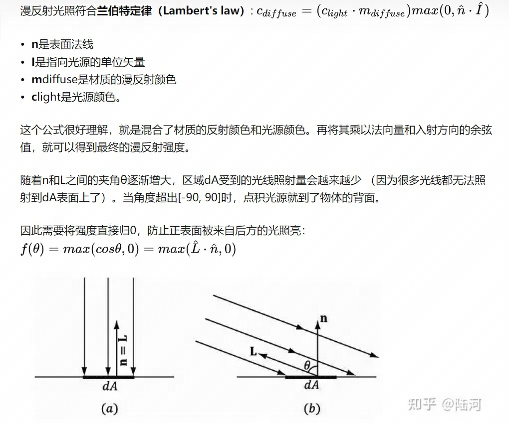
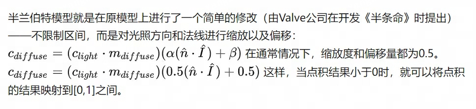

# 光照

## 光照模型

### 模拟光照

模拟真实光照环境来生成一张图像，需要考虑三种物理现象

- 首先，光线从光源射出
- 然后，光线和场景中的物体相交：一些被吸收，一些被散射到其它地方
- 最后，摄像机吸收了一些光，产生一张图像

#### 辐照度

辐照度(irradiance): 垂直于I的单位面积上单位事件穿过的能量

E(x) = dΦ(x) / dS E(x)表示辐射照度 Φ(x)表示辐射通量 S表示面积

一般来说，光照都不会和平面垂直，因此需要使用光源方向和表面法线之间的夹角余弦值得到照射面积

#### 吸收和散射

- 散射(scattering)和吸收(absorption)
- 散射只会改变光线的方向，而不改变光线的密度和颜色
- 吸收只会改变光线的密度和颜色，而不会改变光线的方向

- 折射(refraction)或透射(transmission)
- 光线在物体表面经过散射后，会散射到内部，称之为折射或投射

- 反射(reflection)
- 散射到外部，称之为反射

在折射进入物体内部的光线还会与内部颗粒进行相交，一些光线最后会重新发射出物体表面，而一些则被吸收

那些重新发射出去的光线将具有和入射光线不同方向分布和颜色

为了区分这两种不同的散射方向，在光照模型中使用不同的部分计算他们

- 高光反射 specular 部分表示物体表面是如何反射光线的
- 漫反射 diffuse 部分表示有多少光线会被折射、吸收、散射出表面

#### 着色

着色shading。根据材质属性、光源信息，使用一个等式去计算沿某个观察方向的出射度的过程。这个灯饰也被称为光照模型（Lighting Model）

#### BRDF光照模型

当已知光源位置和方向、视角方向时，我们就需要知道一个表面是如何和光照进行交互的

BRDF(Bidirectional refectance distribution function)包含了对给定模型表面上的一个点的外观的完整描述

### 标准光照模型

#### 环境光

在真实的光照情况下，一个物体也可能会被间接光照所照亮

#### 自发光

光线也可以直接由光源进入摄像机。标准光照模型使用自发光来计算这个部分的贡献度。直接使用改材质的自发光颜色

#### 漫反射

漫反射光照用于对那些被物体表面随机散射到各个方向的辐射度进行建模。在漫反射中，视角的位置并不重要，可以认为在任何反射方向上的分布都是一样的。

- 兰伯特光照模型 
- 半兰伯特光照模型 

#### 高光反射


- Phong光照模型
  - mgloss 是材质的光泽度（gloss），也被称为反光度（shininess）。用于控制高光区域的亮点有多宽。他的值越大，亮点就越小
  - mspecular 是材质的高光反射颜色，用于控制该材质对于高光反射的强度和颜色
  - clight 则是光源的颜色和强度，同样，也需要防止（v*r）结果为负数
- Blinn-Phong光照模型

#### 逐像素还是逐顶点

- 在顶点着色器中计算，称为逐顶点光照（per-vertex lighting）。
  - 也被称为高洛德着色（Gouraud shading）。在逐顶点光照中，对每个顶点计算光照，然后在渲染图元内部进行线性插值，最后输出像素颜色。由于顶点数量小于像素，因此逐顶点光照的计算量往往小于逐像素光照。但是逐顶点光照依赖于线性插值，因此当光照模型中有非线性计算时，逐顶点光照就会出现问题。
  - 而且由于逐顶点光照会在渲染图元内部对顶点颜色进行插值，这会导致渲染图元内部的颜色总是暗与顶点处的最高颜色值，某些情况下会产生明显的棱角现象。
- 在片元着色器中计算，称为逐像素光照（per-pixel lighting）
  - 在逐像素光照中，以每个像素为基础，得到他的法线（通过顶点法线插值或者法线纹理采样得到），然后计算光照模型。这种在面片之间对顶点法线进行插值的技术称为Phong着色（Phong shading），也称为Phong插值或法线插值着色技术。

#### Unity中的环境光和自发光

#### 实现漫反射光照模型

#### 实现高光反射模型

### 公式总结

漫反射 - 兰伯特模型

```C#
fixed3 diffuse = _LightColor0.rgb * _Diffuse.rgb * saturate(dot(worldNormal, worldLight));
```

漫反射 - 半兰伯特模型

```C#
fixed3 diffuse = _LightColor0.rgb * _Diffuse.rgb*(0.5*dot(worldNormal, worldLightDir) + 0.5); 
```

高光反射 - Phong光照模型

```C#
fixed3 reflectDir = normalize(reflect(-worldLightDir, worldNormal));

fixed3 specilar = _LightColor0.rgb * _Specular.rgb * pow(saturate(dot(reflectDir, viewDir)), _Gloss);
```

高光反射 - Blinn-phong模型

```C#
fixed3 worldLightDir = normalize(_WorldSpaceLightPos0.xyz);
fixed3 viewDir = normalize(_WorldSpaceCameraPos.xyz - i.worldPos.xyz);

fixed3 halfDir = normalize(worldLightDir + viewDir);


fixed3 specular = _LightColor0.rgb * _Specular.rgb * pow(max(0, dot(worldNormal, halfDir)), _Gloss);
```
