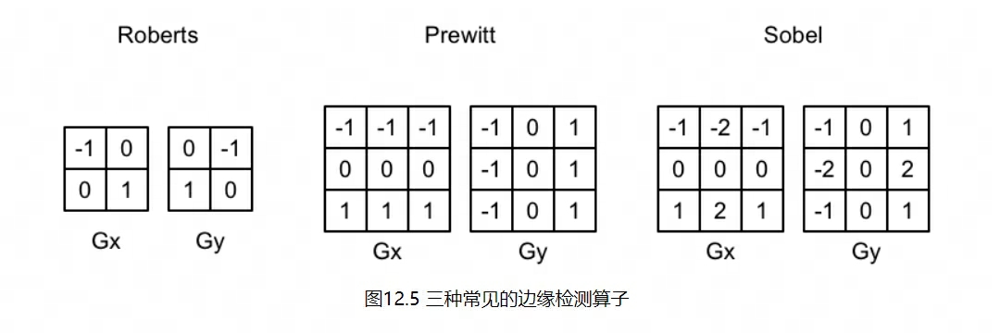
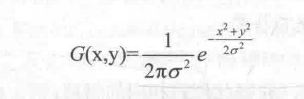

# Post-Processing 后处理

想要实现屏幕后处理的基础在于得到选然后的屏幕图像,即抓取屏幕,Unity为我们提供了一个方便的接口 OnRenderImage 函数; 函数声明如下

```C#
Monobehavior.OnRenderImage(RenderTexture src, RenderTexture dest);

// 在 OnRenderImage 函数中,我们通常是利用Graphics.Blit 函数来完成对渲染纹理的处理

public static void Blit(Texture src, RenderTexture dest);
public static void Blit(Texture src, RenderTexture dest, Material mat, int pass = -1);
public static void Blit(Texture src, Material mat, int pass = -1);

// 参数pass默认值为-1,表示将会依次调用Shader内的所有Pass.否则,只会调用给定索引的Pass
// 默认情况下,OnRenderImage函数会在所有不透明和透明的Pass执行完毕后被调用,以便对场景中的所有游戏对象都产生影响
// 如果想在不透明Pass执行完毕后立即调用OnRenderImage,我们可以在OnRenderImage函数前添加ImageEffectOpaque属性来实现这样的需求
```

## 屏幕亮度，饱和度，对比度

- 亮度 Brightness // 原颜色乘以亮度系数(_Brightness)即可

```C#
fixed3 finalColor = renderTex.rgb * _Brightness;
```

- 饱和度 Saturation // 计算该像素的亮度值Luminance，这是通过对每个颜色分量乘以一个特定的系数再相加得到的，使用该颜色值创建一个饱和度为0的颜色值，并使用_Saturation属性在其和上一步得到的颜色之间进行插值，从而得到希望的饱和色

```C#
fixed luminance = 0.2125 * color.r + 0.7154 * color.g + 0.0721 * color.b;
fixed3 luminanceColor = fixed3(luminance, luminance, luminance);
finalColor = lerp(luminanceColor, finalColor, _Saturation);
```

- 对比度 Contrast // 首先闯将一个对比度为0的颜色值（各分量为0.5），再使用_Contrast属性和上一步得到的颜色之间进行插值

```C#
fixed3 avgColor = fixed3(0.5, 0.5, 0.5);
finalColor = lerp(avgColor, finalColor, _Contrast);
```

## 边缘检测

边缘检测是描边效果的一种实现方法，原理是利用一些边缘检测算子对图像进行卷积操作（convolution）

### 什么是卷积

在图像处理中，卷积操作指的就是使用一个卷积核(kernel)对一张图像中的每个像素进行一系列的操作。卷积核通常是一个四方形网格结构，该区域的每个方格都有一个权重值。当对图像中的某个像素进行卷积时，我们会把卷积核的中心放置于该像素上，翻转核之后再依次计算核中每个元素和其覆盖的图像像素值的成绩并求和，得到的结果就是该位置的新像素值

### 常见的边缘检测算子



## 高斯模糊

模糊的实现有很多方法，例如均值模糊、中值模糊

- 均值模糊：使用了卷积操作，它使用的卷积核中的各个元素值都相等，且相加等于1，也就是说，卷积后得到的像素值是其邻域内各个像素值的平均值
- 中值模糊：选择邻域内对所有像素排序后的中值替换掉原颜色
- 高斯模糊：同样使用卷积计算，它使用的卷积核为高斯核，高斯核是一个正方形大小的滤波核，每个元素都基于高斯方程


## Bloom

Bloom实现原理非常简单，我们首先更具一个阈值提取图像中的较亮区域，把他们存储在一张渲染纹理中，再利用高斯模糊对这张渲染纹理进行牧户处理，模拟光线扩散效果，最后再将其和原图像进行混合，得到最终效果

## 运动模糊

运动模糊是真实世界中的摄像机的一种效果。如果在摄像机曝光时，拍摄场景发生了变化，就会产生模糊的画面

- 累计缓存(accumulation buffer) 利用一块累计缓存来混合多张连续的图像，当物体快速移动产生多张图像后，我们取他们之间的平均值作为最后的运动模糊图像
- 速度缓存(velocity buffer) 这个缓存中存储了各个像素当前的运动速度，然后利用该值来决定模糊的大小和方向
