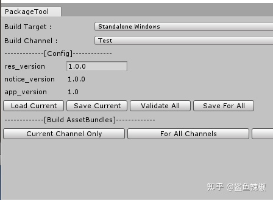
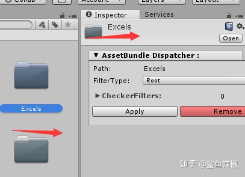
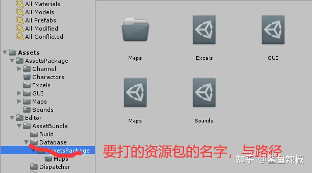

# 游戏框架

## 框架内容简介

- 热更新方案
- 资源管理方案
- 与游戏制作相关的工具，比如配置表，UI框架，时间管理，定时器，IO，Debug模块等
- 采用什么样的开发模式来组织业务逻辑代码，Unity是基于组件化开发模式的，很多游戏框架也会做一些小的改动来定义项目中的开发模式，比如有些框架用状态机作为流程切换与管理的主线，有些用传统的方式夹做流程与管理的主线，具体可以根据自己要做的游戏类型，开发习惯，与团队成员的技术能力等来分析与选择

### 热更新 - 商业框架必备：当前流行的开源模块

新项目，推荐使用基于 IL2CPP vm的热更新方式**HuaTuo**/**HybirdCLR**，选择这两种最大好处是几乎不会影响到正常的Unity开发

- [HuaTuo](https://github.com/tuyoogame/huatuo)
- [HybirdCLR](https://github.com/focus-creative-games/hybridclr)
- [xLua](https://github.com/Tencent/xLua)

### 资源管理

- [YooAsset](https://github.com/tuyoogame/YooAsset)
- 传统的 Resources 方案以被淘汰
- 基于纯AssetsBundle的方案
  - 代码如何加载资源: 先加载AssetsBundle, 然后再从AssetsBundle里面读取资源出来。这种方式确实能读取到资源，但是有一个很严重的问题，那就是开发的时候，每次都要对资源打ab包，每次多加一个资源的时候要多打一次ab包，这样，其实用起来是不方便的。所以我们想了个办法，通过条件编译，加一个预定义开关，如果是编辑器调试模式，那么我们直接使用AssetsDataBase.load来加载资源，不用打ab包，如果是发布模式，才从Ab包里面读取资源。这样开发的时候不用管ab包，打包发布的时候来做ab包即可
  - AssetsBundle资源包放哪里呢 AssetsBundle资源包非常灵活，既可以放远程服务器，又可以放本地，接下来我们一起来看下AssetsBundle资源包如何存放，如何更新。打包的时候，如果你想打入到安装包里面去，那么我们可以把Ab资源包放StreammingAssets目录下，打包进去。加载的时候，使用UnityWebRequest加载StreammingAssets目录下的ab包。如果打空包, 那么StreammingAssets不放任何资源包就可以了。AssetsBundle更新的时候, 先根据版本判断，下载最新的AssetsBundle到私有可写目录下(每个应用，在操作系统上都有自己的一个可写的私有目录)
  - 如何使用更新AssetsBundle包 下载AssetsBundle到app私有目录以后, 编写一个加载AssetsBundle的接口，这个函数里面，先去私有目录下找, 是否有对应的AssetsBundle,如果有，就从私有目录加载，如果没有，就从本地的StreammingAssets路径下加载。这样就能保证，每次优先从私有下载目录下加载AssetsBundle资源包
  - 资源包要分平台与渠道 我们知道不同的平台(win64, x86, Mac, iOS Android) 要打不同的资源包，所以我们一般会扩展编辑器，统一一个窗口来管理与打包AssetsBundle资源包。 每次打包的时候，你知道打的是哪个平台，哪个渠道哪个版本的资源包,输出的时候也分平台分渠道。
  - 非常方便的指定哪些资源要导入到哪个ab包 我们把资源分类放好以后, 打ab包的时候，要新建ab包的名字，指定哪些资源要打入ab包，这个过程，如果用手动的话，肯定会很麻烦，而且容易出错。我们总结一下，一般我们的资源都是按照逻辑，分类放好的，所以一个文件夹或子文件夹的资源，可以打到一个ab包，有了这些以后，我们就做一个自动化指定资源包的编辑器扩展。要打包的文件或文件夹，创建一个数据库文件出来，打包的时候，遍历这些数据库文件，根据文件路径，将路径下的资源打入资源包里面
  
  
- 基于Addressable的资源管理

### 游戏数据配置表框架

- [luban](https://github.com/focus-creative-games/luban) luban更完善与强大，能处理好{excel(csv,xls,xlsx)、json、bson、xml、yaml、lua、unity ScriptableObject} => {binary、json、bson、xml、lua、yaml、erlang、 custom format}等格式
- [falshExcel](https://github.com/nizhenchao/FlashExcel)  FlashExcel专门处理配置表格

### 如何能定制好自己的游戏框架

游戏框架的核心就是定义一种针对某种类型项目的开发的协作与管理的方式。作为架构师如何能够定制好自己的游戏框架，我觉得重要的有几点

- 掌握基本的原理原则与处理方式。虽然很多东西不用我们写，但是基本的原理原则和使用方式我们要知道，比如打空包，技术原理是如何做的，比如增量更新技术原理是如何做的，比如热更新的技术原理如何等，这些能够帮助我们更好的使用与阅读维护别人写的底层的库。为什么很多小伙伴自己用库，怎么都用不好，看不懂，其实就是知识的储备量不够，如果你能了解主流的解决方案与思路，再去看别人写的源码，你会发现开源库的好处就是别人花了大量的时间做了你要做的工作，而且还不用自己亲自动手,前提是你有和作者接近的知识储备，所以我们要注重我们的基础知识与基本原理原则的学习与积累。
- 搭建商用游戏框架还有重要的一个点就是先学习别人搭建的游戏开发框架是如何组织管理项目的，它们的设计的优点与缺点是什么? 适合哪些游戏，哪些项目。很多人可能在公司用GameFramework/MotionFramework等，虽然我不建议大家在没有搞懂自己的游戏类型与开发管理方式是否与这类框架本身的理念符合时就盲目的使用开源的游戏框架，而不是自己定制，但是我还是推荐大家学习一些游戏开发框架的组织方式与设计理念，为定制你自己的开发流做好一些设计准备
