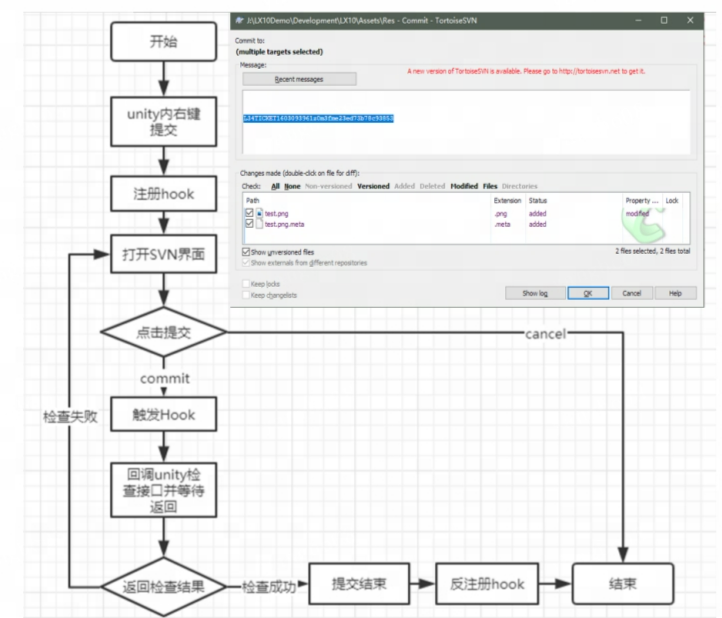

# 资源相关

## 为什么做资源检查

### 追求更好的美术表现带来的必然问题

- 广度
  - 广度上来看，变长的流程，变多的资源，更多程序实现的表现技术的接入，会使得流程更复杂，中间资源变多，美术学习成本增加，会让美术在制作过程中更容易产生失误，造成bug
  - 制作流程复杂化，增加了测试复杂度，测试工作量增加，更容易产生疏漏
- 深度
  - 资源本身变得更加复杂精细，资源制作时要考虑的维度增加，本身也变得更加容易出现问题

### 帮助游戏开发更好的梳理流程

- 检查工具可以帮助我们提前发现问题
- 可以帮助项目确定规范
- 可以减少很多误操作
- 减少手工测试,回归测试的工作量

## 如何做资源检查

- 广度
  - 在资源检查的范畴内做了哪些工作，在哪些不同的节点做了资源的检查，这些不同节点设置检查的目的是什么
- 深度
  - 每一个具体需求从发现到实现到后续跟进的过程

### 可以在哪些节点做资源检查

- 程序实现的美术工具内
  - 美术同学在引擎外制作好资源后，原始的资源格式经常无法直接导入后使用，需要通过程序接口后才可以生成可以打包进入包体的资源。
  - 一般情况下，程序同学这时候会在对应的程序工具内加入相应的检查帮助美术来自查，而我们作为产品 QA，也要对这部分工具的功能和已实现的检查接口保持知情，如果有对应的检查脚本是提供给美术同学自查的，可以在对应的美术工具上添加

- Unity内的资源提交检查
  - 
- 每日定时检查
- 打包检查&打包资源日志
- Unity外基于python的静态检查

### 实现一个检查脚本 & 难点

- 确定需求，确定规范
- 实现检查脚本
- 跟进检查错误

## 资源检查的范围，作用效果

### 实现错误

### 不规范（与约定不同）

### 性能相关
