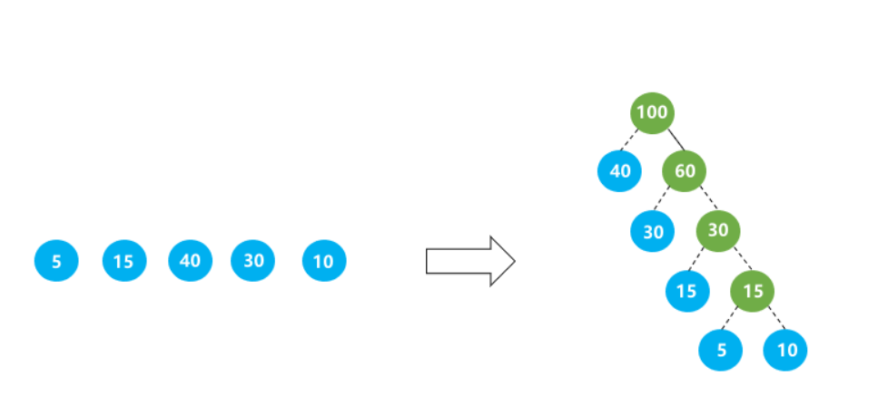

# 算法6

## 计算三叉搜索树的高度

定义构造三叉搜索树规则如下: 每个节点都存有一个数，当插入一个新的数时，从根节点向下寻找，直到找到一个合适的空节点插入查找的规则是:

1.如果数小于节点的数减去500，则将数插入节点的左子树

2.如果数大于节点的数加上500，则将数插入节点的右子树

3.否则，将数插入节点的中子树

给你一系列数，请按以上规则，按顺序将数插入树中，构建出一棵三叉搜索树，最后输出树的高度。

输入描述：

- 第一行为一个数N，表示有N个数，`1<=N<=10000`
- 第二行为N个空格分隔的整数，每个数的范围为`[1,10000]`

输出描述：输出树的高度(根节点的高度为1)

```yaml
输入
5
5000 2000 5000 8000 1800
输出
3
说明
最终构造出的树如下，高度为3
```

```js
class TreeNode {
	constructor(val) {
		this.val = val;
		this.left = null;
		this.mid = null;
		this.right = null;
	}
}
class Tree {
	insert (root, val) {
		if (root === null) {
			return new TreeNode(val);
		}

		if (val < root.val - 500) {
			root.left = this.insert(root.left, val)
		} else if (val > root.val + 500) {
			root.right = this.insert(root.right, val)
		} else {
			root.mid = this.insert(root.mid, val)
		}

		return root; // 返回根节点
	}
	getHeight (root) {
		if (root === null) {
			return 0;
		}
		let leftHeight = this.getHeight(root.left);
		let midHeight = this.getHeight(root.mid);
		let rightHeight = this.getHeight(root.right);

		return Math.max(leftHeight, midHeight, rightHeight) + 1;
	}
}

let tree = new Tree();
let root = null;
const readline = require('readline')
const rl = readline.createInterface({
	input: process.stdin,
	output: process.stdout,
})
rl.on('line', (line) => {
	const N = parseInt(line);
	rl.on('line', (line2) => {
		const numbers = line2.split(' ').map(Number);
		for (let number of numbers) {
			root = tree.insert(root, number)
		}
		const height = tree.getHeight(root);
		console.log(height);
	})
})
```

## 石头剪刀布游戏

石头剪刀布游戏有 3 种出拳形状：石头、剪刀、布。分别用字母 A , B , C 表示。

游戏规则:

出拳形状之间的胜负规则如下： A > B；B > C；C > A；">"左边一个字母，表示相对优势形状。右边一个字母，表示相对劣势形状。 当本场次中有且仅有一种出拳形状优于其它出拳形状，则该形状的玩家是胜利者。否则认为是平局。 当发生平局，没有赢家。有多个胜利者时，同为赢家。

例如 1： 三个玩家出拳分别是A, B, C ，由于出现三方优势循环(即没有任何一方优于其它出拳者)，判断为平局。

例如 2： 两个玩家，出拳分别是 A, B ，出拳 A 的获胜。

例如 3： 三个玩家，出拳全部是 A ，判为平局。

输入描述：

在一场游戏中，每个玩家的信息为一行。玩家数量不超过 1000 。每个玩家信息有 2 个字段，用空格隔开：

玩家 ID：一个仅由英文字母和数字组成的字符串
出拳形状：以英文大写字母表示, A 、B 、C 形状。 例：

```yaml
abc1 A
xyz B
```

输出描述：

输出为赢家的玩家 ID 列表(一个或多个)，每个 ID 一行，按字符串升序排列。如果没有赢家，输出为"NULL"字符串。例如：

```yaml
abc1
```

```yaml
abc1 A  
xyz A

输出 NULL
```


```js
const readline = require('readline');
const rl = readline.createInterface({
	input: process.stdin,
	output: process.stdout,
})

let shapeMap = new Map();
rl.on('line', (line) => {
	const [palyerId, shape] = line.split(' ')
	if (shapeMap.has(shape)) {
		shapeMap.get(shape).push(playerId)
	} else {
		shapeMap.set(shape, [playerId])
	}
}).on('close', () => {
	if (shapeMap.size !== 2) {
		console.log('NULL')
		process.exit(0)
	}
	let winners;

	if (shapeMap.has('A') && shapeMap.has('B')) {
		winners = shapeMap.get('A');
	} else if (shapeMap.has('B') && shapeMap.has('C')) {
		winners = shapeMap.get('B');
	} else if (shapeMap.has('C') && shapeMap.has('A')) {
		winners = shapeMap.get('C');
	} else {
		console.log('NULL')
		process.exit(0)
	}

	winners.sort()
	for (let i = 0; i < winners.length; i++) {
		console.log(winners[i])
	}
})
```

## 多段数据压缩

下图中，每个方块代表一个像素，每个像素用其行号和列号表示。为简化处理，多段线的走向只能是水平、竖直、斜向45度。

上图中的多段线可以用下面的坐标串表示：(2, 8), (3, 7), (3, 6), (3, 5), (4, 4), (5, 3), (6, 2), (7, 3), (8, 4), (7, 5)。

但可以发现，这种表示不是最简的，其实只需要存储6个蓝色的关键点即可，它们是线段的起点、拐点、终点，而剩下4个点是冗余的。

即可以简化为：（2,8）、（3,7）、（3,5）、（6,2）、（8,4）、（7,5）

现在，请根据输入的包含有冗余数据的多段线坐标列表，输出其最简化的结果。

输入描述：

2 8 3 7 3 6 3 5 4 4 5 3 6 2 7 3 8 4 7 5

- 1、所有数字以空格分隔，每两个数字一组，第一个数字是行号，第二个数字是列号；
- 2、行号和列号范围为`[0,64)`，用例输入保证不会越界，考生不必检查；
- 3、输入数据至少包含两个坐标点。

输出描述：

2 8 3 7 3 5 6 2 8 4 7 5

- 压缩后的最简化坐标列表，和输入数据的格式相同。

备注: 输出的坐标相对顺序不能变化。

```js
function isTrunPoint(prev, curr, next) {
	const dx1 = curr[0] - prev[0]
	const dy1 = curr[1] - prev[1]
	const dx2 = next[0] - curr[0]
	const dy2 = next[1] - curr[1]

	return dx1 * dy2 !== dy1 * dx2;
}
function simplifyPath(points) {
	if (points.length < 2) return points;
	const result = [points[0]]
	for (let i = 1; i < points.length - 1; i++) {
		if (isTrunPoint(points[i - 1], points[i], points[i + 1])) {
			result.push(point[i])
		}
	}
}
const readline = require('readline');
const rl = readline.createInterface({
	input: process.stdin,
	output: process.stdout,
})

const points = []
rl.on('line', (line) => {
	const nums = line.split(' ').map(Number);
	for (let i = 0; i < nums.length; i += 2) {
		points.push([nums[i], nums[i + 1]])
	}
	el.close()
}).on('close', () => {
	const simplifiedPoints = simplifyPath(points);
	const output = simplifiedPoints.map(point => {
		return point.join(' ')
	}).join(' ')
	console.log(output);
	process.exit(0);
})
```

## 求字符串中所有整数的最小和

输入字符串s，输出s中包含所有整数的最小和

说明

- 字符串s，只包含 `a-z A-Z +- `；
- 合法的整数包括
	- 1）正整数 一个或者多个0-9组成，如 0 2 3 002 102
  - 2）负整数 负号 - 开头，数字部分由一个或者多个0-9组成，如 -0 -012 -23 -00023


输入描述：包含数字的字符串

输出描述：所有整数的最小和

```yaml
输入：
bb1234aa

输出：
10

bb12-34aa

输出 -31
说明 1 + 2 - 34 = 31;
```

```js
function getMinSum (str) {
	let numArr = str.split(/[^\d-]+/);
	let res = 0;

	function getNumSum(num) {
		let sum = 0;
		for (let c of num) {
			sum += parseInt(c);
		}
		return sum;
	}

	for (let i = 0; i < numArr.length; i++) {
		if (numArr[i]) {
			if (numArr[i].indexOf('-') === -1) {
				res += getNumSum(numArr[i]);
			} else {
				let isNeg = numArr[i].startsWith('-');
				let subStrs = numArr[i].split('-');
				for (let i = 0; i < subStrs.length; i++) {
					if (subStrs[i]) {
						let ele = parseInt(subStrs[i])
						if (i === 0) {
							res += isNeg ? (0 - ele) : getNumSum(subStrs[i])
						} else {
							res -= ele;
						}
					}
				}
				
			}
		}
	}
	console.log(res);
}
```

## 求幸存数之和

给一个正整数列nums，一个跳数jump，及幸存数量left。运算过程为:

- 从索引为0的位置开始向后跳，中间跳过 J 个数字，命中索引为 J+1的数字，该数被敲出，并从该点起跳，以此类推，直到幸存left个数为止。然后返回幸存数之和。

约束:

0是第一个起跳点。

起跳点和命中点之间间隔jump 个数字，已被敲出的数字不计入在内。

跳到末尾时无缝从头开始(循环查找)，并可以多次循环。

若起始时 left > len(nums) 则无需跳数处理过程。

```yaml
/**
*
* @param nums  正整数数列，长度范围 [1,10000]
* @param jump  跳数，范围 [1,10000]
* @param left  幸存数量，范围 [1,10000]
* @return 幸存数之和
*/
int sumOfLeft(int[] nums,int jump,int left)
```

```yaml
输入：
[1,2,3,4,5,6,7,8,9],4,3

输出：
13

说明：
从1(索引为0)开始起跳,中间跳过4个数字因此依次删除 6,2,8,5,4,7。 剩余 1,3,9,返回和为13
```

```js
const readline = require('readline')
const rl = readline.createInterface({
	input: process.stdin,
	output: process.stdout
})

let nums = []
let jump = 0;
let left = 0;

rl.on('line', (line) => {
	if (!this.nums.length) {
		this.nums = line.split(',').map(Number)
	} else if (!jump) {
		jump = parseInt(line);
	} else if (!left) {
		left = parseInt(line);
		console.log(sumOfLeft(nums, jump, left))
		rl.close()
	}
})

function sumOfLeft(nums, jump, left) {
	if (left >= nums.length) {
		return nums.reduce((acc, cur) => {
			return acc + cur
		}, 0)
	}
	let index = 0;
	let list = nums.slice();
	while (list.length > left) {
		index = (index + jump + 1) % list.length;

		list.splice(index, 1)

		index = index - 1;
	}

	return list.reduce((acc, cur) => {
		return acc + cur;
	}, 0)
}
```

## 悄悄话

给定一个二叉树，每个节点上站一个人，节点数字表示父节点到该节点传递悄悄话需要花费的时间。

初始时，根节点所在位置的人有一个悄悄话想要传递给其他人，求二叉树所有节点上的人都接收到悄悄话花费的时间。

输入描述：

0 9 20 -1 -1 15 7 -1 -1 -1 -1 3 2 (-1 表示空节点)

输出描述：返回所有节点都接收到悄悄话花费的时间

```js
const readline = require('readline')
const rl = readline.createInterface({
	input: process.stdin,
	output: process.steout,
})
rl.on('line', (line) => {
	const allNums = line.split(' ').map(Number)
	let maxTime = 0;

	const nodeQueue = []
	nodeQueue.push(0);

	while (nodeQueue.length) {
		const parentNodeIndex = nodeQueue.shift();

		const leftIndex = 2 * parentNodeIndex + 1;
		const rightIndex = 2 * parentNodeIndex + 2;
		if (leftIndex < allNums.length && allNums[leftIndex] !== -1) {
			allNums[leftIndex] += allNums[parentNodeIndex]
			nodeQueue.push(leftIndex)
			maxTime = Math.max(maxTime, allNums[leftIndex])
		}
		if (rightIndex < allNums.length && allNums[rightIndex] !== -1) {
			allNums[rightIndex] += allNums[parentNodeIndex]
			nodeQueue.push(rightIndex)
			maxTime = Math.max(maxTime, allNums[rightIndex])
		}
	}
	console.log(maxTime);
	rl.close();
})
```

## 密码解密

给定一段“密文”字符串 s，其中字符都是经过“密码本”映射的，现需要将“密文”解密并输出。

映射的规则（'a' ~ 'i'）分别用（'1' ~ '9'）表示；（'j' ~ 'z'）分别用（"10*" ~ "26*"）表示。

约束：映射始终唯一。

输入描述：“密文”字符串

输出描述：明文字符串

备注：翻译后的文本长度在100以内

```yaml
20*19*20*

输出tst
```

```js
const readline = require('readline')
const rl = readline.createInterface({
	input: process.stdin,
	output: process.stdout
})
rl.on('line', (line) => {
	let s = line;
	const replaceEles = Array.from({
		length: 26
	}, (_, i) => {
		return [i + 1, String.fromCharCode(97 + i)]
	})

	replaceEles.reverse().forEach(([key, val]) => {
		s = s.replaceAll(key >= 10 ? `${key}*` : key.toString(), val);
	})

	console.log(s)
})
```

## 生成哈夫曼树

给定长度为 n 的无序的数字数组，每个数字代表二叉树的叶子节点的权值，数字数组的值均大于等于 1 。

请完成一个函数，根据输入的数字数组，生成哈夫曼树，并将哈夫曼树按照中序遍历输出。

为了保证输出的二叉树中序遍历结果统一，增加以下限制:

- 在树节点中，左节点权值小于等于右节点权值，根节点权值为左右节点权值之和。
- 当左右节点权值相同时，左子树高度高度小于等于右子树。

注意: 所有用例保证有效，并能生成哈夫曼树提醒:哈夫曼树又称最优二叉树，是一种带权路径长度最短的一叉树。

所谓树的带权路径长度，就是树中所有的叶结点的权值乘上其到根结点的路径长度(若根结点为 0 层，叶结点到根结点的路径长度为叶结点的层数)

输入描述：

例如：由叶子节点 5 15 40 30 10 生成的最优二叉树如下图所示，该树的最短带权路径长度为 40∗1+30∗2+15∗3+5∗4+10∗4=205。



输出描述：输出一个哈夫曼的中序遍历数组，数值间以空格分隔

```yaml
输入：
5
5 15 40 30 10

输出：
40 100 30 60 15 30 5 15 10

说明：
根据输入，生成哈夫曼树，按照中序遍历返回。所有节点中，左节点权值小于等于右节点权值之和。当左右节点权值相同时左子树高度小于右子树。结果如上图
```

```js
class Node {
	constructor (value) {
		this.value = value;
		this.left = null;
		this.right = null;
	}
}
class MinPriorityQueue {
	constructor () {
		this.elements = []
	}
	enqueue(element) {
		this.elements.push(element);
		this.elements.sort((a, b) => a.value - b.value);
	}
	dequeue() {
		return this.elements.shift(); // 移除并返回数组第一个元素
	}
	isEmpty() {
		return this.elements.length === 0;
	}
}
function buildHuffmanTree (values) {
	const pq = new MinPriorityQueue();
	values.forEach(value => {
		pq.enqueue(new Node(value))
	})

	while (pq.elements.length > 1) {
		let left = pq.dequeue();
		let right = pq.dequeue();
		const parent = new Node(left.value + right.value);
		parent.left = left;
		parent.right = right;
		pq.enqueue(parent);
	}

	return pq.dequeue();
}
function inorderTraversal(root) {
	if (root) {
		inorderTraversal(root.left);
		console.log(root.value)
		inorderTraversal(root.right);
	}
}

const readline = require('readline')
const rl = readline.createInterface({
	input: process.stdin,
	output: process.stdout
})
rl.on('line', (n) => {
	rl.on('line', (line) > {
		const values = line.split(' ').map(Number)
		const root = buildHuffmanTree(values);
		const result = ''
		console.log(reslut);
		rl.close();
	})
})
```

## 核酸检测

为了达到新冠疫情精准防控的需要，为了避免全员核酸检测带来的浪费，需要精准圈定可能被感染的人群。

现在根据传染病流调以及大数据分析，得到了每个人之间在时间、空间上是否存在轨迹的交叉。

现在给定一组确诊人员编号 (X1,X2,X3,…Xn)在所有人当中，找出哪些人需要进行核酸检测，输出需要进行核酸检测的数。

(注意:确诊病例自身不需要再做核酸检测)需要进行核酸检测的人，是病毒传播链条上的所有人员，即有可能通过确诊病例所能传播到的所有人。

例如:A是确诊病例，A和B有接触、B和C有接触 C和D有接触，D和E有接触。那么B、C、D、E都是需要进行核酸检测的人

输入描述：

- 第一行为总人数N
- 第二行为确证病例人员编号`（确证病例人员数量<N），用逗号隔开`
- 接下来N行，每一行有N个数字，用逗号隔开，其中第i行的第j个数字表名编号i是否与编号j接触过。0表示没有接触，1表示有接触

备注：

- 人员编号从0开始
- `0 < N < 100 0<N<1000<N<100`

输出描述：输出需要做核酸检测的人数

```yaml
5
1,2
1,1,0,1,0
1,1,0,0,0
0,0,1,0,1
1,0,0,1,0
0,0,1,0,1

输出 3
```

```js
// num 5;
// confirmedCases 1,2
// inputs ['1,1,0,1,0', '1,1,0,0,0']
function getHesuanNum (num, confirmedCases, inputs) {
	confirmedCases = confirmedCases.split(',').map(Number);
	let visited = new Array(num).fill(false);
	let contacts = Array.from({ length: num }, () => {
		return Array(N).fill(false);
	})
	inputs.forEach(value => {
		let split = value.split(',');
		contacts[i] = split.map(value => value === 1);
	})

	function dfs (contacts, visited, start) {
		visited[start] = true;
		for (let i = 0; i < contacts.length; i++) {
			if (contacts[start][i] && !visited[i]) {
				dfs(contacts, visited, i);
			}
		}
	}
	// 对确诊病例进行深度优先搜索
	confirmedCases.forEach((caseIndex) => {
		dfs(contacts, visited, caseIndex);
	})
	let count = 0;
	visited.forEach((hasVisited, index) => {
		if (hasVisited && !confirmedCases.includes(i)) {
			count++;
		}
	})
	console.log(count);
}
```

## 贪吃的猴子

一只贪吃的猴子，来到一个果园，发现许多串香蕉排成一行，每串香蕉上有若干根香蕉。每串香蕉的根数由数组numbers给出。猴子获取香蕉，每次都只能从行的开头或者末尾获取，并且只能获取N次，求猴子最多能获取多少根香蕉。

输入描述：

- 第一行为数组numbers的长度
- 第二行为数组numbers的值每个数字通过空格分开
- 第三行输入为N，表示获取的次数

输出描述：按照题目要求能获取的最大数值

```yaml
输入
7
1 2 2 7 3 6 1
3
输出
10


输入
3
1 2 3
3
输出
6
说明
全部获取所有的香蕉，因此最终根数为1+2+3 = 6
```

```js
function getMaxBanner (length, banners, count) {
	let bannersArr = banners.split(' ');
	let totalBanner = bannersArr.recuce((acc, cur) => {
		return acc + cur;
	}, 0);
	if (count === bannersArr.length) {
		return totalBanner;
	}
	let minWindowSum = Infinity;
	let windowSize = length - count;
	let currentWindowCount = 0;
	for (let i = 0; i < windowSize; i++) {
		currentWindowCount += bannersArr[i];
	}
	minWindowSum = currentWindowCount;
	for (let i = windowSize; i < length; i++) {
		currentWindowCount += (number[i] - number[i - windowSize]);
		minWindowSum = Math.min(minWindowSum, currentWindowCount);
	}

	console.log(total - minWindowSum);
}
```