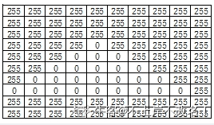

# 算法7

## 灰度图存储

黑白图像常采用灰度图的方式存储，即图像的每个像素填充一个灰色阶段值，256节阶灰图是一个灰阶值取值范围为0-255的灰阶矩阵，0表示全黑，255表示全白，范围内的其他值表示不同的灰度。

但在计算机中实际存储时，会使用压缩算法，其中一个种压缩格式描述如如下：

10 10 255 34 0 1 255 8 0 3 255 6 0 5 255 4 0 7 255 2 0 9 255 21

所有的数值以空格分隔；
前两个数分别表示矩阵的行数和列数；
从第三个数开始，每两个数一组，每组第一个数是灰阶值，第二个数表示该灰阶值从左到右，从上到下（可理解为二维数组按行存储在一维矩阵中）的连续像素个数。比如题目所述的例子， “255 34” 表示有连续 34 个像素的灰阶值是 255。
如下图所：连续34个255，1个0 再来连续8个255。



如此，图像软件在打开此格式灰度图的时候，就可以根据此算法从压缩数据恢复出原始灰度图矩阵。

请从输入的压缩数恢复灰度图原始矩阵，并返回指定像素的灰阶值。

输入描述：

输入包行两行，第一行是灰度图压缩数据，第二行表示一个像素位置的行号和列号，如 0 0 表示左上角像素。

备注：

1、系保证输入的压缩数据是合法有效的，不会出现数据起界、数值不合法等无法恢复的场景；

2、系统保证输入的像素坐标是合法的，不会出现不在矩阵中的像素；

3、矩阵的行和列数范图为:`(0,100]`;

4、灰阶值取值范图:`[0,255]`;

输出描述：输出数据表示的灰阶矩阵的指定像素的灰阶值。

```yaml
10 10 255 34 0 1 255 8 0 3 255 6 0 5 255 4 0 7 255 2 0 9 255 21
3 4

99
```

```js
```

## 手机APP防沉迷系统

智能手机方便了我们生活的同时，也侵占了我们不少的时间。“手机App防沉迷系统” 能够让我们每天合理的规划手机App使用时间，在正确的时间做正确的事

它的大概原理是这样的:

在一天24小时内，可注册每个App的允许使时段;

一个时间段只能使用一个APP， 不能在同时注册App2 和 App3;

App有优先级，数值越高，优先级越高。注册使用时段时，如果高优先级的App时间和低优先级的时段有冲突，则系统会自动注销低优先级的时段；

如果App的优先级相同，则后添加的App不能注册。

请编程实现，根据输入数据注册App，并根据输入的时间点，返回时间点注册的App名称，如果该时间点没有注册任何App，请返回字符串“NA"。

输入描述：

- 第一行表示注册的App数N `(N≤100)`
- 第二部分包括N 行，每行表示一条App注册数据
- 最后一行输入一个时间点，程序即返回注册点可App

```yaml
2
App1 1 09:00 10:00
App2 2 11:00 11:30
09:30
数据说明如下
1、N行注册数据以空格分隔，四项数依次表示: App名称、优先级、起始时间，结束时间
2.优先级1-5，数字值越大，优先级越高
3、时间格式HH:MM，小时和分钟都是两位，不足两位前面补0
4.起始时间需小于结束时间，否则注册不上
5.注册信息中的时间段包含起始时间点，不包含结束时间点
```

输出描述：输出一个字符串，表示App名称，或NA表示空闲时间。

```yaml
输入：
1
App1 1 09:00 10:00
09:30

输出：
App1

说明：
App1注册在9点到10点间，9点半可用的应用名是App1

输入：
2
App1 1 09:00 10:00
App2 2 09:10 09:30
09:20

输出：
App2

说明：
ApP1和App2的时段有冲突，App2优先级高,注册App2之后，App1自动注销，因此输出App2
```

题解

```yaml
这是一个模拟题，需要按照题目描述的规则模拟注册过程，并在给定时间点找到注册的App。

程序的解题思路和关键步骤：

定义一个App类，用于表示应用程序对象，包括应用程序名称、优先级、开始时间和结束时间。同时，在App类中实现一个方法判断两个应用程序对象是否有时间重叠。
编写convertToMinutes方法，将时间字符串转换为分钟表示的整数。
编写convertToApp方法，将输入的字符串转换为应用程序对象。
通过读取输入，获取应用程序的数量，以及每个应用程序的注册信息。将注册信息转换为App对象，并根据题目规则进行注册。如果新注册的应用程序与已有的应用程序有时间重叠，根据优先级判断是否需要注销低优先级的应用程序。
读取给定的时间点，将其转换为分钟表示的整数。
遍历已注册的应用程序列表，找到包含给定时间的应用程序。
输出结果。
该程序使用了类的封装和集合的操作，通过遍历和比较，实现了应用程序的注册和冲突处理。最后，根据给定时间点找到相应的应用程序并输出结果。

时间复杂度：O(N^2)，其中N为应用程序的数量。在每次注册应用程序时，都需要遍历已有的应用程序列表，判断是否有时间重叠。

空间复杂度：O(N)，存储了已注册的应用程序列表
```

## 小朋友来自多少小区

幼儿园组织活动，老师布置了一个任务：

每个小朋友去了解与自己同一个小区的小朋友还有几个。

我们将这些数量汇总到数组 garden 中。

请根据这些小朋友给出的信息，计算班级小朋友至少来自几个小区？

输入描述：

输入：garden[] = {2, 2, 3}

- garden 数组长度最大为 999
- 每个小区的小朋友数量最多 1000 人，也就是 garden[i] 的范围为 [0, 999]

输出描述：

输出：7

```js
const readline = require('readline');
const rl = readline.createInterface({
  input: process.stdin,
  output: process.stdout,
})
rl.on('line', (line) => {
  const input = line.split(' ');
  const zones = new Array(1000).fill(0);
  let result = 0;

  let index = 0;
  while (true) {
    if (index >= input.length) {
      break;
    } else {
      zones[input[index]] += 1;
    }
    index += 1;
  }

  for (let i = 0; i < 1000; i++) {
    if (zones[i] <= 0) {
      continue;
    } else {
      let total = Math.ceil(zones[i] / (i + 1));
      result += total * (i + 1);
    }
  }

  console.log(result);
  rl.close();
})

function aaa ([2, 2, 3]) {
  const zones = new Array(1000).fill(0);
  let result = 0;

  let index = 0;
  while (true) {
    if (index >= input.length) {
      break;
    } else {
      zones[input[index]] += 1;
    }
    index += 1;
  }

  for (let i = 0; i < 1000; i++) {
    if (zones[i] <= 0) {
      continue;
    } else {
      let total = Math.ceil(zones[i] / (i + 1));
      console.log(total, i + 1, total * (i + 1));
      result += total * (i + 1);
    }
  }

  console.log(result);
}
```

## 测试用例执行计划

某个产品当前迭代周期内有N个特性（F1, F2, ..., FN）需要进行覆盖测试，每个特性都被评估了对应的优先级，特性使用其ID作为下标进行标识。

设计了M个测试用例（T1, T2,...,TM），每个用例对应了一个覆盖特性的集合，测试用例使用其ID作为下标进行标识，测试用例的优先级定义为其覆盖的特性的优先级之和。

在开展测试之前，需要制定测试用例的执行顺序，规则为：优先级大的用例先执行，如果存在优先级相同的用例，用例ID小的先执行。

输入描述：

- 第一行输入为N和M，N表示特性的数量，M表示测试用例的数量。
- 之后N行表示特性ID=1到特性ID=N的优先级。
- 再接下来M行表示测试用例ID=1到测试用例ID=M关联的特性的ID的列表。

输出描述：按照执行顺序（优先级从大到小）输出测试用例的ID，每行一个ID。

```js
const readline = require('readline');
const rl = readline.createInterface({
  input: process.stdin,
  output: process.stdout,
})

let inputs = []
rl.on('line', (line) => {
  inputs.push(line);
}).on('close', () => {
  let [M, N] = inputs.shift().split(' ').map(Number);
  let featuresNums = inputs.slice(0, N).map(Number);

  let testCases = inputs.slice(N).map((line, index) => {
    let sum = line.split(' ').reduce((acc, cur) => {
      return acc + featuresNums[index];
    })

    return {
      id: index + 1,
      priority: sum,
    }
  })
  testCases.sort((a, b) => {
    return b.proiority - a.priority || a.id - b.id;
  })
  testCases.forEach(testCase => {
    console.log(testCase.id)
  })
})
```

## 螺旋数字矩阵

疫情期间，小明隔离在家，百无聊赖，在纸上写数字玩。他发明了一种写法:

给出数字个数n和行数m (0 < n <= 999，0 < m <= 999)，从左上角的1开始，按照顺时针螺旋向内写方式，依次写出2,3...n，最终形成一个m行矩阵。

小明对这个矩阵有些要求:

- 每行数字的个数一样多
- 列的数量尽可能少
- 填充数字时优先填充外部
- 数字不够时，使用单个*号占位

输入描述：两个整数，空格隔开，依次表示n、m

输出描述：符合要求的唯一矩阵

```yaml
输入：
9 4

输出：
1 2 3
* * 4
9 * 5
8 7 6

说明：
9个数字写成4行，最少需要3列
```

```yaml
这是一个模拟题，主要考察对矩阵的遍历和填充的能力。

首先，通过输入获取数字个数n和行数m。
计算矩阵的列数cols，根据题意，最少需要的列数是(n-1) / m + 1。
初始化一个大小为m行cols列的矩阵，所有元素初始值为"*"。
使用四个变量top、bottom、left、right来表示当前矩阵的上下左右边界。
使用cur变量表示当前要填充的数字，从1开始。
进入循环，按照顺时针螺旋的方式依次填充矩阵的数字。
从左到右：遍历当前行的左右范围，依次填充数字。
从上到下：遍历当前列的上下范围，依次填充数字。
从右到左：遍历当前行的右左范围，依次填充数字。
从下到上：遍历当前列的下上范围，依次填充数字。
在每次填充后，更新相应的边界。
循环直到所有数字都填充完毕。
最后，输出填充好的矩阵。
这样，通过模拟顺时针螺旋填充的过程，就能得到符合要求的矩阵。
```

## 堆内存申请

有一个总空间为100字节的堆，现要从中新申请一块内存，内存分配原则为:

优先分配紧接着前一块已使用的内存，分配空间足够时分配最接近申请大小的空闲内存。

输入描述：

- 第1行是1个整数，表示期望申请的内存字节数。
- 第2到第N行是用空格分割的两个整数，表示当前已分配的内存的情况，每一行表示一块已分配的连续内存空间，每行的第1个和第2个整数分别表示偏移地址和内存块大小，如: 0 1 3 2 表示0偏移地址开始的1个字节和3偏移地址开始的2个字节已被分配，其余内存空闲。

输出描述：

- 若申请成功，输出申请到内存的偏移 若申请失败，输出-1。

备注:

- 若输入信息不合法或无效，则申请失败
- 若没有足够的空间供分配，则申请失败
- 堆内存信息有区域重叠或有非法值等都是无效输入

```yaml
输入：
1
0 1
3 2

输出：
1

说明：
堆中已使用的两块内存是偏移从0开始的1字节和偏移从3开始的2字节，空闲的两块内存是偏移从1开始2个字节和偏移从5开始95字节根据分配原则，新申请的内存应从1开始分配1个字节，所以输出偏移为1。
```

```js
const readline = require('readline');
const rl = readline.createInterface({
  input: process.stdin,
  output: process.stdout,
})

let mallocSize; // 需要分配的内存大小
let useMemory = []; // 已分配的内存
rl.on('line', (line) => {
  if (!mallocSize) {
    mallocSize = parseInt(line.trim());
    if (mallocSize <= 0 || mallocSize > 100) {
      console.log(-1)
      process.exit(0);
    }
  } else {
    const memoryBlock = line.split(' ').map(Number);
    useMemory.push(memoryBlock);
  }
}).on('close', () => {
  useMemory.sort((a, b) => a[0] - b[0]);

  let start = 0;
  let bestFitStart = -1;
  let minSizeDiff = Number.MAX_SAFE_INTEGER;

  for (let block of useMemory) {
    let blockStart = block[0];
    let blockSize = block[1];

    if (blockStart < start || blockStart <= 0 || blockStart + blockSize > 100) {
      console.log(-1)
      process.exit(0);
    }
    let freeSpace = blockStart - start
    // 空闲空间
    if (mallocSize <= freeSpace && (freeSpece - mallocSize) < minSizeDiff) {
      bestFitStart = blockStart;
      minSizeDiff = freeSpace - mallocSize;
    }
    start = blockStart + blockSize;
  }
  // 检查最后一个内存块是否有足够空间
  if (100 - start >= mallocSize && (100 -start-mallocsize) < minSizeDiff) {
    bestFitStart = start;
  }
  console.log(bestFitStart)
})
```

## 单行道汽车通行时间

M`（1<=M<=20）`辆车需要在一条不能超车的单行道到达终点，起点到终点的距离为N`（1<=N<=400）`。速度快的车追上前车后，只能以前车的速度继续行驶。求最后一车辆到达目的地花费的时间。

注：每辆车固定间隔一小时出发，比如第一辆车0时出发，第二辆车1时出发，以此类推

输入描述：

- 第一行两个数字：M N分别代表车辆数和到终点的距离，以空格分隔。
- 接下来M行，每行1个数字S，代表每辆车的速度。`0<S<30`。

输出描述：

最后一辆车到达目的地花费的时间

```yaml
2 11
3
2

输出 5.5
```

```js
const readline = require('readline');
const rl = readline.createInterface({
  input: process.stdin,
  output: process.stdout,
})
let inputs = []

rl.on('line', (line) => {
  lines.push(line)
}).on('close', () => {
  const [M, N] = lines[0].split(' ').map(Number)
  const speeds = lines.slice(1, M + 1).map(Number)
  const arrivalTimes = new Array(M).fill(0)
  arrivalTimes[0] = N / speeds[0]

  for (let index = 1; index < M; index++) {
    const currentTime = N / speeds[index] + index;
    if (currentTime > arrivalTimes[index - 1]) {
      arrivalTimes[index] = currentTime;
    } else {
      arrivalTimes[index] = arrivalTimes[index - 1];
    }
  }
  console.log(arrivalTimes[M - 1] - M + 1)
})
```
