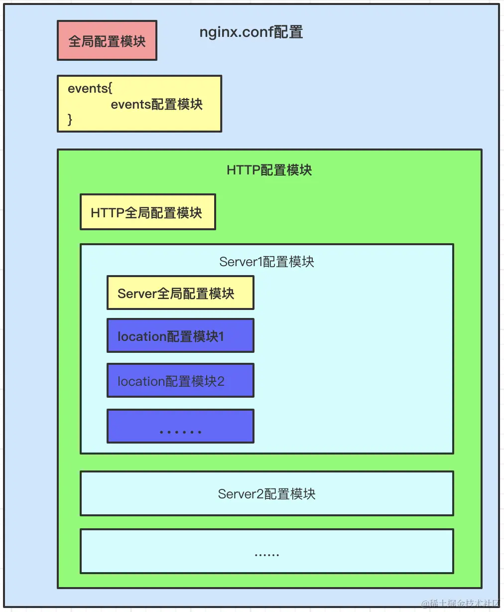

# Nginx配置指南

Nginx 是开源、高性能、高可靠的 Web 和反向代理服务器，而且支持热部署，几乎可以做到 7 * 24 小时不间断运行，即使运行几个月也不需要重新启动，还能在不间断服务的情况下对软件版本进行热更新。性能是 Nginx 最重要的考量，其占用内存少、并发能力强、能支持高达 5w 个并发连接数，最重要的是，Nginx 是免费的并可以商业化，配置使用也比较简单

使用场景

- 静态资源服务，通过本地文件系统提供服务
- 反向代理服务，延伸出包括缓存、负载均衡等
- API 服务

## 配置文件概述

- main全局块：与Nginx运行相关的全局配置
- events块: 与网络连接有关的设置
- http块：代理、缓存、日志、虚拟主机配置
- server块：虚拟主机的参数设置(一个http可包含多个server块)
- location块：定义请求路由及页面处理方式



```yaml
main        # 全局配置，对全局生效
├── events  # 配置影响 Nginx 服务器或与用户的网络连接
├── http    # 配置代理，缓存，日志定义等绝大多数功能和第三方模块的配置
│   ├── upstream # 配置后端服务器具体地址，负载均衡配置不可或缺的部分
│   ├── server   # 配置虚拟主机的相关参数，一个 http 块中可以有多个 server 块
│   ├── server
│   │   ├── location  # server 块可以包含多个 location 块，location 指令用于匹配 uri
│   │   ├── location
│   │   └── ...
│   └── ...
└── ...
```

## 配置文件示例

```shell
# 全局段配置
# ------------------------------

# 指定运行nginx的用户或用户组，默认为nobody。
#user administrator administrators;

# 设置工作进程数，通常设置为等于CPU核心数。
#worker_processes 2;

# 指定nginx进程的PID文件存放位置。
#pid /nginx/pid/nginx.pid;

# 指定错误日志的存放路径和日志级别。
error_log log/error.log debug;
# events段配置信息
# ------------------------------
events {
    # 设置网络连接序列化，用于防止多个进程同时接受到新连接的情况，这种情况称为"惊群"。
    accept_mutex on;

    # 设置一个进程是否可以同时接受多个新连接。
    multi_accept on;

    # 设置工作进程的最大连接数。
    worker_connections  1024;
}

# http配置段，用于配置HTTP服务器的参数。
# ------------------------------
http {
    # 包含文件扩展名与MIME类型的映射。
    include       mime.types;

    # 设置默认的MIME类型。
    default_type  application/octet-stream;

    # 定义日志格式。
    log_format myFormat '$remote_addr–$remote_user [$time_local] $request $status $body_bytes_sent $http_referer $http_user_agent $http_x_forwarded_for';

    # 指定访问日志的存放路径和使用的格式。
    access_log log/access.log myFormat;

    # 允许使用sendfile方式传输文件。
    sendfile on;

    # 限制每次调用sendfile传输的数据量。
    sendfile_max_chunk 100k;

    # 设置连接的保持时间。
    keepalive_timeout 65;

    # 定义一个上游服务器组。
    upstream mysvr {   
      server 127.0.0.1:7878;
      server 192.168.10.121:3333 backup;  #此服务器为备份服务器。
    }

    # 定义错误页面的重定向地址。
    error_page 404 https://www.baidu.com;

    # 定义一个虚拟主机。
    server {
        # 设置单个连接上的最大请求次数。
        keepalive_requests 120;

        # 设置监听的端口和地址。
        listen       4545;
        server_name  127.0.0.1;

        # 定义location块，用于匹配特定的请求URI。
        location  ~*^.+$ {
           # 设置请求的根目录。
           #root path;

           # 设置默认页面。
           #index vv.txt;

           # 将请求转发到上游服务器组。
           proxy_pass  http://mysvr;

           # 定义访问控制规则。
           deny 127.0.0.1;
           allow 172.18.5.54;          
        } 
    }
}
```

### location 路径映射详解

```yaml
location [ = | ~ | ~* | !~ | !~* | ^~ | @ ] uri {...}
```

标识符

- = 精确匹配
- ~ 执行正则匹配区分大小写
- ~* 执行正则匹配不区分大小写
- !~：正则匹配，区分大小写不匹配
- !~*：正则匹配，不区分大小写不匹配。
- ^~：前缀匹配。如果匹配成功，不再匹配其他location，且不查询正则表达式。
- @：指定命名的location，主要用于内部重定向请求，如 error_page 和 try_files。
- uri：待匹配的请求字符串。可以是普通字符串或包含正则表达式

优先级及示例

```shell
location = / {
    # 精确匹配 /，主机名后面不能带任何字符串
    # http://abc.com [匹配成功]
    # http://abc.com/index [匹配失败]
}

location ^~ /img/ {
    # 以 /img/ 开头的请求，都会匹配上
    # http://abc.com/img/a.jpg [匹配成功]
    # http://abc.com/img/b.mp4 [匹配成功]
}

location ~* /Example/ {
    # 忽略 uri 部分的大小写
    # http://abc.com/test/Example/ [匹配成功]
    # http://abc.com/example/ [匹配成功]
}

location /documents {
    # 如果有正则表达式可以匹配，则优先匹配正则表达式
    # http://abc.com/documentsabc [匹配成功]
}

location / {
    # http://abc.com/abc [匹配成功]
}
```

### 反向代理

反向代理是Nginx的核心功能之一，允许Nginx将来自客户端的请求转发到后端服务器，并将后端服务器的响应返回给客户端,使客户端感觉就像是直接与后端服务器通信一样

```shell
location /some/path/ {
    proxy_pass http://your_backend_address;
}
```

- proxy_pass 定义后端服务器地址
- proxy_set_header 修改从客户端传递到代理服务器的请求头
- proxy_hide_header 隐藏从代理服务器返回的响应头
- proxy_redirect 修改从代理服务器返回的响应头中的Location和Refresh头字段

```shell
server {
    listen 80;
    server_name example.com;

    location / {
        proxy_pass http://localhost:8080;
        proxy_set_header Host $host;
        proxy_set_header X-Real-IP $remote_addr;
        proxy_set_header X-Forwarded-For $proxy_add_x_forwarded_for;
    }
}
```

注意事项

- 当使用proxy_pass指令时，确保后端服务器是可用的，否则Nginx将返回错误。
- 使用proxy_set_header确保后端服务器接收到正确的请求头。
- 如果后端服务器和Nginx在不同的机器上，确保网络连接是稳定的。

### 负载均衡

当有多台服务器时，代理服务器根据规则将请求分发到指定的服务器上处理。

策略名称

- 轮询 (round robin) 默认的负载均衡方式。Nginx将客户端请求按照顺序依次分发给后端服务器，每个服务器处理相同数量的请求
- IP Hash IP哈希根据客户端IP地址计算Hash值，并将请求分配到某一台服务器上，后面该客户端的所有请求都分发到同一服务器
- 最少连接(Least Connections) 将请求分配给连接数最少的服务器。Nginx会统计哪些服务器的连接数最少
- 权重(Weighted) 加权轮询允许为每个后端服务器分配一个权重值。Nginx将根据服务器的权重比例分发请求,权重越高的服务器将接收更多的请求
- 第三方
  - fair 根据后端服务器的响应时间分配请求，响应时间短的优先分配
  - url_hash 根据请求的URL的hash结果分配请求，确保同一个URL的请求总是发给同一个后端服务器

```shell
# 轮询
upstream web_servers { server localhost:8081; server localhost:8082; }
# IP Hash
upstream web_servers { ip_hash; server localhost:8080; server localhost:8081; }
# 最小连接
upstream web_servers { least_conn; server localhost:8080; server localhost:8081; }
# 权重
upstream web_servers { server localhost:8081 weight=1; server localhost:8082 weight=2; }
# fair
upstream backend { fair; server localhost:8080; server localhost:8081; }
# url_hash
upstream backend { hash_method crc32; hash $request_uri; server localhost:8080; server localhost:8081; }
```

### 配置动静分离

动静分离是指将动态内容和静态内容分开处理。

- 静态内容通常包括：图片、CSS、JavaScript、HTML文件等，这些内容不需要经常更改。
- 动态内容则是经常变化的，如：PHP、ASP、JSP、Servlet等生成的内容

直接为静态内容设置一个别名或根目录

```shell
location ~* .(jpg|jpeg|png|gif|ico|css|js)$ {
    root /path/to/static/files;
    expires 30d;  # 设置缓存时间
}
# 在上述配置中，所有的静态文件都被存放在/path/to/static/files目录下。expires指令设置了静态文件的缓存时间
```

使用alias别名：

```shell
# 如果你的静态文件不在项目的主目录下，你可以使用alias来指定静态文件的实际路径
location /static/ {
    alias /path/to/static/files/;
}
# 在这个配置中，URL中的/static/会映射到文件系统的/path/to/static/files/
```

代理动态内容

```shell
# 对于动态内容，你可能需要将请求代理到后端的应用服务器，如Tomcat、uWSGI等。
location / {
    proxy_pass http://backend_server_address;
    proxy_set_header Host $host;
    proxy_set_header X-Real-IP $remote_addr;
}
```

### 静态资源优化

为了提高静态资源的传输效率，Nginx提供了以下三个主要的优化指令：

- sendfile 用于开启高效的文件传输模式。它通过调用系统内核的 sendfile 函数来实现，从而避免了文件的多次拷贝，同时减少了用户态和内核态之间的切换，从而提高了静态文件的传输效率
- tcp_nopush 当 sendfile 开启时，tcp_nopush 也可以被启用。它的主要目的是提高网络数据包的传输效率
- tcp_nodelay 只有在 keep-alive 连接开启时，tcp_nodelay 才能生效。它的目的是提高网络数据包的实时性

### 静态资源压缩

在数据的传输过程中，为了进一步优化，Nginx引入了gzip模块，用于对传输的资源进行压缩，从而减少数据的传输体积，提高传输效率

Nginx中的静态资源压缩可以在http块、server块、location块中配置。涉及的主要模块有

- ngx_http_gzip_module模块 (内置)
- ngx_http_gzip_static_module模块
- ngx_http_gunzip_module模块

#### Gzip模块配置指令

- gzip 开启或关闭gzip功能。
  语法：gzip on | off
  默认值：gzip off
- gzip_types 根据响应的MIME类型选择性地开启gzip压缩
  语法：gzip_types mime-type
  默认值：gzip_types text/html
  示例：gzip_types application/javascript
- gzip_comp_level 设置Gzip压缩的程度，级别从1-9
  语法：gzip_comp_level level
  默认值：gzip_comp_level 1
- gzip_vary 设置是否携带"Vary:Accept-Encoding"的响应头部。
  语法：gzip_vary on|off
  默认值：gzip_vary off
- gzip_buffers 处理请求压缩的缓冲区数量和大小。
  语法：gzip buffers number size
  默认值：gzip_buffer 32 4k | 16 8K
- gzip_disable 选择性地开启和关闭gzip功能，基于客户端的浏览器标志
  语法：gzip_disable regex
  默认值：gzip_disable -
  示例：gzip_disable "MSIE [1-6]."
- gzip_http_version 针对不同的http协议版本，选择性地开启和关闭gzip功能
  语法：gzip_http_version 1.0 | 1.1
  默认值：gzip_http_version 1.1
- gzip_min_length 根据响应内容的大小决定是否使用gzip功能
  语法：gzip_min_length length
  默认值：gzip_min_length 20
- gzip_proxied 设置是否对nginx服务器对后台服务器返回的结果进行gzip压缩
  语法：gzip_proxied off | expired | no-cache | no-store | private | no_last_modified | no_etag | auth | any
  默认值：gzip_proxied off

### 跨域

跨域资源共享（CORS）是一种安全策略，用于控制哪些网站可以访问您的资源。当您的前端应用程序和后端API位于不同的域上时，通常会遇到跨域问题。Nginx可以通过设置响应头来帮助解决这个问题

```shell
location / {
    # 其他配置...

    # 设置允许来自所有域名请求。如果需要指定域名，将'*'替换为您的域名。
    add_header 'Access-Control-Allow-Origin' '*';

    # 允许的请求方法。
    add_header 'Access-Control-Allow-Methods' 'GET, POST, OPTIONS';

    # 允许的请求头。
    add_header 'Access-Control-Allow-Headers' 'DNT,User-Agent,X-Requested-With,If-Modified-Since,Cache-Control,Content-Type,Range';

    # 允许浏览器缓存预检请求的结果，单位为秒。
    add_header 'Access-Control-Max-Age' 1728000;

    # 允许浏览器在实际请求中携带用户凭证。
    add_header 'Access-Control-Allow-Credentials' 'true';

    # 设置响应类型为JSON。
    add_header 'Content-Type' 'application/json charset=UTF-8';

    # 针对OPTIONS请求单独处理，因为预检请求使用OPTIONS方法。
    if ($request_method = 'OPTIONS') {
        return 204;
    }
}
```

### 防盗链

防盗链是指防止其他网站直接链接到你的网站资源（如图片、视频等），从而消耗你的服务器带宽。Nginx提供了一个非常方便的模块——ngx_http_referer_module，用于实现防盗链功能。

## 内置变量

| params      | Description |
| ----------- | ----------- |
| $args请求行中的参数 | 同$query_string |
| $content_length | 请求头中的Content-length字段 |
| $content_type | 请求头中的Content-Type字段 |
| $document_root | 当前请求在root指令中指定的值 |
| $host | 请求行的主机名，或请求头字段 Host 中的主机名 |
| $http_user_agent | 客户端agent信息 |
| $http_cookie | 客户端cookie信息 |
| $limit_rate | 可以限制连接速率的变量 |
| $request_method | 客户端请求的动作，如GET或POST |
| $remote_addr  | 客户端的IP地址 |
| $remote_port | 客户端的端口 |
| $remote_user | 已经经过Auth Basic Module验证的用户名 |
| $request_filename | 当前请求的文件路径 |
| $schemeHTTP方法 | 如http，https |
| $server_protocol | 请求使用的协议，如HTTP/1.0或HTTP/1.1 |
| $server_addr | 服务器地址 |
| $server_name | 服务器名称 |
| $server_port | 请求到达服务器的端口号 |
| $request_uri | 包含请求参数的原始URI |
| $uri | 不带请求参数的当前URI |
| $document_uri | 与$uri相同 |

## 常用命令

```shell
nginx -s reload # 向主进程发送信号，重新加载配置文件，热重启
nginx -s reopen # 重启 Nginx
nginx -s stop    # 快速关闭
nginx -s quit    # 等待工作进程处理完成后关闭
nginx -T         # 查看当前 Nginx 最终的配置
nginx -t -c 配置路径    # 检查配置是否有问题，如果已经在配置目录，则不需要-c
```

## 最佳实践

- 为了使 Nginx 配置更易于维护，建议为每个服务创建一个单独的配置文件，存储在 /etc/nginx/conf.d 目录，根据需求可以创建任意多个独立的配置文件
- 独立的配置文件，建议遵循以下命名约定 服务.conf，比如域名是 sherlocked93.club，那么你的配置文件的应该是这样的 /etc/nginx/conf.d/sherlocked93.club.conf，如果部署多个服务，也可以在文件名中加上 Nginx 转发的端口号，比如 sherlocked93.club.8080.conf，如果是二级域名，建议也都加上 fe.sherlocked93.club.conf
- 常用的、复用频率比较高的配置可以放到 /etc/nginx/snippets 文件夹，在 Nginx 的配置文件中需要用到的位置 include 进去，以功能来命名，并在每个 snippet 配置文件的开头注释标明主要功能和引入位置，方便管理。比如之前的 gzip、cors 等常用配置，我都设置了 snippet
- Nginx 日志相关目录，内以 域名.type.log 命名（比如 be.sherlocked93.club.access.log 和 be.sherlocked93.club.error.log ）位于 /var/log/nginx/ 目录中，为每个独立的服务配置不同的访问权限和错误日志文件，这样查找错误时，会更加方便快捷
