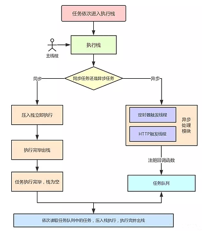

# 基础

## 防抖和节流

- 防抖：在事件触发n秒后执行函数，如果在n秒内再次触发事件，则重新计时
- 节流：如果在定时器的时间范围内再次触发，不予执行，等到当前定时器完成，才能开启下一个定时器任务

## 重绘、重排、合成

重绘：样式计算-绘制

重排：生成DOM树-样式计算-生成布局树-构建图层-绘制

- 重绘：当页面上的元素样式改变并不影响它在文档流中的位置时(color,backgroundColor,visibility等)，浏览器会将新样式赋予给元素并重新绘制它
  - 元素的背景色更改
  - 文字颜色、边框颜色变化
- 重排：对页面元素结构的修改引发了DOM几何尺寸的变化（当元素的布局发生变化时,浏览器重新计算元素的位置和尺寸,并重新绘制的过程）
  - 调整窗口大小
  - 改变字体或字体大小
  - 一个元素的几何属性发生变化(width、height、padding、margin、left、top、border等)
  - 使DOM节点发生增减或移动
  - 读写offset、scroll、client等属性
  - 调用window.getComputedStyle方法
- 合成：更改了一个既不需要布局也不需要绘制的属性，渲染引擎会跳过布局和绘制，直接执行后续的合成操作
  - 一些 CSS 属性,如 transform、opacity、filter 等,可以触发 GPU 加速,将图层提升为合成层
  - 合成层的变化不会触发重排和重绘,因为它们是独立于主线程的,可以在 GPU 上快速完成

### 如何避免

- 使用 translate 替代 top
- 使用 visibility 替换 display: none
- 避免使用 table 布局
- 优化CSS选择器：CSS 选择符从右往左匹配查找，避免使用深层次的或复杂的CSS选择器
- 集中更改样式：将多次样式修改合并为一次,减少重排和重绘的次数
- 避免频繁访问布局属性 (offset, scroll, client)
- 使用 DocumentFragment 或 display: none; 对元素进行批量修改，修改完后将他们一次性添加回DOM
- 将渲染层提升为合成层
  - 合成层的位图，会交由 GPU 合成，比 CPU 处理要快
  - 当需要 repaint 时，只需要 repaint 本身，不会影响到其他的层
  - 对于 transform 和 opacity 效果，不会触发 layout 和 paint

### GPU加速的原因

利用CSS3的 transform，opacity，filter 等属性就可以实现合成效果，也就是GPU加速

- 在合成的情况下，直接跳过布局和绘制阶段，进入非主线程处理部分，即直接交给合成线程处理
- 充分发挥GPU优势，合成线程生成位图的过程中会调用线程池，并在其中使用GPU进行加速生成，GPU是非常擅长处理位图数据的
- 没有占用主线程资源

## 事件循环机制 （event loop）

### js 事件循环

- JS分为同步任务和异步任务
- 同步任务都是在主线程上执行，形成一个执行栈(execution context stack)
- 主线程之外，事件触发线程管理着一个任务队列(task queue)，只要异步任务有了运行结果，就在任务队列之中放置一个事件
- 一旦执行栈中的所有同步任务执行完毕(此时JS引擎空闲)，系统就会读取任务队列，将可以运行的异步任务队列添加到可执行栈中，开始执行
- 主线程不断重复上面的第三步

首先我们需要知道：js 是单线程的语言，EventLoop 是 js 的执行机制

异步队列有两种：macro（宏任务）队列和 micro（微任务）队列。宏任务队列可以有多个，微任务队列只有一个

- 宏任务 (包含整体代码 script，setTimeout，setInterval，setImmediate，MessageChannel， I/O 操作、UI 渲染)
- 微任务 (Promise，process.nextTick、Object.observe、MutationObserver)

- 事件循环会不断地从任务队列中取出任务并执行
- 当调用栈为空时,事件循环会先检查微任务队列,如果有微任务,会依次执行微任务直到微任务队列为空
- 然后,事件循环会从宏任务队列中取出一个宏任务并执行
- 执行完一个宏任务后,事件循环会再次检查并执行所有的微任务
- 重复上述过程,直到任务队列为空

当某个宏任务执行完后，会查看是否有微任务队列，如果有，先执行微任务队列中的所有任务，如果没有，会读取宏任务队列中排在最前面的任务；执行宏任务的过程中，遇到微任务，依次加入微任务队列。栈空后，再次读取微任务队列里的任务



### node 事件循环

外部输入数据 -> 轮循阶段(poll) -> 检查阶段(check) -> 关闭阶段(close callbacks) -> 定时器检查阶段(timer) -> I/O 阶段(I/O callbacks) -> 闲置阶段(idle, prepare) -> 轮询阶段(poll)

- timer 阶段： 执行到期的 setTimeout/setInterval 队列回调
- I/O 阶段：执行上轮循环中未执行完的 I/O 回调
- idle，prepare (仅 node 内部使用)
- poll
  - 如果 poll 队列不为空,则同步执行 poll 队列里的回调,直到队列为空或达到系统限制
  - 如果 poll 队列为空，执行定时器
    - 如有已注册的 setImmediate 回调,则前往 check 阶段执行 setImmediate 回调
    - 如果没有已注册的 setImmediate 回调,则在 poll 阶段等待回调被加入队列,然后立即执行
  - 如有已注册的 setTimeout/setInterval 回调,且其超时时间已到,则返回 timer 阶段执行这些回调
- check 阶段 执行setImmediate回调
- close callbacks 执行关闭事件的回调,如 socket.on('close', ...)

process.nextTick 独立于 EventLoop 之外的，它有一个自己的队列，当每个阶段完成后，如果存在 nextTick 队列，就会清空队列中的所有回调函数，并且优先于其它 microtask 执行


## 跨域

前端领域中，跨域是指在一个域名下的页面，试图访问另一个不同域名下的资源，由于浏览器的同源策略，跨域访问会被阻止

同源策略：协议+域名+端口相同 (即使两个不同的域名指向了同一个 ip 地址，也非同源)

他会限制以下几种行为

- Cookie, LocalStorage 和 IndexDB 无法读取
- DOM 和 JS 对象无法获得
- AJAX 请求无法发送

### 简单请求和非简单请求

简单请求：满足以下两大条件

- 方法是以下 3 中之一
  - HEAD
  - GET
  - POST
- 头信息不超过以下几个字段
  - Accept
  - Accept-Language
  - Content-Language
  - Last-Event-ID
  - Content-type

凡是不满足以上两个条件的，就属于非简单请求，非简单请求的 CORS 请求，会在正式通信之前，增加一次 HTTP 查询请求，称为“预检”请求
浏览器先询问服务器，服务器收到预检请求后，检查 Origin、Access-Control-Request-Methods 和 Access-Control-Request-Headers 字段以后，确认允许跨源请求，浏览器才会发出正式的 XMLHttpRequest 请求，否则就报错

### 解决方案

- JOSNP: 利用 script 标签不受跨域限制的特点，缺点是只支持 get 请求，只能接收 JSON 格式的数据，无法处理其它格式的数据
- CORS: 设置 Access-Control-Allow-Origin: \*
  - 即跨域资源共享，它允许浏览器向非同源服务器，发送 AJAX 请求，这种方式的跨域主要是在后端进行设置
  - 整个 CORS 通信过程，都是浏览器自动完成，不需要用户参与
- postMessage
  - postmessage 是一种 html5 新增的跨文档通信方式，它可以在两个不同的窗口之间进行安全跨域通信。
  - 原理：在一个窗口中发送消息，另一个窗口监听消息并处理
- nginx 反向代理跨域
  - 实现原理：通过 nginx 配置一个代理服务器(同域不同端口)做中间件，反向代理要跨域的域名
- node 中间件
  - 原理：同源策略是浏览器要遵循的标准，而如果是服务器向服务器请求就没有跨域这么一说（原理大致和 nginx 相同，都是通过启一个代理服务器，实现数据的转发）
- websocket
  - websocket 是一种基于 TCP 协议的双向通信协议，它提供了一种浏览器和服务器之间实时、低延迟、高效率的全双工通信方式，同时允许跨域通讯
  - 浏览器在发送 websocket 请求时，会在请求头中携带 Origin 字段，用于告诉服务器该请求的来源。服务器在收到请求后，会根据 Origin 字段判断是否允许该请求跨域，如果允许，则在响应头中添加 CROS 头

#### JSONP 实现

```js
function getInfo(data) {
  console.log(data); // jsonp 跨域成功
}

let script = document.createElement("script");
script.src = "https://example.com/api?callback=getInfo";
document.body.appendChild(script);
```

#### postmessage 实现

```js
// 发送消息
var targetWindow = window.parent;
var message = "hello parent message";
targetWindow.postMessage(message, "*"); // 可以指定域名，这里*表示任意上层parent窗口

// 接收消息
window.addEventListener("message", function(event) {
  var message = event.data;
  console.log("message = " + message);
});
```

#### nginx 反向代理

```nginx
server {
    listen 80;
    server_name www.doman1.com;
    location / {
        proxy_pass   http://www.domain2.com:8080;  # 反向代理
        proxy_cookie_domain www.domain2.com www.domain1.com; # 修改cookie里域名
        index  index.html index.htm;

        # 当用webpack-dev-server等中间件代理接口访问nignx时，此时无浏览器参与，故没有同源限制，下面的跨域配置可不启用
        add_header Access-Control-Allow-Origin http://www.domain1.com;  # 当前端只跨域不带cookie时，可为*
        add_header Access-Control-Allow-Credentials true;
    }
}
```

```js
// 前端代码
var xhr = new XMLHttpRequest();
// 前端开关：浏览器是否读写cookie
xhr.withCredentials = true;
// 访问nginx中的代理服务器
xhr.open("get", "http://www.domain1.com:81/?user=admin", true);
xhr.send();
```

```js
// 后端代码
var http = require("http");
var server = http.createServer();
var qs = require("querystring");
server.on("request", function(req, res) {
  var params = qs.parse(req.url.substring(2));
  // 向前台写cookie
  res.writeHead(200, {
    "Set-Cookie": "l=123456;Path=/;Domain=www.domain2.com;HttpOnly" // HttpOnly:脚本无法读取
  });
  res.write(JSON.stringify(params));
  res.end();
});
server.listen(8080);
```

#### node 中间件实现

```js
// nodeMiddleServer
const express = require("express");
const { createproxyMiddleware } = require("http-proxy-middleware");

const app = express();

app.use(express.static(__dirname));
// 使用代理
app.use(
  "/api",
  createproxyMiddleware({
    target: "http:localhost:8002",
    pathRewrite: {
      "^/api": ""
    },
    changeOrigin: true
  })
);

app.listen(8001);
```

```js
// nodeServer.js
const express = require("express");
const app = express();

app.get("/request", (req, res) => {
  res.end("request success");
});

app.listen(8002);
```

## 事件委托

事件委托本质上是利用了浏览器的事件冒泡机制，因为事件在冒泡过程中会上传到父节点，父节点可以通过事件对象获取到目标节点，因此可以把子节点的监听函数定义到父节点上，由父节点的监听函数统一处理多个子元素事件，这种方式称为事件委托

使用事件委托可以不必为每一个子元素都绑定监听事件，减少了内存上的消耗，并且使用事件代理还可以实现事件的动态绑定，比如新增一个子节点，无需单独为它增加一个监听事件，它绑定的事件会交给父元素的监听函数处理

### 事件冒牌

在js中，事件的传播分为3个阶段：捕获阶段(capturing phase)、目标阶段(target phase)、冒泡阶段(bubbling phase)

默认情况下，事件的传播是先捕获再冒泡。也就是说：事件首先从文档的跟节点开始，沿着文档树向下传播，直到到达目标元素(事件的实际目标)。这个过程称为捕获节点。

然后，事件在目标元素上被触发，这个阶段称为目标阶段。最后事件从目标元素开始，沿着文档树向上传播，直到到达文档的根节点，这个过程称为冒泡阶段。

- 捕获阶段(Capturing Phase)
  - 事件从文档的根节点开始传播,沿着文档树向下传递,直到到达目标元素
  - 在捕获阶段,事件会依次经过目标元素的所有祖先元素,直到到达目标元素本身
  - 如果在捕获阶段注册了事件监听器,那么事件会在到达目标元素之前被触发
- 目标阶段(target phase)
  - 事件到达目标元素后,在目标元素上被触发
  - 如果在目标元素上注册了事件监听器,那么事件会在目标阶段被触发
- 冒泡阶段(bubbling phase)
  - 事件从目标元素开始,沿着文档树向上传播,直到到达文档的根节点。
  - 在冒泡阶段,事件会依次经过目标元素的所有祖先元素,直到到达文档的根节点
  - 如果在冒泡阶段注册了事件监听器,那么事件会在传播过程中被触发

需要注意的是,并非所有的事件都会经历捕获和冒泡阶段。有些事件,如 focus、blur、load 等,只会在目标元素上触发,不会进行捕获和冒泡

在 JavaScript 中,可以通过 addEventListener 方法的第三个参数来指定事件监听器是在捕获阶段还是冒泡阶段触发。如果将第三个参数设置为 true,则事件监听器会在捕获阶段触发;如果设置为 false 或省略,则事件监听器会在冒泡阶段触发

## 闭包、执行上下文和作用域链的理解

- 闭包
  - 闭包允许函数访问其被定义时所在的作用域
  - 闭包通常通过在一个函数内部定义另一个函数来创建。内部函数可以访问外部函数的变量和参数,即使外部函数已经执行完毕
  - 闭包的一个常见用途是创建私有变量和方法。通过闭包,可以封装一些不希望被外部直接访问的数据,只暴露必要的接口
- 执行上下文
  - 执行上下文是 JavaScript 中的一个抽象概念,它定义了代码执行的环境。每当 JavaScript 代码被执行时,都会创建一个执行上下文
  - 三个重要组成部分：变量对象、作用域链、this绑定
  - 三种类型的执行上下文：全局执行上下文、函数执行上下文、eval执行上下文
    - 全局执行上下文: 是默认或者最外层的执行上下文,它对应的是全局作用域
    - 函数执行上下文: 每当一个函数被调用时,都会为该函数创建一个新的执行上下文
    - Eval 函数执行上下文: 在 eval 函数内部执行的代码也有其自己的执行上下文
- 作用域
  - 作用域是一个对象列表，它定义了变量和函数的查找顺序。当访问一个变量或函数时，js引擎会通过作用域链来确定在哪个作用域中查找该变量或函数
  - 每个执行上下文都有其对应的作用域链。作用域链的创建基于函数的嵌套关系。当一个函数被定义时,它的作用域链包含了它自己的变量对象和其父级函数的作用域链

闭包优缺点

- 优点
  - 变量常驻内存，对于实现某些业务很有帮助，比如计数器之类的
  - 让函数外部访问内部变量成为可能
  - 私有化，一定程序上解决命名冲突问题，可以实现私有变量
- 缺点
  - 变量常驻内存中，其占用的内存无法被GC回收，导致内存溢出

## ES6 有哪些新特性

- 箭头函数：相当于匿名函数，简化了函数定义；箭头函数内部的this是词法作用域，由上下文确定
- 解构赋值 `[a, b, ...rest] = [10, 20, 30, 40, 50];`
- 模板字符串
- promise
- symbol
- let const
- 扩展运算符
- Map 和 Set
- Proxy
- 类 Class
- 默认参数
- ES6 Module

## for...in 和 for...of 和 foreach 区别

for...in 遍历对象属性，顺序不确定，取决于 js 引擎实现（无法直接遍历数组），遍历的是对象的属性名(键)，（使用该循环时，需要使用 hasOwnProperty 方法过滤原型链上的属性，以确保只遍历对象本身的属性）
for...of 遍历可迭代对象(数组，字符串，Map，Set)元素时，按照元素在数组中的顺序进行遍历，遍历的是元素值
foreach 只能用于遍历数组，不能用于遍历对象，遍历的是元素值

## window.onload 和 DOMContentLoaded 区别

- DOMContentLoaded 事件是在 HTML 文档被完全加载和解析之后才会触发，并不需要等到(样式表，图像，子框架)加载完成之后再进行
- window.onload 事件在页面所有内容(包括样式表、图像等)都加载完成后触发

## async 和 defer

async 和 defer 属性只对外部脚本起作用，如果没有 src 属性它们会被忽略

- async(异步)
  - 当浏览器遇到带有async属性的脚本时，会在继续解析 HTML 的同时并行下载该脚本
  - 脚本下载完成后，浏览器会中断HTML解析，执行该脚本，然后继续解析HTML
  - 多个带有async属性的脚本可能会以任意顺序执行，不保证他们的执行顺序
  - 适用于独立的脚本，不依赖于其他脚本或DOM的脚本
- defer(延迟)
  - 当浏览器遇到带有defer属性的脚本时，会在继续解析 HTML 的同时并行下载该脚本
  - 脚本下载完成后，浏览器不会立即执行该脚本，而是等到HTML解析完成后，在DOMContentLoaded 事件触发之前执行
  - 多个带有 defer 属性的脚本会按照它们在 HTML 中出现的顺序依次执行
  - 适用于需要在 HTML 解析完成后执行的脚本,或者有依赖关系的脚本

注意的是,如果脚本没有使用 async 或 defer 属性,浏览器会在遇到 `<script>` 标签时立即下载并执行该脚本,阻塞 HTML 的解析,可能会影响页面的加载性能

异步加载：指同时加载，即某个 js 文件加载的同时，其余文件也可以加载
同步加载：指某个 js 文件加载的同时，其余文件不能加载

defer 比 async 要先引入，他的执行在解析完全完成之后才能开始，它处在 DOMContentLoaded 事件之前。它保证脚本会按照它在 html 中出现的顺序执行，并且不会阻塞解析
async 脚本在他们完成下载后的第一时间执行，它处在 window 的 load 事件之前，这意味着可能设置了 async 的脚本不会按照它在 html 中出现的顺序执行

## apply、call 和 bind

apply 和 call 都是为了改变某个函数运行时的上下文(context)而存在的，也就是为了改变函数体内部 this 的指向
两者作用是一致的，区别是两者传参的方式不一样，例如

bind 方法会创建一个新函数，称为绑定函数，当调用这个绑定函数时，绑定函数会以创建它时传入 bind()方法的第一个参数作为 this，传入 bind 方法的第二个及以后的参数加上绑定函数运行时本身的参数按照顺序作为原函数的参数来调用原函数

总结

- apply、call 和 bind 都是用来改变函数的 this 指向的
- apply、call 和 bind 三者的第一个参数都是 this 要指向的调用对象，也就是指定的上下文
- apply、call 和 bind 三者都可以传参
- apply、call 是立即调用，bind 则是返回对应函数，便于后续调用

```js
var func = function(par1, par2) {};
func.call(this, par1, par2);
func.apply(this, [par1, par2]);
```

### 实现 apply

- 将函数设为对象的属性
- 执行&删除这个函数
- 指定 this 到函数并传入给定参数执行函数

### 实现 call

- 将函数设为对象的属性
- 执行&删除这个函数
- 指定 this 到函数并传入给定参数执行函数

### 实现 bind

- 返回一个函数，绑定 this，传递预置参数
- bind 返回的函数可以作为构造函数使用，作为构造函数时应使得 this 失效，但是传入的参数依然有效

## 类型判断

- typeof 只能识别基础类型和引用类型 (注意 null, NaN, document.all 的判断)
- constructor 指向创建该实例对象的构造函数 (注意 null 和 undefined 没有 constructor，以及 constructor 可以被改写，不太可靠)
- instanceof
- Object.prototype.toString.call("[object Number]", "[object Undefined]" 等等类型)

## new 本质

- 创建一个新对象
- 链接到原型 obj.**prototype** = Con.portotype;
- 绑定到 this
- 返回新对象(如果构造函数有自己的 return，则返回该值)

```js
function myNew(func) {
  return function() {
    let obj = {
      __proto__: func.prototype
    };
    const ret = func.apply(obj, Array.prototype.slice.call(arguments));

    return typeof ret === "object" ? ret : obj;
  };
}
```

## Object.create 实现原理

```js
// 将传入的对象作为原型
function create(obj) {
  function F() {}
  F.prototype = obj;
  return new F();
}
```

## Promise

```js
```

## 并发请求

假如有几十个请求，如何去控制并发

```js
// 使用async/await 和 Promise.all
async function sendRequest (urls, concurrencyLimit = 6) {
  const batchs = [];
  for (let i = 0; i < urls.length; i++) {
    const batch = urls.slice(i, i + concurrencyLimit);
    batchs.push(batch);
  }
  for (const batch of batchs) {
    const requests = batch.map(url => fecth(url));
    await Promise.all(requests);
  }
}
```

```js
// 使用并发控制库,如 p-limit
import pLimit from 'p-limit';
async function sendRequests (urls, concurrencyLimit = 6) {
  const limit = pLimit(concurrencyLimit);
  const requests = urls.map(url => limit(() => fetch(url)));
  await Promise.all(requests);
}
```

```js
// 使用队列和计数器
import axios from 'axios'

export const handQueue = (
  reqs // 请求总数
) => {
  reqs = reqs || []
  const requestQueue = (concurrency) => {
    concurrency = concurrency || 6 // 最大并发数
    const queue = [] // 请求池
    let current = 0
    // 这个函数用于从请求池中取出请求并发送。它在一个循环中运行，直到当前并发请求数current达到最大并发数concurrency或请求池queue为空
    // 对于每个出队的请求，它首先增加current的值，然后调用请求函数requestPromiseFactory来发送请求
    // 当请求完成（无论成功还是失败）后，它会减少current的值并再次调用dequeue，以便处理下一个请求
    const dequeue = () => {
      while (current < concurrency && queue.length) {
        current++;
        const requestPromiseFactory = queue.shift() // 出列
        requestPromiseFactory()
          .then(() => { // 成功的请求逻辑
          })
          .catch(error => { // 失败
            console.log(error)
          })
          .finally(() => {
            current--
            dequeue()
          });
      }

    }
    // 函数返回一个函数，这个函数接受一个参数requestPromiseFactory，表示一个返回Promise的请求工厂函数。
    // 这个返回的函数将请求工厂函数加入请求池queue，并调用dequeue来尝试发送新的请求，当然也可以自定义axios，利用Promise.all统一处理返回后的结果
    return (requestPromiseFactory) => {
      queue.push(requestPromiseFactory) // 入队
      dequeue()
    }
  }
  // 测试
  const enqueue = requestQueue(6)
  for (let i = 0; i < reqs.length; i++) {
    enqueue(() => axios.get('/api/test' + i))
  }
}
```

## Map 和 WeakMap

WeakMap 是 Map 的弱版本，它只接受对象作为键名（null 除外），不接受其他类型的值。它的行为类似于其他数据结构，但是没有 size 属性。

举个例子

如果我们使用Map的话，那么对象间是存在强引用关系的

```js
let obj = { name : 'vcplugin'}
const target = new Map();
target.set(obj,'vcplugin Value');
obj = null;
```

虽然我们手动将obj，进行释放，然是target依然对obj存在强引用关系，所以这部分内存依然无法被释放

再来看WeakMap：

```js
let obj = { name : 'vcplugin'}
const target = new WeakMap();
target.set(obj,'vcplugin Value');
obj = null;
```

如果是WeakMap的话，target和obj存在的就是弱引用关系，当下一次垃圾回收机制执行时，这块内存就会被释放掉

## 箭头函数和普通函数区别

- 语法简洁性
- this指向问题
  - 普通函数中：this的值是在函数被调用时确定的，他指向调用该函数的对象
  - 箭头函数中：this的值是在函数定义时确定的，它指向定义箭头函数的上下文，意味着箭头函数没有自己的this，它继承父级作用域的this
- 不适用于构造函数(箭头函数)
  - 不能用作构造函数，不能通过new关键字来实例化对象
- 无arguments对象
  - 普通对象可以使用arguments访问所有传入的参数，箭头函数没有自己的arguments对象

## es5怎么实现继承的，讲讲对原型链的理解

原型链的理解：原型链是js中实现继承的主要方式，每个对象都有一个内部指针[[Prototype]]，指向它的原型对象。当访问一个对象的属性或方法时，如果这个对象本身没有这个属性或方法，就会沿着原型链向上查找，直到找到为止或者到达原型链末尾(Object.prototype)。

在es5中实现继承的方式有以下几种

- 原型链继承：原型链继承是通过将子类的原型对象设置为父类的实例来实现的。这样,子类的实例就可以通过原型链访问到父类的属性和方法
- 构造函数继承：构造函数继承是通过在子类的构造函数中调用父类的构造函数,并将子类的 this 绑定到父类构造函数的调用结果上来实现的
- 组合继承
- 原型式继承：原型式继承是通过创建一个临时的构造函数,将其原型设置为要继承的对象,然后返回这个临时构造函数的实例来实现的
- 寄生式继承：寄生式继承是在原型式继承的基础上,通过封装一个函数来增强对象,返回这个增强后的对象
- 寄生组合式继承：寄生组合式继承是组合继承的优化版本,通过寄生式继承来继承父类的原型,避免了父类构造函数的多次调用

```js
// 原型链继承
function Parent() {
  this.name = 'Parent';
}
function Child() {
  this.age = 18;
}
Child.prototype = new Parent();
var child = new Child();
console.log(child.name);
console.log(child.age);
```

```js
// 构造函数继承
function Parent(name) {
  this.name = name;
}
function Child(name, age) {
  Parent.call(this, name);
  this.age = age;
}
var child = new Child('vcplugin', 18);
```

```js
// 组合继承
function Parent(name) {
  this.name = name;
}
Parent.prototype.sayHello = function() {
  console.log('Hello from ' + this.name);
};
function Child(name, age) {
  Parent.call(this, name);
  this.age = age;
}
Child.prototype = new Parent();
Child.prototype.constructor = Child;
var child = new Child('Child', 10);
```

```js
// 原型式继承
function createObject(proto) {
  function F() {}
  F.prototype = proto;
  return new F();
}

var parent = {
  name: 'Parent'
};

var child = createObject(parent);
console.log(child.name); // 输出: 'Parent'
```

```js
// 寄生式继承
function createObject(proto) {
  function F() {}
  F.prototype = proto;
  return new F();
}
function createEnhancedObject(proto) {
  var obj = createObject(proto);
  obj.sayHello = function() {
    console.log('Hello from ' + this.name);
  };
  return obj;
}
var parent = {
  name: 'Parent'
};
var child = createEnhancedObject(parent);
console.log(child.name); // 输出: 'Parent'
child.sayHello(); // 输出: 'Hello from Parent'
```

## 中间页携带cookie

- 服务器端设置Cookie的域名：在服务端设置Cookie时，可以通过设置Cookie的域名属性来实现跨域共享的Cookie，将 Cookie 的域名设置为顶级域名,这样在子域名之间跳转时,Cookie 就可以被携带
- 使用window.location.href跳转，将Cookie值作为URL参数传递给目标页面
- 使用 AJAX 请求: 如果目标页面与中间页面属于同一个域名,可以在中间页面中使用 AJAX 请求将 Cookie 的值发送给服务器,然后在服务器端将 Cookie 值设置到响应头中,再进行页面跳转

```js
// 发送 AJAX 请求
var xhr = new XMLHttpRequest();
xhr.open('POST', '/set-cookie', true);
xhr.setRequestHeader('Content-Type', 'application/json');
xhr.onreadystatechange = function() {
  if (xhr.readyState === 4 && xhr.status === 200) {
    // 跳转到目标页面
    window.location.href = 'https://www.example.com/target-page';
  }
};
xhr.send(JSON.stringify({ username: getCookie('username') }));
```

```js
// 在服务器端 (Node.js),可以接收 AJAX 请求,并将 Cookie 值设置到响应头中
app.post('/set-cookie', function(req, res) {
  var username = req.body.username;
  res.cookie('username', username, { domain: '.example.com', path: '/' });
  res.sendStatus(200);
});
```
