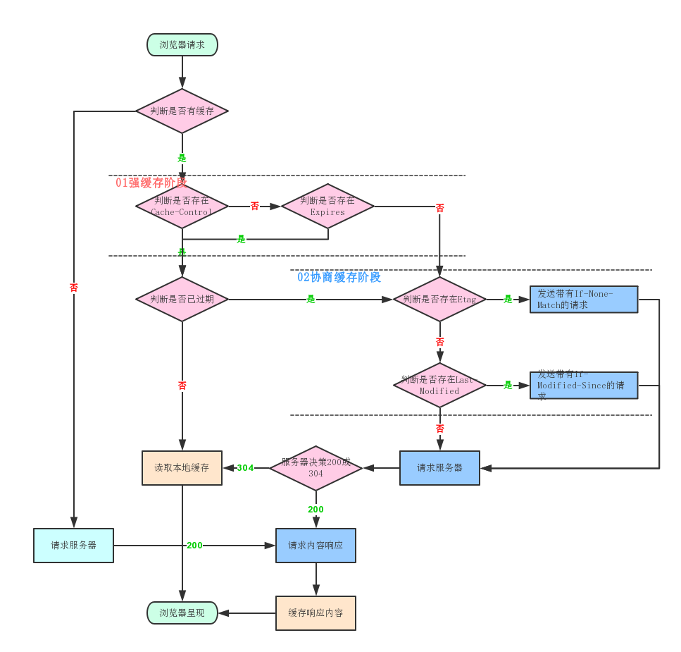
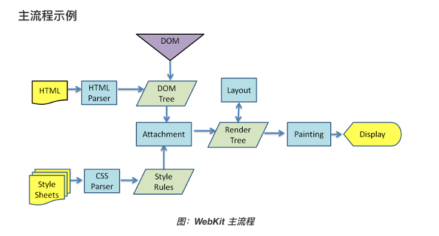

# 浏览器相关

## 进程和线程

进程是 CPU 资源分配的最小单位
线程是 CPU 资源调度的最小单位

进程和线程之间的关系如下

- 一个进程可以创建多个线程，这些线程共享同一个地址空间和资源，能够并发执行任务
- 线程在进程内部创建和销毁的，他们与进程共享进程的上下文，包括打开的文件，全局变量和堆内存等
- 每个进程至少包含一个主线程，主线程用于执行进程的主要业务逻辑，其它线程可以作物辅助线程来完成特定任务

多进程：在同一个时间里，同一个计算机系统中允许两个或两个以上的进程处于运行状态
多线程：程序包含多个执行流，即在一个程序中可以同时运行多个不同的线程来执行不同的任务，就是说允许单个程序创建多个并行执行的线程来完成各自的任务

- 堆内存
  - js 中对象、数组、函数等复杂数据类型都存储在堆内存中
  - 使用 new 关键字或对象字面量语法创建对象时，会在堆内存中分配相应的内存空间
  - 堆内存的释放由垃圾回收机制自动处理，当一个对象不在被引用时，垃圾回收机制会自动回收器占用的内存，释放资源
- 栈内存
  - js 中的基本数据类型，数字、布尔值、字符串以及函数的局部变量报仇呢在栈内存中
  - 栈内存的分配时静态的，编译器在编译阶段就确定了变量的内存空间大小
  - 当函数被调用时,会在栈内存中创建一个称为栈帧 stack frame 的数据结构,用于存储函数的参数、局部变量、返回地址等信息
  - 当函数执行完毕或从函数中返回时,对应的栈帧会被销毁,栈内存中的数据也随之释放

## 浏览器架构

### 多进程架构

- Browser进程：负责浏览器界面的显示和交互；负责各页面的管理，创建和销毁；网络的资源管理、下载等
- 第三方插件进程：每种类型的插件对应一个进程，仅当使用该插件时才创建
- GPU进程：最多一个，用于3D绘制
- 渲染进程：默认每个Tab页面一个进程，互不影响，主要用于页面渲染、脚本执行、事件处理等

多进程的优势

- 避免单个页面崩溃影响整个浏览器
- 避免第三方插件崩溃影响整个浏览器
- 多进程充分利用多核优势
- 方便使用沙箱隔离插件等进程，提高浏览器稳定性和安全性

### 渲染进程

- GUI渲染线程
  - 负责渲染浏览器页面，解析HTML、CSS，构建DOM树和Render树，布局和绘制等
  - 当界面需要重绘(Repaint)或由于某种操作引发重排(Reflow)，该线程就会执行
  - 注意：GUI线程和JS线程是互斥的，当JS线程执行时，GUI线程会挂起，GUI更新会被保存在一个队列中等待JS线程空闲时立即执行
- JS引擎线程
  - JS引擎，也称JS内核，负责处理JS脚本
  - JS引擎线程负责解析JS脚本，运行代码
  - JS引擎一直等待任务队列中任务的到来，然后处理，一个Tab页中无论什么时候只会有一个js线程
  - 注意：由于和GUI线程互斥，因此如果一个js任务执行事时间太长，就会导致页面渲染不连贯，卡顿
- 事件触发线程
  - 归属于浏览器而不是JS引擎，用于控制事件循环
  - 当JS引擎执行代码块如setTimeout时(也可来自浏览器内核的其它线程，如鼠标点击、AJAX异步请求等)，会将对应任务添加到事件线程中
  - 当对应的事件符合触发条件时，该线程会把事件添加到待处理队列的队尾，等待JS引擎的处理
  - 由于JS单线程的缘故，这些待处理队列的事件都得排队等待JS引擎处理
- 定时器触发线程
  - setInterval与setTimeout所在线程
  - 浏览器定时计数器并不是由JS引擎计数的(因为JavaScript引擎是单线程的, 如果处于阻塞线程状态就会影响记计时的准确)，通过单独线程来计时并触发定时(计时完毕后，添加到事件队列中，等待JS引擎执行)
- 异步HTTP请求线程
  - 在XMLHttpRequest连接后通过浏览器开一个线程请求
  - 当检测到状态变更时，如果设置有回调函数，异步线程就会产生状态变更事件，将这个回调再放入事件队列中，由js引擎执行

### 浏览器组成

- 用户界面 地址栏、前进后退、书签等
- 浏览器引擎 在用户界面和渲染引擎之间传递指令
- 渲染引擎 负责显示请求的内容
- 网络 用于网络调用，如HTTP请求
- JavaScript 解释器 解释和执行JavaScript代码
- 数据存储 这是一个层，用于记录所有类型的数据
- 用户界面后端 用于绘制基本的窗口小部件，如下拉框和窗口

## 浏览器安全（CSRF、XSS）

### XSS(Cross-Site Scripting) 跨站脚本攻击

XSS 是一种代码注入攻击。攻击者可以在目标网站注入恶意脚本，使之在用户浏览器运行。利用这些恶意脚本，攻击者可以获取用户的敏感信息，如 Cookie 等

- 反射型攻击
  - 攻击者构造出特殊的 URL，其中包含恶意代码
  - 用户打开带有恶意代码的 url 时，网站服务端将恶意代码从 URL 中取出，拼接在 HTML 中返回给浏览器
  - 用户浏览器接收到响应后解析执行，混在其中的恶意代码也被执行
  - 恶意代码窃取用户数据并发送到攻击者的网站，或者冒充用户的行为，调用目标网站接口执行攻击者指定的操作
- 存储型攻击
  - 攻击者将恶意代码提交到目标网站数据库中
  - 用户打开目标网站，网站服务端将恶意代码从数据库取出，拼接在 HTML 中返回给浏览器
  - 用户浏览器接收到响应后解析执行，混在其中的恶意代码也被执行
  - 恶意代码窃取用户数据并发送至攻击者网站或服务器
- 基于 dom 的 xss 攻击
  - 攻击者构造出特殊的 URL，其中包含恶意代码
  - 用户打开带有恶意代码的 URL。
  - 户浏览器接收到响应后解析执行，前端 JavaScript 取出 URL 中的恶意代码并执行

xss 防范措施

- 输入过滤
- 预防存储型和反射型 xss 攻击
  - 改成纯前端渲染，把代码和数据分隔开
  - 对 HTML 做充分转义
- 预防 dom 的 xss 攻击
- Content Security Policy
  - 严格的 CSP 在 XSS 的防范可以起到下面几个作用
  - 禁止加载外域代码，防止复杂的攻击逻辑
  - 禁止外域提交，网站被攻击后，用户的数据不会泄露到外域
  - 禁止内联脚本执行
  - 禁止未授权的脚本执行
  - 合理使用上报可以及时发现 XSS，利于尽快修复问题
- HTTP-only Cookie
  - 禁止 js 读取某些敏感 cookie，攻击者完成 XSS 注入后也无法窃取此 Cookie

### CSRF(Cross-Site request forgery) 跨站请求伪造

攻击者诱导受害者进入第三方网站，在第三方网站中，向被攻击网站发送跨站请求。利用受害者在被攻击网站已经获取的注册凭证，绕过后台的用户验证，达到冒充用户对被攻击网站执行某项操作的目的

- get 类型的 csrf
  - get 类型的 csrf 非常简单，只需要一个 http 请求
- post 类型的 csrf
  - 这种类型的 csrf 利用起来通常使用的是一个自动提交的表单
- 链接类型的 csrf
  - 链接类型的 CSRF 并不常见，比起其他两种用户打开页面就中招的情况，这种需要用户点击链接才会触发。这种类型通常是在论坛中发布的图片中嵌入恶意链接，或者以广告的形式诱导用户中招，攻击者通常会以比较夸张的词语诱骗用户点击

csrf 防范措施

- 同源检测
  - 利用 http 请求中的 Origin Header 和 Referer Header，服务器可以通过解析这两个 header 中的域名，来确认请求的来源域
- CSRF token
  - 服务器给用户生成一个 Token，这个 Token 通过加密算法进行过加密
  - 客户端页面提交请求时，把 token 加入到请求数据或者头信息中，一起传给后端
  - 后端验证前端传来的 token 和 session 是否一致
- 给 Cookie 设置合适的 SameSite

### 其它

- 点击劫持
- HTTP 严格传输安全
- CDN 劫持
- 内容安全策略

## 浏览器缓存策略

浏览器在加载资源时，会先根据这个资源的 header 判断它是否命中缓存，强缓存如果命中，浏览器直接在自己的缓存中读取资源，不会发请求到服务器
当强缓存没有命中的时候，浏览器一定会发送一个请求到服务器，通过服务器端依据资源的另外一些 header 字段验证是否命中协商缓存，如果协商缓存命中，服务器会将这个请求返回，但是不会返回这个请求的资源数据，而是告诉客户端可以直接从缓存中加载这个资源
强缓存和协商缓存的共同点是：如果命中，都是从客户端缓存中加载资源，而不是从服务器加载资源数据；区别是：强缓存不发请求到服务器，协商缓存会发请求到服务器
当协商缓存也没命中时，浏览器直接从服务器拉取资源

### 强缓存

当浏览器对某个资源的请求命中了强缓存时，返回的 HTTP 状态码为 200，在谷歌浏览器的开发者工具的 network 里面 size 会显示 disk cache 或 memory cache

- Cache-Control 的 max-age 的优先级高于 Expires，以秒为单位，是一个相对时间
  - 第一次请求某个资源，服务器返回这个资源同时，在 response 的 header 加上了 Cache-control 的 header，浏览器接收到这个资源后，会把这个资源连同 header 缓存下
  - 浏览器再次请求这个资源，先从缓存中寻找，找到这个资源后，根据它第一次的请求时间和 Cache-control 设定的有效期，计算出一个资源过期时间，再拿这个过期时间和当前请求时间比较，如果请求时间再过期时间之前，就命中缓存
  - 属性值
    - max-age 过期时长
    - public 客户端和代理服务器都可以缓存
    - private 只有浏览器能缓存了，中间的代理服务器不能缓存
    - no-cache 跳过当前的强缓存，发送HTTP请求，即直接进入协商缓存阶段
    - no-store 非常粗暴，不进行任何形式的缓存
- Expires 是 http1.0 提出的一个表示资源过期时间的 header，值是一个绝对时间，由服务器返回
  - 缺点：由于它是服务器返回的一个绝对时间，在服务器时间和客户端时间相差较大时，缓存会出问题，还有就是客户端可以随意更改时间

### 协商缓存

强缓存失效之后，浏览器在请求头中携带相应的 缓存tag 来向服务器发请求，由服务器根据这个tag，来决定是否使用缓存，这就是协商缓存

- Last-Modified最后修改时间 Last-Modified(服务端响应携带) & If-Modified-Since (客户端请求携带) ，其优先级低于 Etag
  - 浏览器第一次跟服务器请求一个资源，服务器返回资源的同时，会在 response 的 header 加上 Last-Modified，表示资源在服务器上的最后修改时间
  - 浏览器再次请求这个资源，在 request header 上加上 If-Modified-Since 的 header，这个 header 就是上一次请求时返回的 Last-Modified
  - 服务器再次受到请求，根据浏览器传过来的 If-Modified-Since 和资源在服务器上的最后修改时间判断资源是否有变化，如果没有变化则返回 304 Not Modified
  - 缺点：有时候服务器上资源有变化，但是最后修改时间却没有变化，就会影响缓存安全性
- ETag Etag(服务端响应携带) & If-None-Match(客户端请求携带)
  - 这个唯一标识是一个字符串，只要资源有变化这个值就不同

服务端判断值是否一致，如果一致，则直接返回 304 通知浏览器使用本地缓存，如果不一致则返回新的资源

两者对比

- 精度上：Etag优于Last-Modified，Last-Modified的感知单位是秒，Etag是按照内容给资源生成的唯一标识，能准确感知资源的变化
- 性能上：Last-Modified优于Etag，Last-Modified仅仅只是记录一个时间点，而 Etag需要根据文件的具体内容生成哈希值



### 缓存位置

- Service Worker
  - 借鉴webworker思路，独立于浏览器窗口，因此无法直接访问DOM
  - 离线缓存 Service Worker 可以拦截网络请求并决定如何响应。这使得开发者可以在用户离线时提供自定义的离线页面，或者从缓存中提供之前存储的资源
  - 消息推送 即使在应用未运行的情况下，Service Worker 也可以接收来自服务器的推送消息，并显示通知给用户
  - 网络代理 Service Worker 可以拦截网络请求并根据需要修改请求和响应，这使得开发者可以实现例如请求重试、请求重定向等复杂的网络功能
- Memory Cache
  - 内存缓存，从效率上来讲它是最快的，但存活时间又是最短的 当渲染进程结束后，内存缓存也就不存在了
- Disk Cache
  - 存储在磁盘中的缓存，存取效率上来讲比内存缓存慢，但是存储容量大&存活时间久
- Push Cache
  - 推送缓存，它是HTTP/2的特性
  - 在 HTTP/2 中，服务器可以在客户端需要之前就主动将资源推送到客户端的缓存中，这样当客户端需要这些资源时就可以直接从缓存中获取，而不需要再向服务器发送请求

## 浏览器存储

### Cookie

http协议是一个无状态协议，客户端向服务器发送请求，服务器返回响应，如何让服务端知道客户端是谁，如何跟踪用户状态？这种背景下，产生了Cookie

Cookie本质上是一个文本文件（内部以键值对的方式来存储），保存在客户端的硬盘上，当浏览器访问服务器时，会将Cookie信息自动发送给服务器。

- 内容缺陷 体积上限只有4kb，只能用来存储少量数据
- 性能缺陷 Cookie紧跟域名，不管域名下的某一个地址需不需要这个Cookie，请求都会携带上完整的Cookie，造成性能浪费
- 安全缺陷 由于Cookie以纯文本方式在浏览器和服务器之间传递，很容易被非法用户截取，然后进行一系列篡改，这是非常危险的

SameSite

- Strict：浏览器完全禁止第三方请求携带Cookie
- Lax：只能在get方法提交表单或者a标签发送get请求的情况下带Cookie
- None：默认模式，请求会自动携带Cookie

### localStorage和sessionStorage

localStorage

- 容量：上限为5MB，针对同域名，对于一个域名来说是持久存储的
- 只存储在客户端，默认不参与服务端的通讯
- 接口封装，操作方便

sessionStorage

- 容量。容量上限也为 5M
- 只存在客户端，默认不参与与服务端的通信。
- sessionStorage和localStorage有一个本质的区别，那就是前者只是会话级别的存储，并不是持久化存储。会话结束，也就是页面关闭，这部分sessionStorage就不复存在了

### IndexedDB

IndexedDB 是 HTML5 中新增的数据库，它允许在浏览器端存储大量结构化数据。

- 键值对存储 使用键值对来存储数据，每个键值对被存储在一个对象存储空间
- 异步操作 不会阻塞浏览器主线程
- 大数据存储
- 支持事务 意味着你可以在一个操作失败时回滚其它操作，保证数据一致性
- 二进制数据存储 支持存储二进制数据，如 Blob 对象或 TypedArray 对象
- 受同源策略限制

## 浏览器垃圾回收

在 js 内存管理中有一个概念叫做可达性，就是那些以某种方式可访问或者说可用的值，他们被保证存储在内存中，反之不可访问则需回收

### 垃圾回收策略

- 标记清除 (Mark-sweep)
  - 此算法分为标记和清除两个阶段，标记阶段即为所有活动对象做上标记，清除阶段则是把没有标记(也就是非活对象)销毁
  - 过程
    - 垃圾收集器在运行时会给内存中的所有变量加上一个标记，假设内存中所有对象都是垃圾，全部标记为 0
    - 然后从各个根对象开始遍历，把不是垃圾的节点改成 1
    - 清理所有标记为 0 的垃圾，销毁并回收他们所占用的内存空间
    - 最后，把所有内存中对象标记修改为 0，等待下一轮垃圾回收
  - 优点：实现简单
  - 缺点：清除之后，剩余的对象内存位置是不变的，会导致空闲内存空间是不连续的，出现内存碎片，并且由于剩余空闲内存不是一整块，它是由不同大小内存组成的内存列表，就会造成内存分配问题
    - 分配速度慢 即使是 first-fit 策略，其操作仍是一个 O(n)的操作，最坏情况是每次都要遍历到最后，同时因为碎片化，大对象的分配效率会变慢
    - 内存碎片化：空闲内存块是不连续的，容易出现很多空闲内存块，还可能出现所分配的内存较大找不到合适的块
  - 标记整理算法(Mark-Compact)算法可以有效解决，它的标记阶段和标记清除算法没有什么不同，只是标记结束后，标记整理算法会将活着的对象向内存的一端移动，最后清理掉边界的内存
- 引用计数 (Reference Counting)
  - 它把 对象是否不再需要 简化定义为 对象有没有被其它对象引用到它，如果没有引用指向该对象(零引用)，对象将被垃圾回收机制回收
  - 问题： 循环引用，引用计数的计数器需要占很大的位置

### v8 中的垃圾回收

分代式垃圾回收：V8 的垃圾回收策略主要基于分代式垃圾回收机制，V8 中将堆内存分为新生代和老生代两个区域，采用不同的垃圾回收器也就是不同的策略来进行垃圾回收

- 新生代
  - 新生代对象为存活时间较短的对象，简单来说就是新产生的对象（通常只支持 1-8mb 容量）
  - 新生代对象是通过一个名为 Scavenge 的算法进行垃圾回收，在 Scavenge 算法主要采用了一种复制式的方法(Cheney)
    - Cheney 算法将堆内存一分为二，一个是处于使用状态的空间 使用区，一个是处于闲置状态的空间 空闲区
    - 新加入的对象都会存放到使用区，当使用区快被写满时，就需要执行一次垃圾清理操作
    - 当开始进行垃圾回收时，新生代垃圾回收器会对使用区中的活动对象做标记，标记完成之后将使用区的活动对象复制进空闲区进行排序，随后进入垃圾清理阶段，即将非活动对象占用的空间清理掉。最后进行角色互换，把原来的使用区变为空闲区，原来的空闲区变为使用区
    - 当一个对象经过多次复制还存活，它将被认为时生命周期较长的对象，随后会被移动到老生代中
    - 另外一种情况：如果复制一个对象到空闲区，空闲区的空间占用超过了 25%，那么这个对象会被直接晋升到老生代空间中（设置为 25%的原因是：当完成 Scavenge 回收后，空闲区翻转成使用区，继续进行对象的内存分配，若占比过大，会影响后续内存分配）
- 老生代
  - 老生代对象为存活时间较长或常驻内存的对象，简单来说就是经历过新生代垃圾回收后还存活的对象(容量通常比较大)
  - 老生代流程采取的是 标记清除算法（标记整理算法解决连续内存问题）

分代式机制把一些新、小、存活时间短的对象作为新生代，采用一小块内存频率较高的快速清理，而一些大、老、存活时间久的对象作为老生代，使其很少接受检查，老生代的回收机制及频率是不同的，此机制的出现很大程度提高了垃圾回收机制的频率

### 垃圾回收其它

增量标记与惰性清理

增量就是将一次 GC 标记的过程，分成了很多小步，每执行完一小步就让应用逻辑执行一会儿，交替多次后完成一轮 GC 标记

缺点：首先是并没有减少主线程的总暂停的时间，甚至会略微增加，其次由于写屏障机制的成本，增量标记可能会降低应用程序的吞吐量

- 三色标记法(暂停与恢复)
  - 白色：未被标记对象
  - 灰色：自身被标记，成员变量(该对象的引用对象)未被标记
  - 黑色：自身和成员变量皆被标记
- 写屏障(增量中修改引用)
  - 一旦有黑色对象引用白色对象，该机制会强制将引用的白色对象改为灰色，从而保证下一次增量 GC 标记阶段可以正确标记，这个机制也被称为强三色不变性

惰性清理

增量标记只是对活动对象和非活动对象进行标记，对于真正的清理释放内存 V8 采用的是惰性清理

- 老生代主要使用并发标记，主线程在开始执行 JavaScript 时，辅助线程也同时执行标记操作（标记操作全都由辅助线程完成）
- 标记完成之后，再执行并行清理操作（主线程在执行清理操作时，多个辅助线程也同时执行清理操作）
- 同时，清理的任务会采用增量的方式分批在各个 JavaScript 任务之间执行

[参考](https://juejin.cn/post/6981588276356317214?searchId=202403152003388D4D643DAD3DC81C4E96)

### v8 垃圾回收总结

将内存中不再使用的数据进行清理，释放出内存空间。V8 将内存分成 新生代空间 和 老生代空间。

- 新生代空间: 用于存活较短的对象
  - 又分成两个空间: from 空间 与 to 空间
  - Scavenge GC 算法: 当 from 空间被占满时，启动 GC 算法
    - 存活的对象从 from space 转移到 to space
    - 清空 from space
    - from space 与 to space 互换
    - 完成一次新生代 GC
- 老生代空间: 用于存活时间较长的对象
  - 从 新生代空间 转移到 老生代空间 的条件
    - 经历过一次以上 Scavenge GC 的对象
    - 当 to space 体积超过 25%
  - 标记清除算法: 标记存活的对象，未被标记的则被释放
    - 增量标记: 小模块标记，在代码执行间隙执，GC 会影响性能
    - 并发标记(最新技术): 不阻塞 js 执行
  - 压缩算法: 将内存中清除后导致的碎片化对象往内存堆的一端移动，解决 内存的碎片化

### 内存泄漏

- 意外的全局变量， 无法被回收
- 被遗忘的计时器或回调函数
- 事件监听: 没有正确销毁 (低版本浏览器可能出现)
- 闭包，会导致父级中的变量无法被释放
- 没有清理的 DOM 元素引用

```javascript
// 意外的全局变量
function foo() {
  bar = "this is a hidden global variable"; // bar没被声明,会变成一个全局变量,在页面关闭之前不会被释放
}
function foo1() {
  this.variable = "potential accidental global"; // this 指向了全局对象（window）
}
foo();
foo1();
// 被遗忘的计时器或回调函数
var someResource = getData();
setInterval(function() {
  var node = document.getElementById("Node");
  if (node) {
    node.innerHTML = JSON.stringify(someResource);
  }
}, 1000);
// 如果id为Node的元素从DOM中移除，该定时器仍会存在，同时，因为回调函数中包含对someResource的引用，定时器外面的someResource也不会被释放
```

如何避免

- 减少不必要的全局变量，或者生命周期较长的对象
- 注意程序逻辑，避免死循环
- 避免创建过多的对象

## 从输入URL到页面呈现发生了什么 (网络)

网络请求

- 构建请求：浏览器会构建请求行
- 查找强缓存：先检查强缓存，如果命中直接使用，否则进入下一步
- DNS解析
  - 由于我们输入的是域名，而数据包是通过IP地址传给对方的，因此我们需要知道域名对应的IP地址,这个过程需要依赖一个服务系统，这个系统将域名和IP一一映射，也就是所称的DNS(域名系统)
  - 如果浏览器或操作系统缓存了这个域名的解析结果，就直接使用这个结果，否则向DNS服务器发送请求解析域名
  - 如果不指定端口的话，默认采用对应的80端口
- 建立TCP连接 (Transmission Control Protocol，传输控制协议)
  - 通过三次握手(即总共发送3个数据包确认已经建立连接)建立客户端和服务器之间的连接
  - 进行数据传输：这里有一个重要机制，接收方接收到数据包后必须要向发送方确认，如果发送方没有收到这个确认消息，就判定为数据包失败，并重新发送该数据包。优化策略：大数据包拆成一个个小包，依次传输到接收方，接收方按照小包顺序组装成完整的数据包
  - 断开连接阶段：数据传输完成，通过4次挥手来断开连接
- 发送HTTP请求
  - TCP连接建立完毕，浏览器可以和服务器通信，即开始发送HTTP请求，浏览器发送HTTP请求要携带3样东西：请求行、请求头、请求体

网络响应

HTTP 请求到达服务器，服务器进行对应的处理。最后要把数据传给浏览器，也就是返回网络响应；跟请求部分类似，网络响应具有三个部分:响应行、响应头和响应体

## 从输入URL到页面呈现发生了什么 (渲染)



### 构建DOM树

处理HTML标记并构建DOM树

字节(Bytes) -> 字符(Characters) -> 令牌(tokens) -> 节点(Nodes) -> 对象模型(DOM)

过程

- 浏览器从磁盘或网络读取HTML原始字节，并根据文件的指定编码(比如utf-8)将他们转换为字符
- 生成令牌：浏览器将字符串转换成标准规定的各种令牌
- 词法分析：将令牌转换成DOM节点
- 构建DOM：浏览器会将这些节点按照HTML标签的嵌套关系，组织成一棵DOM树

DOM 构建是增量的。HTML 响应变成令牌（token），令牌变成节点，而节点又变成 DOM 树。单个 DOM 节点以 startTag 令牌开始，以 endTag 令牌结束。节点包含有关 HTML 元素的所有相关信息。该信息是使用令牌描述的。节点根据令牌层次结构连接到 DOM 树中。如果另一组 startTag 和 endTag 令牌位于一组 startTag 和 endTag 之间，则你在节点内有一个节点，这就是我们定义 DOM 树层次结构的方式

### 样式计算

DOM 构造是增量的，CSSOM 却不是。CSS 是渲染阻塞的：浏览器会阻塞页面渲染直到它接收和执行了所有的 CSS

- 格式化样式表
  - 将字节数据转化为浏览器可以理解的结构 stylesheet
  - 浏览器控制台能够通过document.styleSheets来查看这个最终的结构
- 标准化样式表
  - 将一些浏览器不理解的数值转化为标准数值(比如 em->px， bold-> 700)
- 计算每个DOM节点的具体样式
  - 继承：每个子节点默认去继承父节点样式，如果父节点找不到，就会采用浏览器默认样式也叫UserAgent样式
  - 层叠：样式层叠，是CSS的一个基本特征，它定义如何合并来自多个源的属性值的算法

### 布局阶段

- 创建布局树(Layout Tree)
  - 在DOM树上不可见的元素（head、meta等），以及使用display: none的元素，最后都不会出现在布局树上，所以浏览器布局系统需要额外构建一颗只包含可见元素的布局树
- 布局计算
  - 遍历生成的DOM树节点，并把他们添加到布局树中
  - 计算布局树节点的位置信息

渲染树包括了内容和样式：DOM 和 CSSOM 树结合为渲染树。为了构造渲染树，浏览器检查每个节点，从 DOM 树的根节点开始，并且决定哪些 CSS 规则被添加

### 分层

- 生成图层树(Layer Tree)
  - 一般情况下，节点的图层会默认属于父节点的图层(这些图层也被称为合成树)
  - 有时候会提升为一个单独的合成层：一种是显式合成，一种是隐式合成
  - 显示合成
    - 拥有层叠上下文的节点
    - 需要剪裁(clip)的地方(比如文字超出容器，超出的部分就需要被裁剪。如果出现了滚动条，那么滚动条也会单独提升为一个图层)
  - 隐式合成
    - 简单来说就是层叠等级低的节点被提升为单独的图层之后，那么所有层叠等级比它高的节点都会成为一个单独的图层
    - 隐式合成如果一个大型项目，z-index比较低的元素被提升为单独图层之后，层叠在它上面的元素统统都会被提升为单独的图层
- 拥有层叠上下文属性的元素会被提升为单独一层
- 需要裁剪的地方也会创建图层
- 图层绘制

### 绘制

把一个复杂的图层拆分为很小的绘制指令，然后再按照这些指令的顺序组成一个绘制列表(比如先画背景、再描绘边框......然后将这些指令按顺序组合成一个待绘制列表，相当于给后面的绘制操作做了一波计划)

### 分块

绘制列表准备好之后，渲染进程的主进程会给 合成线程 发送 commit 消息，把绘制列表提交给合成线程

合成线程首先要做的就是将图层分块，这些块的大小一般不会特别大，通常是256*256或512*512，这样可以大大加速首页的首屏展示

因为后面图块数据要进入 GPU 内存，考虑到浏览器内存上传到 GPU 内存的操作比较慢，即使是绘制一部分图块，也可能会耗费大量时间。针对这个问题，Chrome 采用了一个策略: 在首次合成图块时只采用一个低分辨率的图片，这样首屏展示的时候只是展示出低分辨率的图片，这个时候继续进行合成操作，当正常的图块内容绘制完毕后，会将当前低分辨率的图块内容替换。这也是 Chrome 底层优化首屏加载速度的一个手段

### 光栅化

有了图块之后，合成线程会按照视口附近的图块来优先生成位图，实际生成位图的操作是由栅格化来执行的。所谓栅格化，是指将图块转换为位图

- 图块是栅格化执行的最小单位
- 渲染进程中专门维护了一个栅格化线程池，专门负责把图块转换为位图数据
- 合成线程会选择视口附近的图块(tile)，把它交给栅格化线程池生成位图
- 生成位图的过程实际上都会使用 GPU 进行加速，生成的位图最后发送给合成线程

### 合成阶段

栅格化操作完成之后，合成线程会生成一个绘制命令，即 DrawQuad，并发送给浏览器进程

浏览器进程的 viz组件 接收到这个命令时，根据这个命令，把页面内容绘制到内存，也就是生成了页面，然后把这部分内存发送给显卡

每次更新的图片都来自显卡的前缓冲区，而显卡接收到浏览器进程传来的页面数据后，会合成相应的图像，并将图像保存到后缓冲区，然后系统自动将前缓冲区和后缓冲区对换位置，如此循环更新

## 渲染流程相关问题

### 为什么js是单线程的

因为js会处理页面中用户的交互、DOM操作、CSS样式的操作，如果是多线程方式，那么可能会出现某一个线程删除了一个DOM，而另一个线程还在修改这个DOM，那么就会出现冲突

### 为什么 JS 阻塞页面加载（GUI渲染线程与JS引擎线程互斥原因）

由于js是可操纵DOM的，如果在修改这些元素的同时渲染页面(即JS线程和GUI线程同时运行)，那么渲染线程前后获得的元素数据就可能不一致了；因此为了防止渲染出现不可预期的结果，浏览器设置GUI线程和JS线程为互斥的关系，当JS引擎执行时GUI会挂起；所以要尽量避免JS执行时间过长。

### 渲染过程中遇到 JS 文件如何处理

js的加载、解析和执行会阻塞文档的解析，也就是说，在构建dom时，html解析器遇到js，那么它会暂停文档的解析，将控制权交给js引擎，等js引擎运行完毕，浏览器再从中断的地方恢复继续解析文档。也就是说，想要首屏渲染的越快，就应该把js文件放在body表签底部，也可以给script标签添加defer或async属性

### 文档预解析

文档预解析是浏览器的一种特性，可以使浏览器预先获取用户可能需要的数据，从而提高网页加载速度和性能；预解析虽然可以提高性能，但也会增加服务器的负载和用户的带宽

当执行js脚本时，另一个线程解析剩下的文档，并加载后面需要通过网络加载的资源。这种方式可以使资源并行加载从而使整体速度更快；需要注意的是：预解析并不改变DOM树，它将这个工作留给主解析过程，自己只解析外部资源的引用，比如外部脚本、样式和图片

### CSS如何阻塞文档解析

在HTML文档中遇到 <link rel="stylesheet" href="style.css"> 这样的标签时，它会暂停HTML文档的解析，等待CSS文件加载完成并解析，然后再继续解析HTML文档

css加载是否会阻塞dom树渲染

- css加载不会阻塞DOM树解析(异步加载时DOM照常构建)
- 但会阻塞render树的渲染(渲染时需要等css加载完毕，因为render树需要css信息)

这样做的原因可能是：加载css的时候，如果css加载不阻塞render树渲染时，可能会修改下面DOM节点的样式，那么当css加载完成后，渲染线程前后获得的元素数据就可能不一致了，render树又要重新去渲染

### 如何优化关键渲染路径（Critical Rendering Path）

关键渲染路径是浏览器将HTML,CSS,JS转换为屏幕上呈现的像素的过程。优化关键渲染路径意味着使页面尽快呈现，这对性能至关重要

- 最小化关键资源
- 优化关键资源的加载顺序
- 异步加载非关键资源
- 优化服务器响应时间： 使用CDN，减少服务器响应时间
- 利用浏览器缓存： 通过设置HTTP缓存头，使浏览器缓存关键资源
- 减少重绘和重排： 避免频繁的DOM操作，减少重绘和重排
- 使用Web字体的优化策略： Web字体可能会阻塞文本的渲染，可以使用font-display属性或者使用系统字体作为备选
- 代码分割： 将代码分割成多个小的、按需加载的包，可以减少首次加载的时间
- 使用预加载和预渲染 预加载可以提前加载关键资源，预渲染可以提前渲染页面

### 什么情况下会阻塞渲染

### 什么是渲染层合并(Composite)

在浏览器的渲染过程中，渲染层合并是最后一个步骤，这个阶段，浏览器会将所有的层(Layer)按照正确的顺序合并在一起，然后显示在屏幕上

有一些CSS属性，如transform和opacity，会触发Composite阶段，而不会触发Layout和Paint阶段，这样可以提高渲染性能。因为Composite阶段只涉及到图层的移动和合并，而不涉及布局和绘制，所以性能开销较小
