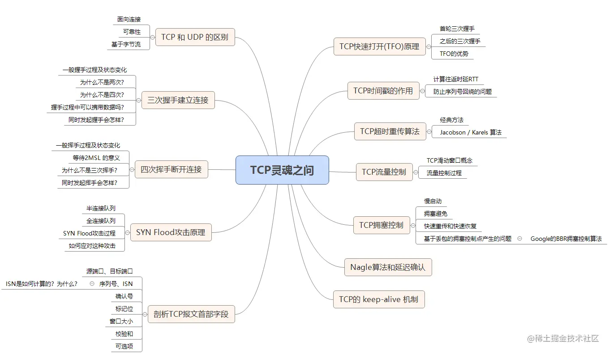
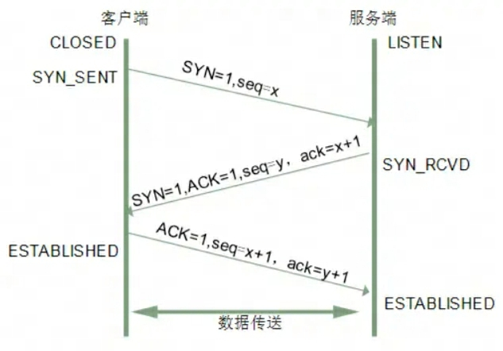
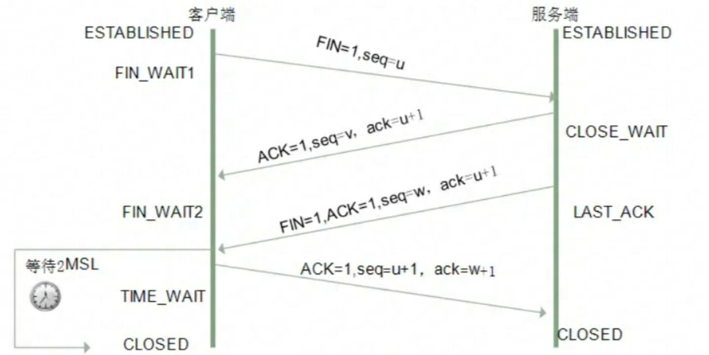

# HTTP TCP DNS

## HTTP

### HTTP请求报文结构

HTTP报文大致可分为请求行、请求头、空行、请求实体四部分；请求实体不是必须有的，每个部分结尾都用空行来作为结束标志

- 请求行: 请求方法 + 空格 + 统一资源标识符（URI） + 空格 + HTTP版本 + CR LF
- 请求头: 字段名 + 冒号 + 值 + CR LF
- 空行: 回车符CR + 换行符LF (很重要，用来区分开头部和实体)
- 请求体：由用户自定义添加，如post的body等

```js
// 请求行
GET /home HTTP/1.1
// 响应报文
HTTP/1.1 200 OK
```

### 状态码分为5类

1. 1xx (信息类状态码) 表示接收的请求正在处理
2. 2xx (成功状态码) 表示请求正常处理完成
3. 3xx (重定向状态码) 需要进行额外的操作以完成请求
4. 4xx (客户端错误状态码) 表示客户端错误
5. 5xx (服务端错误状态码) 表示服务端出现问题

### 常见状态码详解

- 100 Continue; 客户端应当继续发送请求
- 200 OK; 请求成功，最常见的成功状态码
- 204 No Content; 含义和200相同，但响应后没有body数据
- 206 Partical Content; 表示部分内容
- 301 Move Permanently; 请求的资源已永久移动到新位置(永久重定向)
- 302 Found 临时重定向
- 304 Not Modified; 当协商缓存命中时会返回这个状态码
- 400 Bad Request 服务器无法理解请求的格式，客户端不应当尝试再次使用相同的内容发起请求
- 401 Unauthorized; 请求未授权,它必须为请求提供认证信息
- 403 Forbidden; 禁止访问
- 404 Not Found; 请求失败,请求所希望得到的资源未被在服务器上发现
- 405 Method Not Allow
- 500 Internal Server Error; 服务器内部错误
- 501 Not Implemented; 表示客户端请求的功能还不支持
- 502 Bad Gateway; 服务器自身是正常的，但访问的时候出错了
- 503 Service Unavailable;服务不可用

### HTTP请求有哪些

- GET 通常用来获取资源
- POST 提交数据
- PUT 修改数据
- DELETE 删除数据
- OPTION 列出可对资源实行的请求方法，用来跨域请求
- HEAD 获取资源的元信息
- CONNECT 建立连接隧道，用来代理服务器
- TRACE 追踪请求-响应的传输路径

### GET 和 POST 有什么区别

- 缓存：get请求会被浏览器主动缓存下来，留下历史记录
- 编码：get请求只能进行URL编码，只允许ASCII字符; post没有限制，支持二进制数据
- 参数：get请求参数一般放在URL中，因此不安全（且长度限制跟浏览器厂商有关）；post放在请求体中，无长度限制；get请求参数可以保留在浏览器历史中
- TCP：get请求会把请求报文一次性发出去，而 POST 会分为两个 TCP 数据包，首先发 header 部分，如果服务器响应 100(continue)， 然后发 body 部分。(火狐浏览器除外，它的 POST 请求只发一个 TCP 包)

### URI( Uniform Resource Identifier) 统一资源标识符

结构

```js
shceme :// user:passwd@ host:port path ?query #fragment

// scheme 表示协议名，比如http，https，file等等。后面必须和:// 连在一起
// user:passwa@ 表示登录主机时的用户信息，不过很不安全，不推荐使用
// host:port 主机名和端口
// path 请求路径，标记资源所在位置
// query 查询参数
// fragemnt 表示URI所定位的资源内的一个锚点，浏览器可以根据这个锚点跳转到对应位置
```

### HTTP 和 HTTPS

#### HTTP特点

- 灵活可扩展：主要体现在两个方面。一个是语义上的自由，只规定了基本格式，比如空格分隔单词，换行分隔字段，其他的各个部分都没有严格的语法限制。另一个是传输形式的多样性，不仅仅可以传输文本，还能传输图片、视频等任意数据，非常方便
- 可靠传输：HTTP 基于 TCP/IP
- 请求-应答：也就是一发一收、有来有回， 当然这个请求方和应答方不单单指客户端和服务器之间，如果某台服务器作为代理来连接后端的服务端，那么这台服务器也会扮演请求方的角色
- 无状态：这里的状态是指通信过程的上下文信息，而每次 http 请求都是独立、无关的，默认不需要保留状态信息

#### HTTP缺点

- 无状态：Http是一种无状态协议，每个请求都是独立的，服务器不会暴保留之前的请求信息。这导致了在需要状态管理的场景下必须使用额外的手段(cookie，session)等实现
- 明文传输：Http 协议中的数据都是以明文方式传输的，这意味着在传输过程中，数据可能被中间者截取并篡改
- 队头阻塞：Http如果一个请求响应时间过长，会阻塞同一个连接上的其他请求
- 不支持服务器推送

#### Accept系列字段

数据格式、压缩方式、支持语言和字符集

数据格式

- text: text/html; text/plain; text/css;
- image: image/jpeg; image/png; image/gif;
- audio/video: audio/mpeg; video/mp4;
- application: application/json; application/javascript; application/octet-stream;

压缩方式

- gzip: 当今最流行的压缩格式
- deflate: 另外一种著名的压缩格式
- br: 一种专门为HTTP发明的压缩算法

```bash
# 发送端
Content-Encoding: gzip
# 接收端
Accept-Encoding: gzip
```

支持语言

```bash
# 发送端
Content-Language: zh-CN, zh, en
# 接收端
Accept-Language: zh-CN, zh, en
```

字符集

最后是一个比较特殊的字段, 在接收端对应为Accept-Charset，指定可以接受的字符集，而在发送端并没有对应的Content-Charset, 而是直接放在了Content-Type中，以charset属性指定。如

```bash
# 发送端
Content-Type: text/html; charset=utf-8
# 接收端
Accept-Charset: charset=utf-8
```

#### 定长和不定长的数据，HTTP 是怎么传输的

- 定长包体
  - 对于定长包体而言，发送端在传输的时候一般会带上 Content-Length 字段，告诉服务器本次请求的数据长度
- 不定长包体
  - Transfer-Encoding: chunked (表示分块传输数据，设置这个字段后会自动产生两个效果)
    - Content-Length 字段会被忽略
    - 基于长连接持续推送动态内容

#### HTTP 如何处理大文件的传输

- 分块传输(Chunked Transfer Encoding)
  - 需要在响应头配置 Transfer-Encoding 字段，并设置它的值为 chunked 或 gzip, chunked
  - 每个块包含了自己的长度信息,最后一个块的长度为0,表示传输结束
  - 这种方式允许服务器在不知道响应总长度的情况下开始发送数据,适用于动态生成的内容或者传输大文件
- 范围请求
  - http协议允许客户端在请求头中使用range字段，指定要获取的资源的字节范围
  - 服务器可以根据Range字段返回指定范围的数据，状态码206
  - 这种方式可以实现断点续传、多线程下载等功能，提高文件传输的效率和可靠性
- 流式传输
  - 对于一些大型多媒体文件，可以使用流式传输的方式
  - 服务器不需要等待整个文件生成完毕，而是在获取到数据后立马开始发送
  - 客户端收到数据后可以立即开始播放,而不需要等待整个文件下载完成
- 数据压缩
  - accept-encoding: gzip, deflate, br

#### 队头阻塞(Head-of-line blocking)问题

队头阻塞是指在HTTP/1.1及之前的版本中，同一个TCP连接上的所有HTTP请求必须按照发送顺序依次处理，如果某个请求响应延迟，会导致后面的请求都被阻塞，无法发送，从而影响性能

- 单个TCP连接的限制：在HTTP/1.1及之前版本中,浏览器通常对每个域名只建立一个或有限几个TCP连接。所有的请求都通过这个连接发送,响应也通过这个连接返回,形成一个"请求-响应"的串行模型
- 请求的串行处理：在同一个TCP连接上,HTTP请求必须按照发送顺序依次处理。如果某个请求的响应时间较长,那么后面的请求就必须等待,即使这些请求可能针对不同的服务器资源
- 连接的阻塞：当某个请求出现问题(如服务器响应慢、网络延迟高等)时,整个连接就会被阻塞,后续请求和响应都无法及时处理,浏览器只能等待当前请求完成才能发送下一个请求
- 影响性能

优化

- 并发连接：浏览器可以为每个域名建立多个TCP连接,将请求分散到不同的连接上,减少单个连接的阻塞影响
- 域名分片：将资源分散到不同的域名下,利用浏览器对每个域名的并发连接数限制,提高并发请求的数量
- 资源合并：将多个小文件合并为一个大文件,减少请求数量,从而减少队头阻塞的机会。但这也可能导致单个请求的响应时间变长
- 资源优先级：为关键资源设置更高的优先级,让浏览器优先请求和处理这些资源,减少关键资源的阻塞时间
- 升级为HTTP/2协议：HTTP/2引入了多路复用、请求优先级、服务器推送等特性,可以在同一个连接上并发处理多个请求和响应,从根本上解决了队头阻塞问题

#### http代理

HTTP 是基于请求-响应模型的协议，一般由客户端发请求，服务器来进行响应；当然，也有特殊情况，就是代理服务器的情况。引入代理之后，作为代理的服务器相当于一个中间人的角色，对于客户端而言，表现为服务器进行响应；而对于源服务器，表现为客户端发起请求，具有双重身份

功能

- 负载均衡：代理服务器可以将客户端的请求分发到多个后端服务器
- 安全防护
- 缓存代理

#### TLS 1.2 握手过程

### HTTP/2

- 头部压缩
  - 在http/1.1之前，请求体一般会有响应的压缩编码过程，通过Content-Encoding头部字段来指定，当请求字段非常复杂时，尤其是get请求，请求报文几乎全是请求头，这个时候还是存在非常大的优化空间
  - HTTP/2 针对头部字段，采用了对应的压缩算法 HPACK
  - HPACK
    - 首先在服务器和客户端之间建立哈希表，将用到的字段存在这张表中，那么传输的时候对于之前出现的值，只需要把索引传给对方即可，对方拿到索引查表，这种传索引的方式，让请求头字段得到了极大程度的精简和复用
    - 其次是对整数和字符串进行哈夫曼编码，原理就是将所有出现的字符建立一张索引表，然后让出现次数多的字符对应的索引尽可能短，传输的时候也是传输这样的索引序列，可以达到非常高的压缩率
- 多路复用
  - HTTP/2允许在同一个TCP连接上同时发送多个请求和响应,不再需要按照顺序一个一个地处理请求
  - 每个请求和响应都被分割成更小的二进制帧,这些帧可以交错发送,然后在另一端重新组装
  - 多个请求和响应可以并行处理,不会相互阻塞,大大提高了连接的利用率和效率
  - HTTP对头阻塞
    - HTTP 队头阻塞的问题，其根本原因在于HTTP 基于请求-响应的模型，在同一个 TCP 长连接中，前面的请求没有得到响应，后面的请求就会被阻塞
    - HTTP/2 便从 HTTP 协议本身解决了队头阻塞问题。注意，这里并不是指的TCP队头阻塞，而是HTTP队头阻塞，两者并不是一回事。TCP 的队头阻塞是在数据包层面，单位是数据包，前一个报文没有收到便不会将后面收到的报文上传给 HTTP，而HTTP 的队头阻塞是在 HTTP 请求-响应层面，前一个请求没处理完，后面的请求就要阻塞住。两者所在的层次不一样
  - 二进制分帧
    - HTTP/2 认为明文传输对机器而言太麻烦了，不方便计算机的解析，因为对于文本而言会有多义性的字符，比如回车换行到底是内容还是分隔符，在内部需要用到状态机去识别，效率比较低。于是 HTTP/2 干脆把报文全部换成二进制格式，全部传输01串，方便了机器的解析
    - 原来Headers + Body的报文格式如今被拆分成了一个个二进制的帧，用Headers帧存放头部字段，Data帧存放请求体数据。分帧之后，服务器看到的不再是一个个完整的 HTTP 请求报文，而是一堆乱序的二进制帧。这些二进制帧不存在先后关系，因此也就不会排队等待，也就没有了 HTTP 的队头阻塞问题
    - 通信双方都可以给对方发送二进制帧，这种二进制帧的双向传输的序列，也叫做流(Stream)。HTTP/2 用流来在一个 TCP 连接上来进行多个数据帧的通信，这就是多路复用的概念
    - 所谓的乱序，指的是不同 ID 的 Stream 是乱序的，但同一个 Stream ID 的帧一定是按顺序传输的。二进制帧到达后对方会将 Stream ID 相同的二进制帧组装成完整的请求报文和响应报文。当然，在二进制帧当中还有其他的一些字段，实现了优先级和流量控制等功能
- 设置请求优先级
- 服务器推送
  - 另外值得一说的是 HTTP/2 的服务器推送(Server Push)。在 HTTP/2 当中，服务器已经不再是完全被动地接收请求，响应请求，它也能新建 stream 来给客户端发送消息，当 TCP 连接建立之后，比如浏览器请求一个 HTML 文件，服务器就可以在返回 HTML 的基础上，将 HTML 中引用到的其他资源文件一起返回给客户端，减少客户端的等待

#### 二进制分帧

[iamges](../image/http2_frame.png)

每个帧分为帧头和帧体，先是3各字节的帧长度，这个长度表示的是帧体的长度

然后是帧类型，大概可以分为数据帧和控制帧两种，数据帧用来存放HTTP报文，控制帧用来管理流的传输

接下来的一个字节是帧标志，里面一共有8各标志位，常用的有END_HEADERS表示头数据结束，END_STREAM表示单方向数据发送结束

后4各字节是 StreamId 也就是流标识符，有了它，接收方就能从乱序的二进制帧中选择ID相同的帧，按顺序组装称请求/响应报文

### http 各版本区别

### http1.0

无法复用链接，完成即断开，重新慢启动和TCP3次握手
head of line blocking: 线头阻塞，导致请求之间相互影响

### http1.1

- 长连接(默认keep-alive)，复用
- host字段指定对应的虚拟站点
- 新增功能有
  - 断点续传
  - 身份验证
  - 状态管理
  - cache缓存

### http2.0

多路复用
二进制分帧
头部压缩
服务端推送

### HTTPS

证书/ssl加密/端口443

HTTPS为什么让数据传输更安全

HTTP的特性是明文传输，因此在传输的每一个环节，数据都可能被第三方窃取或篡改，具体来说：Http数据经过TCP层，然后经过wifi路由器、运营商、目标服务器，这些环节都可能被中间人拿到数据并进行篡改，也就是我们常说的中间人攻击

HTTPS并不是一个新的协议，而是一个加强版的HTTP，其原理是在HTTP和TCP之间建立了一个中间层，当HTTP和TCP通信时，不会像以前那样直接通讯，需要经过一个中间层进行加密，将加密的数据包传给TCP；这个中间层也叫安全层，核心就是对数据加密

#### 对称加密和非对称加密

- 对称加密：指加密和解密的密钥相同
- 非对称加密：A加密过的数据包只有B解密，B加密的数据包只能A解密

非对称加密：

这种加密方式中，服务器有两把钥匙，一把是公钥，也就是说每个人都能拿到，是公开的，另一把是私钥，这把私钥只有服务器自己直到

- 浏览器把client_random和加密方法传过来，服务器接收到，把server_random、加密方法和公钥传给浏览器
- 两者拥有了相同的client_random和server_random和加密方法。然后浏览器用公钥将client_random和server_random加密，生成与服务器通信的暗号
- 这时候由于是非对称加密，公钥加密过的数据只能私钥解密，因此就算中间人拿到浏览器传来的数据，由于没有私钥，无法解密，保证了数据的安全性
- 但是公钥加密的数据可以用私钥解密，那私钥加密过的数据也可以用公钥解密
- 服务器的数据只能用私钥加密，中间人一旦拿到公钥，那么就可以对服务器传来的数据进行解密，这样又被破解了；而且，只是采用非对称加密，对于服务器性能的消耗也是相当巨大的

对称加密和非对称加密的结合

可以发现，对称加密和非对称加密，单独应用任何一个，都会存在安全隐患

#### 添加数字证书

尽管通过两者加密方式的结合，能够很好地实现加密传输，但实际上还是存在一些问题。黑客如果采用 DNS 劫持，将目标地址替换成黑客服务器的地址，然后黑客自己造一份公钥和私钥，照样能进行数据传输。而对于浏览器用户而言，是不知道自己正在访问一个危险的服务器的；添加数字证书是为了让服务器证明自己的身份

传输过程：为了获取这个证书，服务器运营商需要向第三方认证机构(CA)获取授权，认证通过后CA会给服务器颁发数字证书，这个证书有两个作用：服务器向浏览器证明自己的身份，把公钥传给浏览器
认证发生时机是在 服务器传送server_random、加密方法的时候，顺便会带上数字证书(包含了公钥)，接着浏览器接收之后，就会开始验证数字证书。如果验证通过，那么后面的过程照常进行，否则拒绝执行


### Websocket

Websocket 是一个持久化的协议，基于http，服务端可以主动push

## DNS

### DNS解析过程

DNS(Domain Name System)域名系统，是一个应用层协议，我们发送一个请求，其中包含我们要查询的主机名，它会返回这个主机名对应的IP
DNS是一个分布式数据库，整个DNS系统分散在世界各地的很多台DNS服务器组成，每台DNS服务器都保存了一些数据，这些数据可以让我们最终查到主机名对应的IP

- 浏览器缓存：浏览器首先会检查自己的缓存中是否有这个域名的解析结果
- 操作系统缓存：如果浏览器缓存中没有，浏览器会向操作系统请求这个域名的解析结果，操作系统中也有一个DNS缓存，如果有这个域名解析结果，直接返回给浏览器
- 本地HOSTS文件：如果操作系统中也没有，操作系统会检查本地HOSTS文件，这个文件可以用来手动指定指定域名和IP地址的对应关系
- 向DNS服务器发送请求：以上步骤都没有，操作系统就会向配置的DNS服务器发送一个解析请求
- 递归查询：DNS服务器接收到请求后，会进行一系列递归查询，首先查询根域名服务器，然后是顶级域名服务器(.com)，然后是二级域名服务器(.baidu.com)，直到查找到这个域名的权威服务器
- 返回解析结果：权威服务器会返回这个域名对应的IP地址。DNS服务器将这个结果返回给操作系统，操作系统再返回给浏览器，浏览器会将这个结果缓存起来，以便下次查询

### DNS服务器

- 根服务器：根DNS服务器是DNS体系的最顶层，他知道所有顶级域(.com .net .org .edu)的DNS服务器地址
- 顶级域名服务器 顶级域DNS服务器负责管理某个顶级域下的所有二级域
- 权威DNS服务器 权威DNS服务器负责管理某个具体的域名；可以返回主机 - IP的最终映射

## TCP



### 三次握手

刚开始客户端处于Closed状态，服务端处于Listen状态。进行三次握手

- 第一次握手：客户端给服务端发送一个SYN报文，并指明客户端的初始化序列号ISN(Initial Sequence Number)(c)。此时客户端处于SYN_SEND状态
- 第二次握手：服务端接收到客户端的SYN报文，会以自己的SYN报文作为应答，并且也是指定了自己的初始化序列号ISN(s)，同时会把客户端的ISN + 1作为ACK值，表示自己已经收到客户端的SYN报文了，此时服务端处于SYN_RECV状态
- 第三次握手：客户端收到SYN报文之后，会发送一个ACK报文，也是一样把服务器的ISN+1作为ACK值，表示已经收到了服务端的 SYN 报文，此时客户端处于 ESTABLISHED 状态。服务器收到 ACK 报文之后，也处于 ESTABLISHED 状态，此时，双方已建立起了连接



#### 为什么需要三次握手，两次不行吗(根本原因：无法确认客户端的接收能力)

- 第一次握手：客户端发送网络包，服务端收到了。
  - 这样服务端就能得出结论：客户端的发送能力、服务端的接收能力是正常的。
- 第二次握手：服务端发包，客户端收到了。
  - 这样客户端就能得出结论：服务端的接收、发送能力，客户端的接收、发送能力是正常的。不过此时服务器并不能确认客户端的接收能力是否正常。
- 第三次握手：客户端发包，服务端收到了。
  - 这样服务端就能得出结论：客户端的接收、发送能力正常，服务器自己的发送、接收能力也正常

如果是两次：你现在发了SYN报文想握手，但是这个包滞留在当前的网络中迟迟没有到达，TCP以为是丢了包，于是重传，两次握手建立好了连接
但是连接关闭后，如果这个滞留在网络中的包到达服务端呢，这时候由于是两次握手，服务端只要接收到然后发送响应的数据包，就默认建立连接，但是现在客户端已经断开了

#### 第三次握手的时候，可以携带。前两次握手不能携带数据

- 如果前两次握手能够携带数据，那么一旦有人想攻击服务器，那么他只需要在第一次握手中的 SYN 报文中放大量数据，那么服务器势必会消耗更多的时间和内存空间去处理这些数据，增大了服务器被攻击的风险
- 第三次握手的时候，客户端已经处于ESTABLISHED状态，并且已经能够确认服务器的接收、发送能力正常，这个时候相对安全了，可以携带数据

#### 半连接队列

当客户端发送SYN到服务端，服务端收到以后恢复ACK和SYN，状态由LISTEN变为SYN_RECD，此时这个连接就被推入了SYN队列，也就是半连接队列

#### 全连接队列

当客户端返回ACK，服务端接收后，三次握手完成。这个时候连接等待被具体的应用取走，在被取走之前，它会被推入另外一个TCP维护的队列，也就是全连接队列

#### SYN攻击

用客户端在短时间内伪造大量不存在的IP地址，并向服务端疯狂发送SYN。对于服务端来说，会产生两个危险的后果：

- 处理大量的SYN包并返回对应的ACK报文，势必有大量的连接处于SYN_RECD状态，从而占满整个半连接队列，无法处理正常的请求
- 由于是不存在的IP，服务端长时间收不到客户端的ACK，会导致服务端不断重发数据，直到服务端资源耗尽

应对：

- 增加SYN连接，也就是增加半连接队列的容量
- 减少SYN + ACK重试次数，避免大量的超时重发
- 利用 SYN Cookie 技术，在服务端接收到SYN后不立即分配连接资源，而是根据这个SYN计算出一个Cookie，连同第二次握手回复给客户端，在客户端回复ACK的时候带上这个Cookie值，服务端验证 Cookie 合法之后才分配连接资源

### 四次挥手

- 第一次挥手
  - 客户端发送FIN报文，报文中会指定一个序列号。此时客户端处于FIN_WAIT1状态
  - 即发出连接释放报文段(FIN=1，序号seq=u)，并停止再发送数据，主动关闭TCP连接，进入FIN_WAIT1状态，等待服务器的确认
- 第二次挥手
  - 服务端收到FIN报文，会发送ACK报文，且把客户端的序列号值 +1 作为ACK报文的序列号值，表明已经收到客户端的报文了，此时服务端处于CLOSE_WAIT状态
  - 即服务端收到连接释放报文段后即发出确认报文段（ACK=1，确认号ack=u+1，序号seq=v），服务端进入CLOSE_WAIT（关闭等待）状态，此时的TCP处于半关闭状态，客户端到服务端的连接释放
  - 客户端收到服务端的确认后，进入FIN_WAIT2（终止等待2）状态，等待服务端发出的连接释放报文段
- 第三次挥手
  - 如果服务端也想断开连接了，和客户端第一次挥手一样，发送FIN报文，并且指定一个序列号，此时服务端处于LAST_ACK状态
  - 即服务端没有要向客户端发送数据，服务端发出连接释放报文段（FIN=1，ACK=1，序号seq=w，确认号ack=u+1）服务端进入LAST_ACK（最后确认）状态，等待客户端的确认
- 第四次挥手
  - 客户端收到 FIN 之后，一样发送一个 ACK 报文作为应答，且把服务端的序列号值 +1 作为自己 ACK 报文的序列号值，此时客户端处于 TIME_WAIT 状态
  - 需要过一阵子以确保服务端收到自己的 ACK 报文之后才会进入 CLOSED 状态，服务端收到 ACK 报文之后，就处于关闭连接了，处于 CLOSED 状态
  - 即客户端收到服务端的连接释放报文段后，对此发出确认报文段（ACK=1，seq=u+1，ack=w+1），客户端进入TIME_WAIT（时间等待）状态。此时TCP未释放掉，需要经过时间等待计时器设置的时间2MSL（Maximum Segment Lifetime，报文最大生存时间）后，客户端才进入CLOSED状态



#### 为什么需要四次挥手

因为服务端在接收到FIN, 往往不会立即返回FIN, 必须等到服务端所有的报文都发送完毕了，才能发FIN。因此先发一个ACK表示已经收到客户端的FIN，延迟一段时间才发FIN。这就造成了四次挥手

#### 等待2MSL的意义

如果不等待，客户端直接跑路，当服务端还有很多数据包要给客户端发，且还在路上的时候，若客户端的端口此时刚好被新的应用占用，那么就接收到了无用数据包，造成数据包混乱。所以，最保险的做法是等服务器发来的数据包都死翘翘再启动新的应用

- 1 个 MSL 确保四次挥手中主动关闭方最后的 ACK 报文最终能达到对端
- 1 个 MSL 确保对端没有收到 ACK 重传的 FIN 报文可以到达

### 其他

#### TCP快速打开原理(TFO)

TCP快速打开(TCP Fast Open, TFO)是一种优化TCP连接建立过程的技术,旨在减少连接建立的延迟,提高网络性能。它允许在客户端发送第一个TCP SYN包的同时携带应用层数据，从而避免了传统三次握手过程中的一个往返事件(RTT Round-Trip Time)

- 客户端首次连接服务器时，发送一个包含TFO选项的SYN包，表示支持TFO
- 服务器收到带有TFO选项的SYN包后，如果也支持TFO，会生成一个唯一的cookie，并在SYN-ACK响应中将Cookie发送给客户端
- 客户端收到服务器的SYN-ACK包后，缓存Cookie，完成剩余的连接建立过程
- 当客户端再次连接同一个服务器时，可以在SYN包中携带之前缓存的cookie以及应用层数据
- 服务器收到带有cookie和数据的SYN包后，验证cookie的有效性，如果有效，服务器会直接接受连接并处理应用层数据，无需等待客户端的ACK确认
- 如果Cookie无效或者服务器不支持TFO,服务器会回复一个正常的SYN-ACK响应,客户端则回退到传统的三次握手过程

#### TCP 和 UDP 的区别

- TCP是一个面向连接的、可靠的、基于字节流的传输层协议
- UDP是一个面向无连接的传输层协议

与UDP相比，TCP有三大核心特性

- 面向连接：所谓连接，是指客户端和服务端的连接，在双方互相通信之前，TCP需要三次握手建立连接，而UDP没有相应的建立连接的过程
- 可靠性：状态和可控制：
  - TCP会精准的记录哪些数据发送了，哪些数据被对方接收了哪些没有被收到，保证数据包按序到达，不允许半点差错
  - 当丢包了或者网络环境不佳，TCP会根据具体情况调整自己的行为，控制自己的发送速度或重发
- 面向字节流：UDP的数据传输是基于数据包的，这是因为仅仅只是继承了IP层的特性，而TCP为了维护状态，将一个个的IP包变成了字节流

#### TCP的流量控制

#### TCP的拥塞控制

## Nginx

- 正向代理
  - 客户端想获得一个服务器的数据，因为种种原因无法获取。于是客户端设置了一个代理服务器，并且指定目标服务器，之后代理服务器向目标服务器转交请求并将获取的资源发给客户端。这样本质上起到了对真实服务器隐藏客户端的目的。正向代理需要修改客户端，比如修改浏览器配置
- 反向代理
  - 当收到请求后，会首先根据转发规则来确定请求应该被转发到哪个服务器上，然后将请求转发到对应的真实服务器上。本质上起到了对客户端隐藏服务器的作用；一般使用反向代理后，需要通过修改DNS让域名解析到代理服务器IP

## 七层模型

OSI 模型

- 应用层 各种应用软件，包括 Web 应用。
- 标识层 数据格式标识，基本压缩加密功能
- 会话层 控制应用程序之间会话能力；如不同软件数据分发给不同软件
- 传输层 端到端传输数据的基本功能；如 TCP、UDP
- 网络层 定义IP编址，定义路由功能；如不同设备的数据转发
- 数据链路层 定义数据的基本格式，如何传输，如何标识；如网卡MAC地址
- 物理层 底层数据传输，如网线；网卡标准