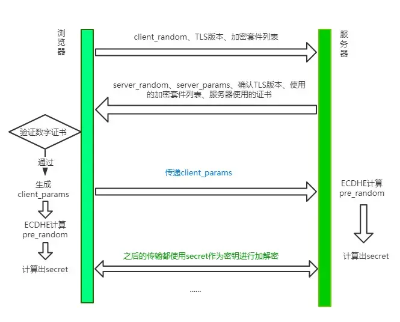

# HTTP TCP DNS

## HTTP

### http状态码

### 状态码分为5类

1. 1xx (信息类状态码) 表示接收的请求正在处理
2. 2xx (成功状态码) 表示请求正常处理完成
3. 3xx (重定向状态码) 需要进行额外的操作以完成请求
4. 4xx (客户端错误状态码) 表示客户端错误
5. 5xx (服务端错误状态码) 表示服务端错误

### 常见状态码详解

- 200 OK; 请求成功，最常见的成功状态码
- 204 No Content; 含义和200相同，但响应后没有body数据
- 206 Partical Content; 表示部分内容
- 301 Move Permanently; 请求的资源已永久移动到新位置(永久重定向)
- 302 临时重定向
- 304 Not Modified; 当协商缓存命中时会返回这个状态码
- 400 Bad Request
- 403 Forbidden; 禁止访问
- 404 Not Found; 服务器无法找到请求的资源
- 405 Method Not Allow
- 500 Internal Server Error; 服务器内部错误
- 501 Not Implemented; 表示客户端请求的功能还不支持
- 502 Bad GateWay 服务器自身是正常的，但访问的时候出错了
- 503 Service Unavailable;服务不可用

### HTTP请求和响应

### HTTP请求有哪些

- GET 通常用来获取资源
- POST 提交数据
- PUT 修改数据
- DELETE 删除数据
- OPTION 列出可对资源实行的请求方法，用来跨域请求
- HEAD 获取资源的元信息
- CONNECT 建立连接隧道，用来代理服务器
- TRACE 追踪请求-响应的传输路径

### GET 和 POST 有什么区别

- 缓存 get请求会被浏览器主动缓存下来，留下历史记录
- 编码 get请求只能进行URL编码，只允许ASCII字符; post没有限制，支持二进制数据
- 参数 get请求参数一般放在URL中，因此不安全（且长度限制跟浏览器厂商有关），post放在请求体中，无长度限制；get请求参数可以保留在浏览器历史中
- TCP  get请求会把请求报文一次性发出去，而 POST 会分为两个 TCP 数据包，首先发 header 部分，如果服务器响应 100(continue)， 然后发 body 部分。(火狐浏览器除外，它的 POST 请求只发一个 TCP 包)

### URI( Uniform Resource Identifier) 统一资源标识符

结构

```js
shceme :// user:passwd@ host:port path ?query #fragment

// scheme 表示协议名，比如http，https，file等等。后面必须和:// 连在一起
// user:passwa@ 表示登录主机时的用户信息，不过很不安全，不推荐使用
// host:port 主机名和端口
// path 请求路径，标记资源所在位置
// query 查询参数
// fragemnt 表示URI所定位的资源内的一个锚点，浏览器可以根据这个锚点跳转到对应位置
```

### HTTP 和 HTTPS

#### HTTP特点

- 灵活可扩展 主要体现在两个方面。一个是语义上的自由，只规定了基本格式，比如空格分隔单词，换行分隔字段，其他的各个部分都没有严格的语法限制。另一个是传输形式的多样性，不仅仅可以传输文本，还能传输图片、视频等任意数据，非常方便
- 可靠传输 TTP 基于 TCP/IP
- 请求-应答 也就是一发一收、有来有回， 当然这个请求方和应答方不单单指客户端和服务器之间，如果某台服务器作为代理来连接后端的服务端，那么这台服务器也会扮演请求方的角色
- 无状态 这里的状态是指通信过程的上下文信息，而每次 http 请求都是独立、无关的，默认不需要保留状态信息

#### HTTP缺点

- 无状态
- 明文传输
- 队头阻塞

### TLS 1.2 握手过程

### HTTP/2

- 头部压缩
  - 在http/1.1之前，请求体一般会有响应的压缩编码过程，通过Content-Encoding头部字段来指定，当请求字段非常复杂时，尤其时get请求，请求报文几乎全是请求头，这个时候还是存在非常大的优化空间
  - http/2 针对头部字段，采用了对应的压缩算法 HPACK
  - HPACK
    - 首先在服务器和客户端之间建立哈希表，将用到的字段存在这张表中，那么传输的时候对于之前出现的值，只需要把索引传给对方即可，对方拿到索引查表，这种传索引的方式，让请求头字段得到了极大程度的精简和复用
    - 其次是对整数和字符串进行哈夫曼编码，原理就是现将所有出现的字符建立一张索引表，然后让出现次数多的字符对应的索引尽可能短，传输的时候也是传输这样的索引序列，可以达到非常高的压缩率
- 多路复用
  - HTTP对头阻塞
    - HTTP 队头阻塞的问题，其根本原因在于HTTP 基于请求-响应的模型，在同一个 TCP 长连接中，前面的请求没有得到响应，后面的请求就会被阻塞
    - HTTP/2 便从 HTTP 协议本身解决了队头阻塞问题。注意，这里并不是指的TCP队头阻塞，而是HTTP队头阻塞，两者并不是一回事。TCP 的队头阻塞是在数据包层面，单位是数据包，前一个报文没有收到便不会将后面收到的报文上传给 HTTP，而HTTP 的队头阻塞是在 HTTP 请求-响应层面，前一个请求没处理完，后面的请求就要阻塞住。两者所在的层次不一样
  - 二进制分帧
    - HTTP/2 认为明文传输对机器而言太麻烦了，不方便计算机的解析，因为对于文本而言会有多义性的字符，比如回车换行到底是内容还是分隔符，在内部需要用到状态机去识别，效率比较低。于是 HTTP/2 干脆把报文全部换成二进制格式，全部传输01串，方便了机器的解析
    - 原来Headers + Body的报文格式如今被拆分成了一个个二进制的帧，用Headers帧存放头部字段，Data帧存放请求体数据。分帧之后，服务器看到的不再是一个个完整的 HTTP 请求报文，而是一堆乱序的二进制帧。这些二进制帧不存在先后关系，因此也就不会排队等待，也就没有了 HTTP 的队头阻塞问题
    - 通信双方都可以给对方发送二进制帧，这种二进制帧的双向传输的序列，也叫做流(Stream)。HTTP/2 用流来在一个 TCP 连接上来进行多个数据帧的通信，这就是多路复用的概念
    - 所谓的乱序，指的是不同 ID 的 Stream 是乱序的，但同一个 Stream ID 的帧一定是按顺序传输的。二进制帧到达后对方会将 Stream ID 相同的二进制帧组装成完整的请求报文和响应报文。当然，在二进制帧当中还有其他的一些字段，实现了优先级和流量控制等功能
- 设置请求优先级
- 服务器推送
  - 另外值得一说的是 HTTP/2 的服务器推送(Server Push)。在 HTTP/2 当中，服务器已经不再是完全被动地接收请求，响应请求，它也能新建 stream 来给客户端发送消息，当 TCP 连接建立之后，比如浏览器请求一个 HTML 文件，服务器就可以在返回 HTML 的基础上，将 HTML 中引用到的其他资源文件一起返回给客户端，减少客户端的等待

#### 二进制分帧

[iamges](../image/http2_frame.png)

每个帧分为帧头和帧体，先是3各字节的帧长度，这个长度表示的是帧体的长度

然后是帧类型，大概可以分为数据帧和控制帧两种，数据帧用来存放HTTP报文，控制帧用来管理流的传输

接下来的一个字节是帧标志，里面一共有8各标志位，常用的有END_HEADERS表示头数据结束，END_STREAM表示单方向数据发送结束

后4各字节是 StreamId 也就是流标识符，有了它，接收方就能从乱序的二进制帧中选择ID相同的帧，按顺序组装称请求/响应报文

### http 各版本区别

### http1.0

无法复用链接，完成即断开，重新慢启动和TCP3次握手
head of line blocking: 线头阻塞，导致请求之间相互影响

### http1.1

- 长连接(默认keep-alive)，复用
- host字段指定对应的虚拟站点
- 新增功能有
  - 断点续传
  - 身份验证
  - 状态管理
  - cache缓存

### http2.0

多路复用
二进制分帧
头部压缩
服务端推送

### https

证书
ssl加密
端口443

https为什么让数据传输更安全

HTTP的特性是明文传输，因此在传输的每一个环节，数据都可能被第三方窃取或篡改，具体来说：Http数据经过TCP层，然后经过wifi路由器、运营商、目标服务器，这些环节都可能被中间人拿到数据并进行篡改，也就是我们常说的中间人攻击

HTTPS并不是一个新的协议，而是一个加强版的HTTP，其原理是在HTTP和TCP之间建立了一个中间层，当HTTP和TCP通信时，不会像以前那样直接通讯，需要经过一个中间层进行加密，将加密的数据包传给TCP；这个中间层也叫安全层，核心就是对数据加密

#### 对称加密和非对称加密

- 对称加密：指加密和解密的密钥相同
- 非对称加密：A加密过的数据包只有B解密，B加密的数据包只能A解密

非对称加密：

这种加密方式中，服务器有两把钥匙，一把是公钥，也就是说每个人都能拿到，是公开的，另一把是私钥，这把私钥只有服务器自己直到

- 浏览器把client_random和加密方法传过来，服务器接收到，把server_random、加密方法和公钥传给浏览器
- 两者拥有了相同的client_random和server_random和加密方法。然后浏览器用公钥将client_random和server_random加密，生成与服务器通信的暗号
- 这时候由于是非对称加密，公钥加密过的数据只能私钥解密，因此就算中间人拿到浏览器传来的数据，由于没有私钥，无法解密，保证了数据的安全性
- 但是公钥加密的数据可以用私钥解密，那私钥加密过的数据也可以用公钥解密
- 服务器的数据只能用私钥加密，中间人一旦拿到公钥，那么就可以对服务器传来的数据进行解密，这样又被破解了；而且，只是采用非对称加密，对于服务器性能的消耗也是相当巨大的

对称加密和非对称加密的结合

可以发现，对称加密和非对称加密，单独应用任何一个，都会存在安全隐患

#### 添加数字证书

尽管通过两者加密方式的结合，能够很好地实现加密传输，但实际上还是存在一些问题。黑客如果采用 DNS 劫持，将目标地址替换成黑客服务器的地址，然后黑客自己造一份公钥和私钥，照样能进行数据传输。而对于浏览器用户而言，是不知道自己正在访问一个危险的服务器的；添加数字证书是为了让服务器证明自己的身份

传输过程：为了获取这个证书，服务器运营商需要向第三方认证机构(CA)获取授权，认证通过后CA会给服务器颁发数字证书，这个证书有两个作用：服务器向浏览器证明自己的身份，把公钥传给浏览器
认证发生时机是在 服务器传送server_random、加密方法的时候，顺便会带上数字证书(包含了公钥)，接着浏览器接收之后，就会开始验证数字证书。如果验证通过，那么后面的过程照常进行，否则拒绝执行



### Websocket

Websocket 是一个持久化的协议，基于http，服务端可以主动push

## DNS

### DNS解析过程

DNS(Domain Name System)域名系统，是一个应用层协议，我们发送一个请求，其中包含我们要查询的主机名，它会返回这个主机名对应的IP
DNS是一个分布式数据库，整个DNS系统分散在世界各地的很多台DNS服务器组成，每台DNS服务器都保存了一些数据，这些数据可以让我们最终查到主机名对应的IP

- 浏览器缓存：浏览器首先会检查自己的缓存中是否有这个域名的解析结果
- 操作系统缓存：如果浏览器缓存中没有，浏览器会向操作系统请求这个域名的解析结果，操作系统中也有一个DNS缓存，如果有这个域名解析结果，直接返回给浏览器
- 本地HOSTS文件：如果操作系统中也没有，操作系统会检查本地HOSTS文件，这个文件可以用来手动指定指定域名和IP地址的对应关系
- 向DNS服务器发送请求：以上步骤都没有，操作系统就会向配置的DNS服务器发送一个解析请求
- 递归查询：DNS服务器接收到请求后，会进行一系列递归查询，首先查询根域名服务器，然后是顶级域名服务器(.com)，然后是二级域名服务器(.baidu.com)，直到查找到这个域名的权威服务器
- 返回解析结果：权威服务器会返回这个域名对应的IP地址。DNS服务器将这个结果返回给操作系统，操作系统再返回给浏览器，浏览器会将这个结果缓存起来，以便下次查询

### DNS服务器

- 根服务器：根DNS服务器是DNS体系的最顶层，他知道所有顶级域(.com .net .org .edu)的DNS服务器地址
- 顶级域名服务器 顶级域DNS服务器负责管理某个顶级域下的所有二级域
- 权威DNS服务器 权威DNS服务器负责管理某个具体的域名；可以返回主机 - IP的最终映射

## TCP

### 三次握手

### 四次挥手

## Nginx

- 正向代理
  - 客户端想获得一个服务器的数据，因为种种原因无法获取。于是客户端设置了一个代理服务器，并且指定目标服务器，之后代理服务器向目标服务器转交请求并将获取的资源发给客户端。这样本质上起到了对真实服务器隐藏客户端的目的。正向代理需要修改客户端，比如修改浏览器配置
- 反向代理
  - 当收到请求后，会首先根据转发规则来确定请求应该被转发到哪个服务器上，然后将请求转发到对应的真实服务器上。本质上起到了对客户端隐藏服务器的作用；一般使用反向代理后，需要通过修改DNS让域名解析到代理服务器IP
