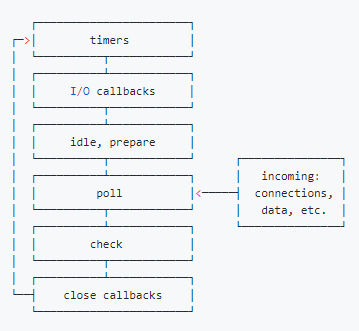

# node 基础

## node 是什么

Node.js 是一种后端技术，允许开发人员在其应用的服务器端使用JavaScript

## node 事件循环机制

Node.js的事件循环(Event Loop)是其处理非阻塞I/O操作和事件驱动编程的核心机制。它允许Node.js在单线程中高效地处理大量的并发请求和I/O操作

外部输入数据 -> 轮循阶段(poll) -> 检查阶段(check) -> 关闭阶段(close callbacks) -> 定时器检查阶段(timer) -> I/O 阶段(I/O callbacks) -> 闲置阶段(idle, prepare) -> 轮询阶段(poll)

每次循环称为一个"Tick",每个Tick处理一批事件和回调

- timers阶段： 执行到期的 setTimeout/setInterval 队列回调
- I/O阶段：执行上轮循环循环中的少数未执行的 I/O 回调
- idle, prepare (仅 node 内部使用)
- poll阶段
  - 执行回调
  - 执行定时器
    - 如有到期的 setTimeout/setInterval，则返回 timer 阶段
    - 如有 setImmediate，则前往 check 阶段
- check阶段 处理由setImmediate()注册的回调
- close callbacks阶段 处理一些关闭的回调,如socket.on('close', ...)

### 事件循环的运行机制

- 事件循环从Timers阶段开始,依次经过每个阶段,处理相应的事件和回调；
- 当一个阶段完成后,事件循环会检查是否有任何需要处理的process.nextTick()回调,如果有,会立即执行这些回调。然后,事件循环进入下一个阶段,重复上述过程
- 当所有阶段完成后,事件循环会检查是否有任何setImmediate()回调需要处理,如果有,会返回到Check阶段处理这些回调
- 如果没有更多的事件和回调需要处理,事件循环会退出

### 特殊的API和回调

- process.nextTick():在当前阶段完成后立即执行回调,优先于其他阶段的回调
- setImmediate():在Check阶段执行回调,类似于setTimeout(callback, 0)
- Promise的回调:在当前阶段完成后处理,优先于setTimeout()和setImmediate()

### 事件循环的阻塞和非阻塞

- Node.js的事件循环是非阻塞的，意味着I/O操作不会阻塞事件循环的执行
- 当遇到I/O操作时，Node.js会将其交给底层的系统线程处理，而事件循环则继续执行其他任务
- 当I/O操作完成后，对应的回调函数会被添加到事件队列中,等待事件循环的处理

## node的构架

- Node API(核心模块http、fs、stream等)
- 中间层(Node.js Bindings) 主要是使 js 和 C/C++ 进行通信
- 支撑 nodejs 运行的关键(v8、libuv、c-ares 等模块组成，向上一层提供 api 服务)

## 其他

### nodejs是如何处理高并发的

nodejs通过其独特的设计和事件驱动的非阻塞I/O模型，实现了高并发。(适合I/O密集型应用，不适合CPU密集型应用)

- 单线程事件循环
  - 使用单个线程来处理所有的请求和事件
  - 事件循环不断地检查事件队列，并执行相应的回调函数。
  - 当一个请求到达时，Node.js 将其放入事件队列中，然后继续处理下一个请求，而不会等待当前请求完成
- 非阻塞I/O
  - 当 Node.js 发起一个 I/O 操作（如文件读取、网络请求）时，它不会阻塞线程，而是立即返回，并在 I/O 操作完成后通过回调函数通知事件循环
  - 这样可以在等待 I/O 操作完成的同时处理其他请求，提高了并发性能
- 事件驱动
  - 当某个事件发生时（如请求到达、I/O 操作完成），Node.js 会触发相应的事件，并执行关联的回调函数
  - 通过事件驱动的方式，Node.js 可以高效地处理大量的并发请求
- 异步编程
  - Node.js 提供了大量的异步 API，如文件系统操作、网络请求等
  - 通过使用回调函数、Promise 或 async/await，可以编写异步代码，避免阻塞线程
  - 异步编程允许 Node.js 在等待 I/O 操作完成的同时处理其他请求，提高了并发性能
- 负载均衡
- 垃圾回收

### express 和 koa 的区别

- 中间件模型
  - express使用传统的回调函数作为中间件，中间件接收request、response 和 next 函数作为参数
  - koa使用洋葱模型，基于 Promise 的中间件模型，中间件接收 context 对象作为参数,通过 await next() 来控制中间件的流程
- 请求和响应
  - Express 的中间件直接操作 request 和 response 对象,可以通过修改这些对象来处理请求和响应
  - Koa 将 request 和 response 对象封装到 context 对象中,中间件通过操作 context 对象来处理请求和响应
- 错误处理
- 路由
  - Express 内置了路由功能,可以直接使用 app.get()、app.post() 等方法定义路由
  - Koa 没有内置路由功能,需要使用第三方中间件如 koa-router 来实现路由功能
- 生态系统
- 性能

### 什么是线程池，Node.js 中哪个库处理它

线程池由 libuv 库处理

libuv 是一个多平台的 C 库，它支持基于异步 I/O 的操作，例如文件系统、网络和并发。

libuv：因为各个系统的 I/O 库都不一样，windows 系统有 IOCP，Linux 系统有 epoll。Node.js 的作者Ryan 为了将其整合在一起实现一个跨平台的异步 I/O 库，开始写 libuv

### Node.js 中的事件发射器是什么

EventEmitter是一个 Node.js 类，它包含所有基本上能够发出事件的对象

这可以通过使用 eventEmitter.on()函数附加由对象发出的命名事件来完成

### Node.js 缓冲区

通常，缓冲区是一个临时内存，流主要使用它来保存一些数据，直到被消耗为止

- 与 JavaScript 的 Unit8Array 相比，缓冲区还引入了其他用例，主要用于表示固定长度的字节序列
- 它还支持 ASCII、utf-8 等传统编码。它是 v8 之外的固定（不可调整大小）分配内存

### Node.js 流streams

stream是基于事件EventEmitter的数据管理模式．由各种不同的抽象接口组成，主要包括可写，可读，可读写，可转换等几种类型

可用于处理和操作网络上的流式大文件（视频、mp3 等）。他们使用缓冲区作为临时存储

- Writable：可以写入数据的流（例如，fs.createWriteStream()）
- Readable：可以从中读取数据的流（例如，fs.createReadStream()）
- Duplex：既可读又可写的流（例如，net.Socket）
- Transform：可以在写入和读取数据时修改或转换数据的双工流（例如，zlib.createDeflate()）
