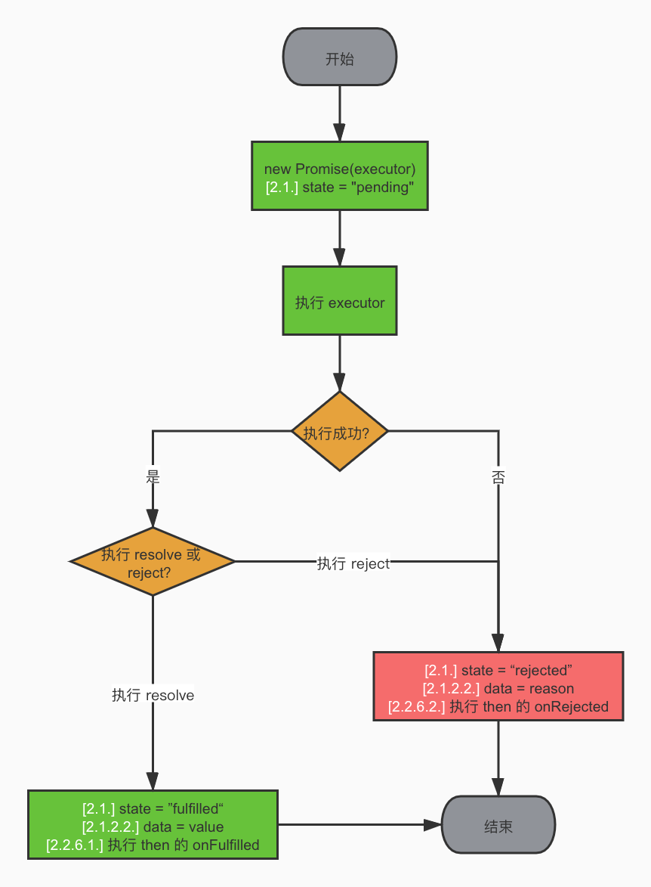

# js原理相关

## async/await原理

async和await的实现依赖js的promise机制和生成器函数，当遇到await表达式时，js引擎会暂停函数的执行，将控制权交给调用者。
在后台，js引擎会监视await等待的Promise对象的状态变化，当Promise状态变为已解决或已拒绝时，引擎会恢复函数的执行，并根据Promise的状态返回解决值或抛出异常

实现原理：async/await是一种语法糖，原理是利用ES6里的迭代函数generator函数

generator函数说明：generator函数跟普通函数在写法上的区别就是：多了一个星号*，并且只有在generator函数中才能使用yield关键字，yield相当于generator函数执行的中途暂停点，如果需要暂停点继续执行后面函数，就需要用到next方法，next方法执行后返回一个对象(value和done)

- value：暂停点后面接的值，也就是yield后面接的值
- done: 是否generator函数已走完，没走完为false，走完为true

```js
function* gen() {
  yield 1;
  yield 2;
  yield 3;
}
const g = gen();
console.log(g.next()); // {value: 1, done: false}
console.log(g.next()); // {value: 2, done: false}
console.log(g.next()); // {value: 3, done: false}
console.log(g.next()); // {value: undefined, done: true} 可以看到最后一个是undefined，这取决于你generator函数有无返回值
// 比如上述gen 函数最终返回了3 那么最后一个next()的value就是3
```

yield后面接函数的话，到了对应暂停点yield，会马上执行此函数，并且该函数的执行返回值，会被当做此暂停点对象的value

```js
function fn(num) {
  console.log(num)
  return num
}
function* gen() {
  yield fn(1)
  yield fn(2)
  return 3
}
const g = gen()
console.log(g.next()) 
// 1
// { value: 1, done: false }
console.log(g.next())
// 2
//  { value: 2, done: false }
console.log(g.next()) 
// { value: 3, done: true }
```

yield后面接Promise

```js
function fn (num) {
  return new Promise((resolve, reject) => {
    setTimeout(() => {
      resolve(num)
    }, 1000)
  })
}

function* gen() {
  yield fn(1);
  yield fn(2);
  return 3;
}
const genFn = gen();
console.log(genFn.next()); // { value: Promise { <pending> }, done: false }
console.log(genFn.next()); // { value: Promise { <pending> }, done: false }
console.log(genFn.next()); // { value: 3, done: true }

// 其实我们想要的结果是，两个Promise的结果1 和 2，那怎么做呢？很简单，使用Promise的then方法就行了
const genResFn = gen();
const next1 = genResFn.next();
next1.value.then((res) => {
  console.log(next1) // 1秒后输出 { value: Promise { 1 }, done: false }
  console.log(res1) // 1秒后输出 1

  const next2 = g.next()
  next2.value.then(res2 => {
    console.log(next2) // 2秒后输出 { value: Promise { 2 }, done: false }
    console.log(res2) // 2秒后输出 2
    console.log(g.next()) // 2秒后输出 { value: 3, done: true }
  })
})
```

next函数传参：generator函数可以用next方法来传参，并且可以通过yield来接收这个参数，注意两点

- 第一次next传参是没有用的，只有从第二次开始next传参才有用
- next传值时，顺序是：先右边yield，后左边接收参数

```js
function* gen() {
  const num1 = yield 1;
  console.log(num1)
  const num2 = yield 2;
  console.log(num2)
  return 3;
}
const g = gen();
console.log(g.next(1)) // { value: 1, done: false }
console.log(g.next(2)) // { value: 2, done: false }
```

Promise+next传参

```js
function fn(nums) {
  return new Promise(resolve => {
    setTimeout(() => {
      resolve(nums * 2)
    }, 1000)
  })
}
function* gen() {
  const num1 = yield fn(1)
  const num2 = yield fn(num1)
  const num3 = yield fn(num2)
  return num3
}

const g = gen()
const next1 = g.next()
next1.value.then(res => {
  console.log(next1) // 1秒后输出 { value: Promise { <pending> }, done: false }
  console.log(res) // 1秒后输出 2

  const next2 = g.next(res)
  next2.value.then(res2 => {
    console.log(next2) // 2秒后同时输出 { value: Promise { 4 }, done: false }
    console.log(res2) // 2秒后同时输出 4

    const next3 = g.next(res2) // 传入上次的res2
    next3.value.then(res3 => {
      console.log(next3) // 3秒后同时输出 { value: Promise { 8 }, done: false }
      console.log(res3) // 3秒后同时输出 8

       // 传入上次的res3
      console.log(g.next(res3)) // 3秒后同时输出 { value: 8, done: true }
    })
  })
})
```

```js
// async/await 实现
function generatorToAsync (generatorFn) {
  return function () {
    const gen = generatorFn.apply(this, arguments);

    return new Promise((resolve, reject) => {
      function go (key, arg) {
        let res;
        try {
          res = gen[key](arg); // 这里有可能会执行返回reject状态的Promise
        } catch (err) {
          return reject(err);
        }

        // 解构获得value和done
        const { value, done } = res;
        if (done) {
          return resolve(value);
        } else {
          // value有可能是：常量，Promise，Promise有可能是成功或者失败
          return Promise.resolve(value).then(val => go('next', val), err => go('throw', err))
        }
      }
      go("next") // 第一次执行
    })
  }
}

function* gen () {
  const num1 = yield fn(1)
  console.log(num1) // 2
  const num2 = yield fn(num1)
  console.log(num2) // 4
  const num3 = yield fn(num2)
  console.log(num3) // 8
  return num3
}

const asyncFn = generatorToAsync(gen)
console.log(asyncFn);
asyncFn().then(res => console.log(res))
```

## instanceof原理

instanceof 用于检查一个对象是否是某个构造函数的实例。它通过判断对象的原型链上是否存在构造函数的 prototype 属性来确定结果

```js
function myInstanceof (obj, constructorObj) {
  if (typeof obj !== 'object' || obj === null) {
    return false;
  }
  let proto = Object.getPrototypeOf(obj);
  // let proto = obj.__proto__;
  while (proto != null) {
    if (proto === constructorObj.prototype) {
      return true;
    }
    proto = Object.getPrototypeOf(proto);
  }
  return false;
}
```

## 浅拷贝

在js中，浅拷贝是指创建一个新的对象，并将原始对象的属性值复制到新对象中，但是如果属性值是引用类型(如对象，数组)，则只复制引用，而不是创建一个新的对象。这意味着原始对象和新对象共享相同的引用类型属性

原理是：遍历原始对象的可枚举属性，并将属性名和属性值复制到新对象中，对于原始类型(如数字、字符串、布尔值)的属性,会直接复制值;对于引用类型的属性,只复制引用,新对象和原始对象指向同一个引用

```js
const originObj = { a: 1, b: 2, c: { d: 3 } };
// 方法1 Object.assign()
const newObj = Object.assign({}, originObj);
// 方法2 扩展运算符
const newObj2 = { ...originObj };
// 数组可以使用slice方法
const originalArr = [1, 2, { a: 3 }];
const newArr = originalArr.slice();
const newArr = [ ...originalArr ];
// 手动拷贝
function shallowCopy(originObj) {
  if (typeof originObj !== 'object' || originObj === null) {
    return originObj;
  }

  const newObj = Array.isArray(originObj) ? [] : {};
  for (let key in originObj) {
    if (originObj.hasOwnProperty(key)) {
      newObj[key] = obj[key];
    }
  }
  return newObj;
}
```

## 深拷贝

在js中，深拷贝是指创建一个新的对象，并递归地复制原始对象的所有属性，包括嵌套的对象和数组，使得新对象和原始对象完全独立，互不影响

原理：

- 对于原始数据类型：直接复制值到新对象中
- 对于引用数据类型：递归地进行深拷贝，创建一个新对象或数组，将原始对象的属性值复制到新对象中
- 对于特殊对象： Date和RegExp，则需要根据其特定的构造函数创建新的对象

方法

- JSON.parse(JSON.stringify(obj))
  - 无法处理函数、Symbol等特殊类型的属性
  - 对象的属性如果是undefined、函数、Symbol，则会被忽略
  - 对象的原型链不会被复制
  - 循环引用的对象会导致错误
- 递归实现深拷贝
  - 无法处理函数、Symbol 等特殊类型的属性
  - 对象的原型链不会被复制
  - 循环引用的对象会导致无限递归

```js
// 方法1 JSON.parse(JSON.stringify(obj))
const obj1 = { a: 1, b: { c: 2 } };
const copyObj1 = JSON.parse(JSON.stringify(obj1));
// 方法2 递归实现深拷贝
function deepCopy (originObj) {
  if (typeof originObj !== 'object' || originObj === null) {
    return obj;
  }
  const newObj = Array.isArray(originObj) ? [] : {};

  for (let key in originObj) {
    if (originObj.hasOwnProperty(key)) {
      newObj[key] = deepCopy(originObj[key]);
    }
  }

  return newObj;
}
// 方法3 更全面的实现
function deepCopyComplete (obj, cache = new WeakMap()) {
  // 使用了WeakMap来存储已经复制过的对象，以避免无限递归和循环引用的问题。如果对象中存在循环引用，即某个对象的属性直接或间接地引用了该对象本身，使用WeakMap可以有效地避免这个问题
  if (typeof obj !== 'object' || obj === null) {
    return obj;
  }

  if (cache.has(obj)) {
    return cache.get(obj);
  }

  let newObj;

  if (obj instanceof Date) {
    newObj = new Date(obj);
  } else if (obj instanceof RegExp) {
    const reFlags = /\w*$/;
    const result = new RegExp(obj.source, reFlags);
    result.lastIndex = obj.lastIndex;
    newObj = result;
  } else if (obj instanceof Symbol) {
    newObj = Symbol(obj.toString());
  } else if (obj instanceof Set) {
    newObj = new Set();
    obj.forEach(value => {
      newObj.add(deepCopyComplete(value, cache));
    })
  } else if (obj instanceof Map) {
    newObj = new Map();
    obj.forEach((value, key) => {
      newObj.set(key, deepCopyComplete(value, cache));
    })
  } else {
    newObj = Array.isArray(obj) ? [] : {};
    cache.set(obj, newObj);

    for (let key in obj) {
      if (obj.hasOwnProperty(key)) {
        newObj[key] = deepCopyComplete(obj[key], cache);
      }
    }
    // myForeach(obj, (value, key) => {
    //   if (obj) {
    //     key = value;
    //   }
    //   newObj[key] = deepCopyComplete(obj[key], cache);
    // })
  }
  return newObj;
}

function myForeach (obj, fn) {
  let index = -1;
  const length = obj.length;
  while (++index < length) {
    fn(obj[index], index);
  }
  return obj;
}
```

## bind、call、apply

```js
Function.prototype.MyApply = function(context, arr) {
  context = context || window;
  context.fn = this;

  let result;
  if (arr) {
    result = context.fn(...arr);
  } else {
    result = context.fn();
  }

  delete context.fn;
  return result;
};
```

```js
Function.prototype.MyCall = function(context, ...args) {
  context = context || window;
  context.fn = this;
  let result = context.fn(...args);
  delete context.fn;
  return result;
};
```

```js
Function.prototype.MyBind = function(context, ...args) {
  const fn = this;
  return function (...args1) {
    const allArgs = [...args, ...args1];
    if (new.target) { // 判断是否为new的构造函数
      return new fn(...allArgs);
    } else {
      return fn.call(context, ...allArgs);
    }
  }
  // if (typeof this !== "function") {
  //   throw new TypeError(
  //     "Function.prototype.bind - what is trying to be bound is not callable"
  //   );
  // }

  // var args = Array.prototype.slice.call(arguments, 1);
  // var fToBind = this;
  // var fNop = function() {};
  // var fBound = function() {
  //   // this instanceof fBound === true时,说明返回的fBound被当做new的构造函数调用
  //   return fToBind.apply(
  //     this instanceof fNop ? this : context,
  //     args.concat(Array.prototype.slice.call(arguments))
  //   );
  // };
  // // 维护原型关系
  // if (this.prototype) {
  //   fNop.prototype = this.prototype;
  // }
  // fBound.prototype = new fNop();
  // return fBound;
};
```

## EventBus

```js
function EventEmitter() {
  this.events = Object.create(null);
}

EventEmitter.prototype.on = function (type, listener, flag = false) {
  if (this.events[type]) {
    if (flag) {
      this.events[type].unshift(listener);
    } else {
      this.events[type].push(listener);
    }
  } else {
    this.events[type] = [listener];
  }
}
EventEmitter.prototype.emit = function (type, ...args) {
  if (this.events[type]) {
    this.events[type].forEach(fn => {
      fn.call(this, ...args);
    })
  }
}
EventEmitter.prototype.once = function (type, listener) {
  const wrapper = (...args) => {
    listener.call(this, ...args);
    this.off(type, wrapper);
  }

  wrapper.origin = listener;
  this.on(type, wrapper);
}
EventEmitter.prototype.off = function (type, listener) {
  if (this.events[type]) {
    this.events[type] = this.events[type].filter(fn => {
      return fn !== listener && fn.origin !== listener;
    })
  }
}
EventEmitter.prototype.removeAllListeners = function () {
  this.events = Object.create(null);
}
```

```js
class EventBus {
  constructor() {
    this.event = Object.create(null);
  }

  on (type, listener, flag = false) {
    if (this.event[type]) {
      if (flag) {
        this.event[type].unshift(listener);
      } else {
        this.event[type].push(listener);
      }
    } else {
      this.event[type] = [listener];
    }
  }

  once (type, listener) {
    const warpper = (...args) => {
      listener.call(this, ...args);
      this.off(type, warpper);
    }
    this.on(type, warpper);
  }

  emit (type, ...args) {
    if (this.event[type]) {
      this.event[type].forEach(fn => {
        fn.call(this, ...args);
      })
    }
  }

  off (type, listener) {
    if (this.event[type]) {
      this.event[type] = this.event[type].filter(fn => {
        return fn !== listener;
      });
    }
  }

  removeAllListeners () {
    this.event = Object.create(null);
  }
}
```

## 防抖和节流

```js
function debounce(fn, delay) {
  let timer;

  return function (..args) {
    let context = this;
    if (timer) {
      clearTimeout(timer);
      timer = null;
    }
    timer = setTimeout(() => {
      fn.apply(context, args);
    })
  }
}

function throttle (fn, delay) {
  let flag = true;

  return function (...args) {
    let context = this;
    if (!flag) {
      return;
    }
    flag = false;
    setTimeout(() => {
      fn.apply(context, args);
      flag = true;
    }, delay)
  }
}
function throttle2 (fn, delay) {
  let last = 0;

  return function (...args) {
    let context = this;
    let now = new Date().getTime();

    if (now - last < delay) {
      return;
    }
    last = now;
    fn.apply(context, args);
  }
}
```

## Object.create

```js
function createObject(obj) {
  function F() {} // 定义一个空的构造函数 F
  F.prototype = obj; // 将传入的对象 obj 设置为构造函数 F 的原型，F 的实例对象将以 obj 为原型
  return new F(); // 返回一个新的对象，该对象是通过构造函数 F 创建的，新对象将以 obj 为原型
}
```

## 函数柯里化

函数柯里化是一种将接受多个参数的函数转换为接受一个单一参数的函数,并且返回接受余下参数且返回结果的新函数的技术

- 这个curry函数接受一个函数fn作为参数,并返回一个新的函数curried
  - 当调用curried函数时,它会接收一些参数args
  - 如果接收到的参数数量(args.length)大于等于原始函数fn所需的参数数量(fn.length),则使用apply方法将args传递给原始函数fn并返回结果
  - 如果接收到的参数数量小于原始函数所需的参数数量,则返回一个新的函数
  - 这个新的函数接受额外的参数newArgs,并通过递归调用curried函数,将之前的参数args和新的参数newArgs合并后传递给curried函数
  - 这个过程会一直递归,直到接收到的参数数量满足原始函数所需的参数数量,然后返回最终的结果

```js
function curry (fn) {
  return function curried (...args) {
    if (args.length >= fn.length) {
      return fn.apply(this, args);
    } else {
      return function (...args2) {
        return curried.apply(this, args.concat(args2));
      }
    }
  }
}
```

## Promise

Promise标准解读:

- 只有一个then方法，没有catch、race、all等方法
- then方法返回一个新的Promise
- 不同Promise可以相互调用（interoperable）
- Promise初始状态为pending，它可以由此状态转为fulfilled或者rejected，一旦状态确定，就不可以再次转换为其他状态、状态确认的过程称为settle

```js
// Promise构造函数接收一个executor函数，executor函数执行完同步或异步操作后，调用它的两个参数resolve和reject
// var promise = new Promise((resolve, reject) => {})
function myPromise (executor) {
  this.status = 'pending' // promise当前状态
  this.value = undefined // promise的值
  this.reason = undefined // promise的失败原因
  this.onFulfilledCallbacks = [] // promise resolve时的回调函数集，因为promise结束之前有可能有多个回调添加到它上面
  this.onRejectedCallbacks = []

  const resolve = (value) => {
    if (this.status !== 'pending') {
      return
    }
    this.status = 'fulfilled'
    this.value = value
    this.onFulfilledCallbacks.forEach(callback => callback())
  }

  const reject = (reason) => {
    if (this.status !== 'pending') {
      return
    }
    this.status = 'rejected'
    this.reason = reason
    this.onRejectedCallbacks.forEach(callback => callback())
  }

  // 考虑到执行executor的过程中有可能出错，所以我们用try/catch块给包起来，并且在出错后以catch到的值reject掉这个Promise
  try {
    executor(resolve, reject) // 执行executor并传入相应的参数
  } catch (error) {
    reject(error)
  }
}
// Promise对象有一个then方法，用来注册在这个Promise状态确定后的回调，很明显，then方法需要写在原型链上
// then方法会返回一个Promise
myPromise.prototype.then = function (onFulfilled, onRejected) {
  // 根据标准，如果then的参数不是function，则我们需要忽略它，此处以如下方式处理
  onFulfilled = typeof onFulfilled === 'function' ? onFulfilled : value => value;
  onRejected = typeof onRejected === 'function' ? onRejected : reason => throw reason;
  const promise2 = new myPromise((resolve, reject) => {
    if (this.status == 'fulfilled') {
      setTimeout(() => {
        try {
          const result = onFulfilled(this.value);
          resolve(result)
        } catch (error) {
          reject(error)
        }
      }, 0)
    } else if (this.status == 'rejected') {
      setTimeout(() => {
        try {
          const result = onRejected(this.reason);
          resolve(result)
        } catch (error) {
          reject(error)
        }
      }, 0)
    } else {
      this.onFulfilledCallbacks.push(() => {  
        setTimeout(() => {
          try {
            const result = onFulfilled(this.value);
            resolve(result)
          } catch (error) {
            reject(error)
          }
        }, 0)
      });  
      this.onRejectedCallbacks.push(() => {  
        setTimeout(() => {
          try {
            const result = onRejected(this.reason);
            resolve(result)
          } catch (error) {
            reject(error)
          }
        }, 0)
      });
    }
  })
  return promise2
}

myPromise.prototype.catch = (onRejected) => {
  return this.then(null, onRejected)
}

// 2.3. Promise 处理程序
// Promise 处理程序是一个将 promise 和 value 作为输入的抽象操作，我们将其表示为 [[Resolve]](promise, x)。
// 补充说明：这里我们将 resolve 和 reject 也传入进来，因为后续要根据不同的逻辑对 promise 执行 fulfill 或 reject 操作。
function promiseResolutionProcedure(promise2, x, resolve, reject) {
  // 2.3.1. 如果 promise 和 x 引用的是同一个对象，promise 将以一个 TypeError 作为 reason 来进行 reject。
  if (promise2 === x) {
    return reject(new TypeError("Chaining cycle detected for promise"));
  }

  // 2.3.2. 如果 x 是一个 promise，根据它的状态：
  if (x instanceof Promise) {
    // 2.3.2.1. 如果 x 的状态为 pending，promise 必须保持 pending 状态直到 x 的状态变为 fulfilled 或 rejected。
    if (x.state === "pending") {
      x.then(function (value) {
        promiseResolutionProcedure(promise2, value, resolve, reject);
      }, reject);
    }
    // 2.3.2.2. 如果 x 的状态为 fulfilled，那么 promise 也用同样的值来执行 fulfill 操作。
    else if (x.state === "fulfilled") {
      resolve(x.data);
    }
    // 2.3.2.3. 如果 x 的状态为 rejected，那么 promise 也用同样的 reason 来执行 reject 操作。
    else if (x.state === "rejected") {
      reject(x.data);
    }
    return;
  }

  // 2.3.3. 除此之外，如果 x 是一个对象或者函数，
  if (x && (typeof x === "object" || typeof x === "function")) {
    // 2.3.3.3.3. 如果 resolvePromise 和 rejectPromise 都被调用，或者多次调用同样的参数，则第一次调用优先，任何之后的调用都将被忽略。
    let isCalled = false;

    try {
      // 2.3.3.1. 声明一个 then 变量来保存 then
      let then = x.then;
      // 2.3.3.3. 如果 then 是一个函数，将 x 作为 this 来调用它，第一个参数为 resolvePromise，第二个参数为 rejectPromise，其中：
      if (typeof then === "function") {
        then.call(
          x,
          // 2.3.3.3.1. 假设 resolvePromise 使用一个名为 y 的值来调用，运行 promise 处理程序 [[Resolve]](promise, y)。
          function resolvePromise(y) {
            // 2.3.3.3.3. 如果 resolvePromise 和 rejectPromise 都被调用，或者多次调用同样的参数，则第一次调用优先，任何之后的调用都将被忽略。
            if (isCalled) return;
            isCalled = true;
            return promiseResolutionProcedure(promise2, y, resolve, reject);
          },
          // 2.3.3.3.2. 假设 rejectPromise 使用一个名为 r 的 reason 来调用，则用 r 作为 reason 对 promise 执行 reject 操作。
          function rejectPromise(r) {
            // 2.3.3.3.3. 如果 resolvePromise 和 rejectPromise 都被调用，或者多次调用同样的参数，则第一次调用优先，任何之后的调用都将被忽略。
            if (isCalled) return;
            isCalled = true;
            return reject(r);
          }
        );
      }
      // 2.3.3.4. 如果 then 不是一个函数，使用 x 作为值对 promise 执行 fulfill 操作。
      else {
        resolve(x);
      }
    } catch (e) {
      // 2.3.3.2. 如果检索 x.then 的结果抛出异常 e，使用 e 作为 reason 对 promise 执行 reject 操作。
      // 2.3.3.3.4. 如果调用 then 时抛出一个异常 e，
      // 2.3.3.3.4.1. 如果 resolvePromise 或 rejectPromise 已经被调用过了，则忽略异常。
      if (isCalled) return;
      isCalled = true;
      // 2.3.3.3.4.2. 否则，使用 e 作为 reason 对 promise 执行 reject 操作。
      reject(e);
    }
  }
  // 2.3.4. 如果 x 不是一个对象或者函数，使用 x 作为值对 promise 执行 fulfill 操作。
  else {
    resolve(x);
  }
}
```



## new 操作符实现

```js
function myNew (fn, ...args) {
  const obj = Object.create(fn.prototype)
  // obj.__proto__ = fn.prototype
  const res = fn.apply(obj, args)
  if (res && (typeof res === 'object')) {
    return res;
  }
  return obj;
}
```

## 数组扁平化

```js
function flattenArray (arr) {
  let res = []
  for (let i = 0; i < arr.length; i++) {
    if (Array.isArray(arr[i])) {
      result = result.concat(flattenArray(arr[i]))
    } else {
      result.push(arr[i])
    }
  }
  return res;
}

function flattenArray2 (arr) {
  return arr.reduce((acc, cur) => {
    if (Array.isArray(cur)) {
      return [...acc, ...flattenArray2(cur)]
    } else {
      return [...acc, cur]
    }
  }, [])
}

function flattenArray3 (arr) {
  const result = []
  const stack = [...arr]

  while (stack.length) {
    const item = stack.pop();
    if (Array.isArray(item)) {
      stack.push(...item)
    } else {
      result.push(item)
    }
  }
  return result;
}
```
