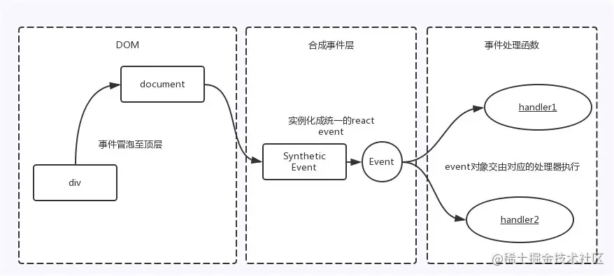

# React

## React 生命周期

新的生命周期不再使用以下三个钩子函数

- componentWillMount
  - 不推荐使用的原因是它的执行时机可能会导致一些问题，具体来说：在 componentWillMount 中触发了异步操作，可能会导致在组件卸载前仍然执行未完成的操作，发生一些潜在错误
- componentWillReceiveProps(nextProps)
  - 容易导致状态不一致的问题，在这个方法中，你可以在组件接收新的 props 之前执行某些操作，但是它不适合进行依赖于 props 的状态更新
- componentWillUpdate(nextProps, nextState)
  - 与 componentWillReceiveProps()类似，这个方法也容易导致状态不一致

因为 ReactFiber Reconciliation 这个过程有可能暂停然后继续执行，所以挂载和更新之前的生命周期钩子就有可能不执行或执行多次

### 旧的生命周期

初始化阶段，由 ReactDOM.render()方法触发初次渲染，会调用以下钩子函数

- constructor
- componentWillMount
- render()
- componentDidMount

更新阶段 由组件内部 this.setState()或父组件重新 render 触发

- shouldComponentUpdate
- componentWillUpdate
- render()
- componentDidUpdate(prevProps,prevState)

卸载阶段 由 ReactDOM.unmountComponentAtNode()方法触发

- componentWillUnmount

### 新的生命周期

初始化阶段

- constructor
  - 构造函数，通常用于初始化组件的状态(state)和绑定方法 (注意：不能在 constructor 中调用 setState，因为第一次 render 还未执行,DOM 节点还未挂载)
- **getDerivedStateFromProps(nextProps, prevState)** 是一个静态方法，用于在组件接收新的 props 时计算并返回新的 state，用来替代不推荐使用的 componentWillReceiveProps
  - 静态方法：getDerivedStateFromProps() 是一个静态方法，因此不能访问实例的 this，它只接收两个参数：nextProps 和 prevState
  - 计算新的 state 通常，你可以在这个方法内部根据 nextProps 和 prevState 来计算并返回新的 state。这个新的 state 将在组件更新时应用
  - 不触发副作用 与 componentDidUpdate() 不同，getDerivedStateFromProps() 不应执行副作用，如发起网络请求。它只用于计算 state
  - 适用于控制组件内部的状态 getDerivedStateFromProps() 主要用于控制组件内部的状态，以确保它与外部传入的 props 保持同步
- render() 是 class 组件中唯一必须实现的方法，用于渲染 dom，必须返回 reactDOM (注意：不要再 render 里面 setState，否则会触发死循环导致内存崩溃)
- componentDidMount() 组件挂载后立即调用，是发送网络请求，启用事件监听方法的好时机，并且可以在此钩子函数里直接调用 setState() 方法

更新阶段

- **getDerivedStateFromProps**
- shouldComponentUpdate
  - 参数：nextProps, nextState(第一个是即将更新的 props 值，第二个是即将跟新后的 state 值)，可以根据更新前后的 props 和 state 老比较加一些限制条件，决定是否更新
  - 不建议在 shouldComponentUpdate() 中进行深层比较或 JSON.stringify()，非常影响效率和性能
  - 不要在 shouldComponentUpdate 中调用 setState，否则会导致无限循环调用更新、渲染，直至浏览器内存崩溃
  - 可以使用内置的 PureComponent 组件替代
- render
- **getSnapshotBeforeUpdate** 它在组件更新之前触发，它允许你捕获组件更新前的一些信息，并在组件更新后使用这些信息
  - 触发时机 getSnapshotBeforeUpdate() 在 render()方法被调用后、组件 DOM 更新前触发，通常用于在更新前捕获一些 DOM 信息
  - 接收两个参数 (prevProps、prevState)，你可以使用这些参数来比较前后的 props 和 state
  - 返回值 方法应该返回一个值（通常是一个对象），它将成为 componentDidUpdate() 方法的第三个参数。这个返回值通常用于保存一些 DOM 相关的信息，比如滚动位置
  - 通常和 componentDidUpdate 一起使用 getSnapshotBeforeUpdate()  结合 componentDidUpdate(prevProps, prevState, snapshot)  使用，snapshot 参数是 getSnapshotBeforeUpdate()  的返回值。你可以在 componentDidUpdate()  中使用 snapshot 来执行 DOM 操作或其他一些操作
- componentDidUpdate(prevProps, prevState, snapshot)
  - 会在更新后会被立即调用。首次渲染不会执行
  - 如果组件实现了  getSnapshotBeforeUpdate 生命周期，第三个是“snapshot” 参数传递

卸载阶段

- componentWillUnmount
  - 这个函数是在组件卸载前执行的，可以在这里做一些清理工作，比如取消订阅、清除定时器、取消异步请求或者移除事件监听

### 哪些方法会触发 React 重新渲染？重新渲染 render 会做些什么

触发 React 重新渲染

- setState（）方法被调用
- 父组件重新渲染

重新渲染 render 会做些什么

- 新旧VNode比较，Diff算法

### React中如何避免不必要的render

- shouldComponentUpdate 和 PureComponent
  - 在 React 类组件中，可以利用 shouldComponentUpdate或者 PureComponent 来减少因父组件更新而触发子组件的 render，从而达到目的。shouldComponentUpdate 来决定是否组件是否重新渲染，如果不希望组件重新渲染，返回 false 即可
- 利用高阶组件
  - 在函数组件中，并没有 shouldComponentUpdate 这个生命周期，可以利用高阶组件，封装一个类似 PureComponet 的功能
- 使用 React.memo
  - React.memo 是 React 16.6 新的一个 API，用来缓存组件的渲染，避免不必要的更新，其实也是一个高阶组件，与 PureComponent 十分类似，但不同的是， React.memo只能用于函数组件

## React 事件机制

React并不是将click事件绑定到了div的真实dom上，而是在document处监听了所有事件，当事件发生并且冒泡到document处的时候，React将事件内容封装并交由真正的处理函数运行。这样不仅减少了内存的消耗，还能在组件挂载销毁时统一订阅和移除事件

除此之外，冒泡到document的事件也不是原生的浏览器事件，而是由react自己实现的合成事件(SyntheticEvent),因此如果不想要事件冒泡的话应该调用 event.preventDefault 方法，而不是 event.stopProppagation 方法



目的

- 抹平浏览器之间的兼容问题，另外这是一个跨浏览器原生事件包装器，赋予了跨浏览器开发的能力
- 对于原生浏览器事件来说，浏览器会给监听器创建一个事件对象。如果有很多事件监听，那么就需要分配很多的事件对象，造成高额的内存分配问题。对于合成事件来说，有一个事件池专门管理他们的创建和销毁，当事件需要被使用时，就会从池子中复用对象，事件回调结束后，就会销毁事件对象上的属性，便于下次复用事件对象

与普通html不同处

- 命名：原生事件为小写，react为小驼峰
- 语法：原生事件为字符串，react为函数
- react事件不能采用return false的方式阻止浏览器的默认行为，而是需要明确调用preventDefault来阻止默认行为

执行顺序

原生事件先执行，合成事件后执行，合成事件会冒泡绑定到document上，应避免原生事件和合成事件混用，如果原生事件阻止冒泡，可能会导致合成事件不执行，因为需要冒泡到document上合成事件才执行

- 事件委派：React会把所有事件绑定到结构的最外层，使用统一的事件监听器，这个事件监听器上维持了一个映射来保存所有组件内部事件监听和处理函数
- 自动绑定：React组件中，每个方法的上下文都会指向该组件的实例，即自动绑定this为当前组件

## React 高阶组件、Render Props、hooks

- HOC是react中用于复用组件的一种高级技巧。是一种设计模式。高阶组件是参数为组件，返回值为新组件的函数
- RenderProps 是一种在React组件之间使用一个值为函数的prop共享代码的简单技术，是一个用于告知组件需要渲染什么内容的函数prop
- hooks：hooks 是 react 16.8 中引入的新的 API，它可以让你在不编写 class 的情况下使用 state 和 lifecycle

## React 组件通讯

- props (父子组件通信)
- Provider,Consumer,Context (跨级组件间通信)
  - Context 在 react 16.x 之前是定义一个全局的对象，类似于 vue 的 eventBus，如果组件要使用到该值直接通过 this.context 获取
- EventEmitter (非嵌套组件间通信)
- onRef
- ref

## React 全局数据

### Redux

Redux 的灵感来源于 Flux 架构和函数式编程原理，状态更新可预测、可跟踪，提倡使用单一存储

单向数据流

- 用户在 view 层触发某个事件，通过 dispatch 发送了 action 和 payload
- action 和 payload 被传入 reducer 函数，返回一个新的 state
- store 拿到 reducer 返回的 state 并做更新，同时通知 view 层进行 re-render

三大原则

- 单一数据源：整个应用的全局 state 被存储在一颗 objectTree 中，并且这个 objectTree 只存在唯一一个 store
- state 是只读的：唯一改变 state 的方法就是触发 action，action 是一个用于描述已发生事件的普通对象
- 纯函数修改：通过 reducer 修改状态，reducer 是纯函数，它接收之前的 state 和 action，返回一个新的 state

缺点：

- 学习曲线陡峭
- 大量的模板代码
- 状态量多的情况，性能较差
- reducer 需要返回新的对象，如果更新的值层级较深，更新成本也很高
- 更多的内存占用，由于采用单一数据源，所有状态存储在一个 state 中，当某些状态不在需要使用时，也不会被垃圾回收器释放资源

### Redux Middleware

所谓中间件，我们可以理解为拦截器，用于对某些过程进行拦截和处理，且中间件之间能够串联使用；在redux中，我们中间件拦截的是dispath提交到reducer的这个过程，从而增强dispatch的功能

中间件的设计遵循了洋葱模型(Onion Model),即每个Middleware都可以在action被dispatch之前或之后对其进行处理，并且可以选择是否将action传递给下一个middleware，middleware的执行顺序是按照其注册的顺序依次执行的

### zustand

Zustand 是一个轻量级的状态管理库，它使用简单的API和最小的样板代码来管理状态；基于hooks概念，通过创建一个自定义的Hook来管理状态

支持多个状态切片(slices),每个切片都有自己的状态和操作方法，简单易用、学习成本低、适用于中小型应用程序

```js
import create from 'zustand';
const useCounterStore = create((set) => ({
  count: 0,
  increment: () => set((state) => ({ count: state.count + 1 })),
  decrement: () => set((state) => ({ count: state.count - 1 })),
})

function Counter() {
  const { count, increment, decrement } = useCounterStore();
  return (
    <div>
      <p>Count: {count}</p>
      <button onClick={increment}>Increment</button>
      <button onClick={decrement}>Decrement</button>
    </div>
  )
}
```

## React Hooks

Hooks 通常指：系统运行到某一时期时，会调用被注册到该时机的回调函数

### Hooks在平时开发中需要注意的问题和原因

- 不要在循环，条件或嵌套函数中调用Hook，必须始终在 React函数的顶层使用Hook
- useEffect 清理副作用
- useEffect 依赖于外部变量，如果依赖的变量发生变化，则会重新执行 useEffect（避免在useEffect中直接修改状态）

### Hooks 解决的问题

- 类组件的不足
  - 状态逻辑复用，在组件之间复用状态逻辑很难，可能要用到 Render Props(渲染属性)或者 Hoc(高阶组件)，但无论是渲染属性还是高阶组件，都会在原先的组件外包裹一层父容器，导致层级冗余
  - 趋向复杂难以维护。在生命周期中混杂不相干的逻辑，如在 componentDidMount 中注册事件以及其它逻辑，在 componentWillUnmount 中卸载事件，这样分散不集中的写法，很容易出 bug
  - this 指向问题，父组件给子组件传递函数时，必须绑定 this

```js
// this 使用方式
// 1. 构造函数中绑定this
// 2. render()中绑定this
// 3. 箭头函数
// 4. 使用类的静态属性：原理和第一种差不多，更简洁
class TestThis extends React.Component {
  handleClick2;
  constructor(props) {
    super(props);
    this.state = {
      num: 1,
      title: "react study"
    };
    this.handleClick2 = this.handleClick1.bind(this);
  }
  handleClick1() {
    this.setState({
      num: this.state.num + 1
    });
  }
  handleClick3 = () => {
    this.setState({
      num: this.state.num + 1
    });
  };

  render() {
    return (
      <div>
        <h2>Hello, {this.state.num}</h2>
        <button onClick={() => this.handleClick1()}>but1</button>
        <button onClick={this.handleClick2}>but2</button>
        <button onClick={this.handleClick1.bind(this)}>but3</button>
        <button onClick={this.handleClick3}>but4</button>
      </div>
    );
  }
}
export default TestThis;
```

- Hoc 是react中用于复用组件逻辑的一种高级技巧，自身并不是reactAPI的一部分，是一种组件的设计模式
- Hooks 的优势

对比mixins

- 难以追溯的方法与属性
- 覆盖、同名
- 多次使用

### useState

useState 是 react 自带的一个 hook 函数，他的作用就是用来声明状态变量

- 参数：状态初始值
- 返回: 一个数组，第一个元素是当前状态的值，第二个元素是更新状态的函数
- useState 可以多次调用，相互之间是独立的；react 是根据 useState 的顺序来定的
- react 规定我们必须把 hooks 函数写在最外层，不能写在 ifelse 条件语句中，确保 hooks 的顺序一致

性能

- Hook 内部使用 Object.is 来比较新/旧 state 是否相等
- 与 class 组件中的 setState 方法不同，如果你修改状态的时候，传的状态值没有变化，则不重新渲染
- 与 class 组件中的 setState 方法不同，useState 不会自动合并更新对象。你可以用函数式的 setSatte 结合展开运算符来达到合并更新对象的效果

默认情况下，只要父组件状态变了，不管子组件一部以来该状态，子组件也会重新渲染

- 类组件：使用 PureComponent
- 函数组件：使用 useMemo，将函数组件传递给 mono 之后，就会返回一个新的组件，新组件的功能：如果接收到的属性没发生变化，则不重新渲染函数

异步更新行为

这个问题的方法是使用 useEffect Hook。useEffect 会在组件渲染后执行，并在组件卸载之前执行清理操作。我们可以使用 useEffect 在组件重新渲染时打印 count 的新值

```js
import React, { useState } from "react";

function TestUseState() {
  const [count, setCount] = useState(0);
  const [age, setAge] = useState(18);

  return (
    <div>
      <p>{count}</p>
      <button
        onClick={() => {
          setCount(count + 1);
        }}
      >
        计数
      </button>
    </div>
  );
}
```

### useEffect

类似于 componentDidMount 和 componentDidUpdate

我们写的有状态组件，通常会产生很多的副作用(side effect),比如发起 ajax 请求获取数据，添加一些事件监听和取消注册，手动修改 dom 等。我们之前都把这些副作用的函数写在生命周期钩子函数中，比如 componentDidMount，componentDidUpdate；而现在的 useEffect 就相当于这些生命周期的集合体

注意：

- react 首次渲染和之后每次渲染都会调用一边传给 useEffect 的函数，之前的话我们需要声明两个生命周期来表示首次渲染(componentDidMount)和之后的更新导致的重新渲染(componentDidUpdate)
- useEffect 中定义的副作用函数的执行不会阻碍浏览器更新视图，也就是说这些函数是异步执行的；而之前的 componentDidMount 或 componentDidUpdate 中的代码则是同步执行的
- 解绑副作用（清除）：让我们传给 useEffect 的副作用函数返回一个新函数，这个新的函数将会在组件的下一次重新渲染之后执行
- 跳过不必要的副作用函数： useEffect 提供了第二个参数，用来告诉 react 只有当这个参数的值繁盛变化时，我们才执行第一个参数副作用函数

```js
// 使用useEffect
useEffect(() => {
  document.title = `YOU CLICK ${count} times`;
})

// 不使用useEffect
componentDidMount() {
  document.title = `You clicked ${this.state.count} times`;
}

componentDidUpdate() {
  document.title = `You clicked ${this.state.count} times`;
}
```

### useLayoutEffect

- useEffect 在全部渲染完毕后才会执行
- useLayoutEffect会在浏览器layout之后，painting之前执行
- 其函数签名与 useEffect 相同，但它会在所有的 DOM 变更之后同步调用 effect
- 可以使用它来读取 DOM 布局并同步触发重渲染
- 在浏览器执行绘制之前 useLayoutEffect 内部的更新计划将被同步刷新
- 尽可能使用标准的 useEffect 以避免阻塞视图更新

```js
function LayoutEffect() {
    const [color, setColor] = useState('red');
    useLayoutEffect(() => {
        alert(color);
    });
    useEffect(() => {
        console.log('color', color);
    });
    return (
        <>
            <div id="myDiv" style={{ background: color }}>颜色</div>
            <button onClick={() => setColor('red')}>红</button>
            <button onClick={() => setColor('yellow')}>黄</button>
            <button onClick={() => setColor('blue')}>蓝</button>
        </>
    );
}
```

### useCallback

useCallback: 接收一个内联回调函数参数和一个依赖项数组（子组件依赖父组件状态，即子组件会使用到父组件的值），会返回该回调函数的 memoized 版本，该回调函数仅在某个依赖项改变时才会更新

### useMemo

把创建函数和依赖项数组作为参数传入 useMemo，它仅会在某个依赖项改变时才重新计算 memoized 值。这种优化有助于避免在每次渲染时都进行高开销的计算

```js
export const useName = () => {
    const randomName = useMemo(() => getRandomName(), [])

    const [name, setName] = useState(randomName)

    return {
        name,
        setName,
    }
}
```

### useReducer

useReducer 和 redux 中的 reducer 很像；useState 内部就是靠 useReducer 来实现的

useState 的替代方案，它接收一个形如 (state, action) => newState 的 reducer，并返回当前的 state 以及与其配套的 dispatch 方法

在某些场景下，useReducer 会比 useState 更适合，例如：state 逻辑较复杂且包含多个子值，或者下一个 state 依赖于前一个 state

```js
const initialState = 0;
function reducer(state, action) {
  console.log("state", state);
  switch (action.type) {
    case "increment":
      return {
        ...state,
        number: state.number + 1
      };

    case "decrement":
      return {
        ...state,
        number: state.number - 1
      };
    default:
      throw new Error("unknown action type");
  }
}

function init(initialState) {
  return {
    number: initialState,
    age: 1
  };
}

function Counter7() {
  const [state, dispatch] = useReducer(reducer, initialState, init);
  return (
    <div>
      Count: {state.number}
      <button onClick={() => dispatch({ type: "increment" })}>+</button>
      <button onClick={() => dispatch({ type: "decrement" })}>-</button>
    </div>
  );
}
export default Counter7;
```

### useContext

- useContext 接收一个 context 对象(React.createContext)，并返回该 context 的当前值
- 当前 context 值由上层组件中距离当前组件最近的 `<MyContext.Provider>` 的 value prop 决定
- 当组件上层最近的`<MyContext.Provider>`的 value prop 发生改变，该 Hook 会触发重渲染，并使用最新传递给 MyContext provider 的 context value 值
- useContext(MyContext)相当于 class 组件中的 static contextType = MyContext; 或者 `<MyContext.Consumer>`
- useContext(MyContext)只是让你能读取 context 的值以及订阅 context 的变化。你仍然需要在上层组件树中使用`<MyContext.Provider>`为下层组件提供 context

```js
const initialState = 0;
function reducer(state, action) {
  switch (action.type) {
    case "ADD":
      return { number: state.number + 1 };
    case "MINUS":
      return { number: state.number - 1 };
    default:
      break;
  }
}

const CounterContext = createContext("counter");

// 第一种获取 CounterContext 方法：不使用 hook
function SubCounter_one() {
  return (
    <CounterContext.Consumer>
      {value => (
        <>
          <p>{value.state.number}</p>
          <button onClick={() => value.dispatch({ type: "ADD" })}>加</button>
          <button onClick={() => value.dispatch({ type: "MINUS" })}>减</button>
        </>
      )}
    </CounterContext.Consumer>
  );
}
// 第二种获取 CounterContext 方法：使用 hook
function SubCounter_two() {
  const { state, dispatch } = useContext(CounterContext);
  return (
    <>
      <p>{state.number}</p>
      <button onClick={() => dispatch({ type: "ADD" })}>加</button>
      <button onClick={() => dispatch({ type: "MINUS" })}>减</button>
    </>
  );
}

function Counter() {
  const [state, dispatch] = useReducer(reducer, initialState, () => ({
    number: initialState
  }));
  return (
    <CounterContext.Provider value={{ state, dispatch }}>
      <SubCounter_two />
    </CounterContext.Provider>
  );
}

export default Counter;
```

### useRef

- 类组件、React元素用React.createRef，函数组件使用useRef
- useRef返回一个可变的ref对象，其current属性被初始化为传入的参数(initialValue)
- useRef返回的ref对象在组件的整个生命周期内保持不变，也就是说每次重新渲染组件时，返回的ref对象都是同一个(使用 React.createRef ，每次重新渲染组件都会重新创建 ref)

### 自定义的 Effect Hooks

本质是把可以复用的逻辑抽离出来，变成一个个可随意插拔的插销，哪个组件需要，就插进哪个组件中去

```js
function useFirendState(id) {
  const [isOnline, setIsOnline] = useState(null);
  function handleStatusChange(isOnline) {
    setIsOnline(isOnline);
  }

  useEffect(() => {
    // dosometings
    return () => {
      // cleanup 清除事件
    };
  });

  return isOnline;
}

// 使用
function FriendStatus(props) {
  const isOnline = useFirendState(props.friend.id);

  if (isOnline === null) {
    return "Loading...";
  }

  return isOnline ? "Online" : "Offline";
}

function FriendListItem(props) {
  const isOnline = useFriendStatus(props.friend.id);

  return (
    <li style={{ color: isOnline ? "green" : "black" }}>{props.friend.name}</li>
  );
}
```

## React-Fiber

主要原理是将渲染过程分成小的工作单元fiber，可以随时中断和恢复，实现可中断的渲染

在React16以前，React更新是通过树的深度优先遍历完成的，遍历是不能中断的，当树的层级深就会产生栈的层级过深，页面渲染速度变慢的问题，为了解决这个问题，引入了fiber

fiber 是一种新的数据结构，是一个链表结构，有三个指针：分别是当前节点的下一个兄弟节点，子节点和兄弟节点

核心概念

- Fiber节点：每个组件实例对应一个Fiber节点，它包含了组件的状态、props、对应的DOM节点等信息
- 工作单元：每个Fiber节点的更新过程被拆分成多个小的工作单元、每个工作单元执行完可以中断，让出主线程
- 优先级调度：引入了优先级概念、高优先级的任务可以中断低优先级的任务
- 双缓存机制：在内存中构建并直接替换原有的fiber树，减少了对DOM的直接操作

更新机制流程

- 初始化：构建Fiber树，从根元素出发，递归地构建一颗新地Fiber树，每个Fiber节点对应一个组件实例
- 更新：当组件state或props发生变化时，React会调度一次更新操作
- 协调子节点:对于每个 Fiber 节点,React 会根据组件的 render 方法返回的 JSX 对象,协调其子节点,判断是否需要新建、删除或移动子节点
- 标记副作用:在协调过程中,React 会标记出需要执行的副作用,例如插入、更新或删除 DOM 节点
- 提交更新:在构建完 Fiber 树后,React 会将标记的副作用提交到 DOM 中,完成更新
- 中断与恢复:在构建 Fiber 树的过程中,如果有更高优先级的任务需要执行,React 可以中断当前的工作,让出主线程。等高优先级任务执行完毕后,再恢复之前的工作

### requestIdleCallback

## 其他

### 受控组件和非受控组件区别（表单数据的控制方式）

- 受控组件
  - 在受控组件中，表单数据由React组件来管理
  - 通过在组件的state中存储表单数据，并通过onChange事件处理函数来更新state
  - 表单元素的值由state驱动,每次用户输入时都会触发onChange事件,更新state,并重新渲染组件
  - 受控组件使得表单数据与组件状态保持同步,可以实时响应用户的输入
  - 适用于需要实时验证和处理表单数据的场景
- 非受控组件
  - 在非受控组件中,表单数据由DOM元素自身管理,而不是由React组件管理
  - 通过使用ref属性获取DOM元素的引用,然后通过该引用访问表单元素的值
  - 表单元素的值由用户输入直接控制,React组件只在需要时才获取表单数据
  - 非受控组件更接近传统的HTML表单,适用于简单的表单场景或者需要与第三方库集成的情况

```js
// 受控组件
import React, { useState } from 'react';

function ControlledForm() {
  const [value, setValue] = useState('');

  const handleChange = (event) => {
    setValue(event.target.value);
  };

  const handleSubmit = (event) => {
    event.preventDefault();
    console.log('提交的值:', value);
  };

  return (
    <form onSubmit={handleSubmit}>
      <input type="text" value={value} onChange={handleChange} />
      <button type="submit">提交</button>
    </form>
  );
}
```

```js
// 非受控组件
import React, { useRef } from 'react';

function UncontrolledForm() {
  const inputRef = useRef(null);

  const handleSubmit = (event) => {
    event.preventDefault();
    console.log('提交的值:', inputRef.current.value);
  };

  return (
    <form onSubmit={handleSubmit}>
      <input type="text" ref={inputRef} />
      <button type="submit">提交</button>
    </form>
  );
}
```

### React context 的理解

- 在React中，数据传递一般使用props传递数据，维持单向数据流，这样可以让组件之间的关系变得简单且可预测，但是单项数据流在某些场景中并不适用。单纯一对的父子组件传递并无问题，但要是组件之间层层依赖深入，props就需要层层传递显然，这样做太繁琐了。
- Context 提供了一种在组件之间共享此类值的方式，而不必显式地通过组件树的逐层传递 props。
- 可以把context当做是特定一个组件树内共享的store，用来做数据传递。简单说就是，当你不想在组件树中通过逐层传递props或者state的方式来传递数据时，可以使用Context来实现跨层级的组件数据传递

### React中refs的作用是什么？有哪些应用场景

在React中，refs是React提供给开发者用来访问DOM元素的特殊属性。它允许我们在React组件中直接引用DOM元素或组件实例，并对其进行操作

- 访问 DOM 元素：通过 refs,我们可以获取到组件中的 DOM 元素,并对其进行直接操作,如获取输入框的值、设置焦点等
- 访问组件实例：通过 refs,我们可以获取到组件的实例,并调用组件的方法或访问组件的属性
- 集成第三方库：有些第三方库需要直接操作 DOM 元素,通过 refs 可以方便地获取到相应的 DOM 元素并传递给第三方库使用

应用场景

- 处理焦点、文本选择
- 触发强制动画
- 获取DOM元素的属性
- 调用子组件的方法

### React.forwardRef是什么？它有什么作用

React.forwardRef 会创建一个React组件，这个组件能够将其接收的ref属性转发到其组件树下的另一个组件

- 转发refs到DOM组件
- 在高阶组件中转发refs

```jsx
import React from 'react';
const MyInput = React.forwardRef((props, ref) => (
  <input type="text" ref={ref} {...props} />
));
class MyComponent extends React.Component {
  constructor(props) {
    super(props);
    this.inputRef = React.createRef();
  }
  componentDidMount() {
    this.inputRef.current.focus();
  }
  render() {
    return (
      <div>
        <MyInput ref={this.inputRef} />
      </div>
    );
  }
}
export default MyComponent;
```

### setState调用之后发生了什么 同步还是异步 批量更新 第二个参数

调用setState函数之后，会将传入的对象合并到当前组件的状态中，并触发组件的重新渲染

- 在合成事件和生命周期中，setState是异步的
  - 当在合成事件(如 onClick、onChange 等)或生命周期方法(如 componentDidMount、componentDidUpdate 等)中调用 setState 时,React 会将多个 setState 调用合并为一个批量更新,以提高性能
  - 这意味着在调用 setState 后,状态并不会立即更新,而是在事件处理函数或生命周期方法执行完毕后,React 会进行批量更新,并触发组件的重新渲染
- 在异步回调函数和原生事件中,setState 是同步的
  - 当在异步回调函数(如 setTimeout、Promise 的 then 方法等)或原生事件(如 addEventListener 绑定的事件)中调用 setState 时,setState 会立即执行,状态会立即更新,并触发组件的重新渲染

在合成事件和生命周期方法中,setState 是异步的,多个 setState 调用会合并为一次批量更新(出于性能原因，多次setState状态变更合并为一次)

第二个参数是一个可选的回调函数，这个回调函数将在组件重新渲染后执行，这个回调函数中你可以拿到更新后的state值

### React-Router 4的Switch有什么用

Switch 通常被用来包裹 Route，用于渲染与路径匹配的第一个子 `<Route> 或 <Redirect>`，它里面不能放其他元素

- Switch 组件用于渲染与路径匹配的第一个子路由
- 它可以避免重复渲染,提高性能,并且可以处理 404 Not Found 的情况
- 在 Switch 组件中,路由的顺序很重要,更具体的路由应该放在前面
