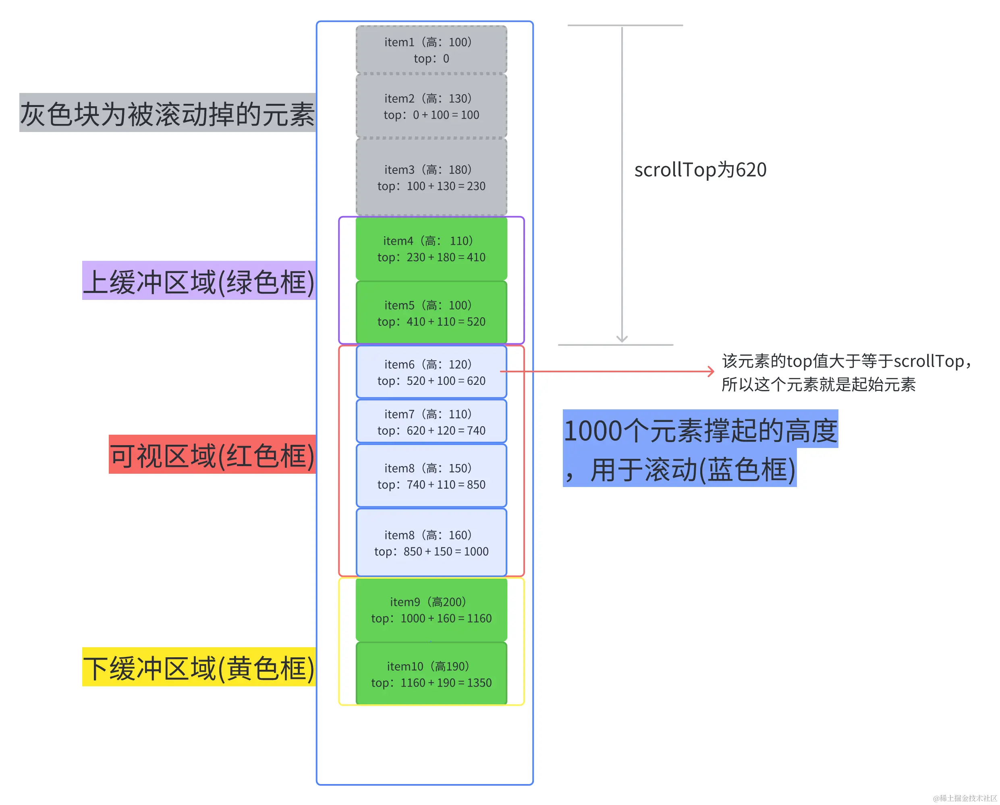

# 虚拟列表技术

## 核心步骤及思想

- 计算可视区域
  - 通过获取容器的高度和滚动位置，计算出当前可视区域的起始位置和结束位置
  - 根据可视区域的位置和每个列表项的高度，计算出需要渲染的列表项的索引范围
- 渲染可视区域的列表项
  - 根据计算出的索引范围，从数据源中获取对应数据
  - 创建或更新列表项的DOM元素，并将其插入到容器中
  - 通过设置列表项的位置和样式，确保他们在正确的位置显示
- 处理滚动事件
  - 监听容器的滚动事件，当滚动位置发生变化时，重新计算可视区域和需要渲染的列表项
  - 根据新的可视区域，更新列表项DOM元素的位置和样式
- 回收和复用DOM元素
  - 为了进一步优化性能,可以使用对象池技术来回收和复用不再可视区域内的列表项的DOM元素
  - 当列表项滚动出可视区域时,将其DOM元素存储到对象池中,而不是直接销毁
  - 当需要渲染新的列表项时,先从对象池中获取可复用的DOM元素,避免频繁创建和销毁DOM元素
- 处理列表项的高度
  - 虚拟列表假设所有列表项的高度是固定的,以便于计算可视区域和位置
  - 如果列表项的高度不固定,可以通过动态计算或者缓存列表项的高度来处理

### 不定高度虚拟列表

思路及难点

- 由于每个元素高度不一，我们开始无法直接计算出container的总高度
- 每个元素可能高度不一，每个元素的top值不能通过 `itemSize*index` 直接求出
- 每个元素高度不一，不能直接通过 `scrollOffset / itemSize` 计算出已被滚动掉的元素的个数，很难获取到可视区的起始索引

如何解决

- 难点1：可以通过遍历所有的row计算出总高度，不需要计算精确的总高度，只要让container容器足够大，让用户能进行滚动操作。我们可以假设每一个元素的高度，再乘以个数，弄一个假的但足够高的container让用户去触发滚动事件
- 难点2和3：
  - 每次只需要计算上缓冲区到下缓冲区之间的元素，并记录他们，并且记录下最底下的那个元素的索引
  - 当用户进行滚动时，如果我们是向上滚动，就可以直接从已经计算好的记录里取，
  - 如果向下滚动，我们根据上一次记录的最大的索引的那个元素不断累加新元素的高度，直到它大于已经滚动掉的高度，此时的索引值就是可视区的起始索引了，这个起始索引所对应的top就是累加的高度
  - 每一个元素的top值都能通过上一个元素的top值 + 上一个元素的height计算出来



```tsx
import { useState } from 'react';

// 元数据
const measuredData = {
  measuredDataMap: {},
  LastMeasuredItemIndex: -1,
};

const estimatedHeight = (defaultEstimatedItemSize = 50, itemCount) => {
  let measuredHeight = 0;
  const { measuredDataMap, LastMeasuredItemIndex } = measuredData;
  // 计算已经获取过真实高度的项的高度之和
  if (LastMeasuredItemIndex >= 0) {
    const lastMeasuredItem = measuredDataMap[LastMeasuredItemIndex];
    measuredHeight = lastMeasuredItem.offset + lastMeasuredItem.size;
  }
  // 未计算过真实高度的项数
  const unMeasuredItemsCount = itemCount - measuredData.LastMeasuredItemIndex - 1;
  // 预测总高度
  const totalEstimatedHeight = measuredHeight + unMeasuredItemsCount * defaultEstimatedItemSize;
  return totalEstimatedHeight;
}

const getItemMetaData = (props, index) => {
  const { itemSize } = props;
  const { measuredDataMap, LastMeasuredItemIndex } = measuredData;
  // 如果当前索引比已记录的索引要大，说明要计算当前索引的项的size和offset
  if (index > LastMeasuredItemIndex) {
    let offset = 0;
    // 计算当前能计算出来的最大offset值
    if (LastMeasuredItemIndex >= 0) {
      const lastMeasuredItem = measuredDataMap[LastMeasuredItemIndex];
      offset += lastMeasuredItem.offset + lastMeasuredItem.size;
    }
    // 计算直到index为止，所有未计算过的项
    for (let i = LastMeasuredItemIndex + 1; i <= index; i++) {
      const currentItemSize = itemSize(i);
      measuredDataMap[i] = { size: currentItemSize, offset };
      offset += currentItemSize;
    }
    // 更新已计算的项的索引值
    measuredData.LastMeasuredItemIndex = index;
  }
  return measuredDataMap[index];
};

const getStartIndex = (props, scrollOffset) => {
  const { itemCount } = props;
  let index = 0;
  while (true) {
    const currentOffset = getItemMetaData(props, index).offset;
    if (currentOffset >= scrollOffset) return index;
    if (index >= itemCount) return itemCount;
    index++
  }
}

const getEndIndex = (props, startIndex) => {
  const { height, itemCount } = props;
  // 获取可视区内开始的项
  const startItem = getItemMetaData(props, startIndex);
  // 可视区内最大的offset值
  const maxOffset = startItem.offset + height;
  // 开始项的下一项的offset，之后不断累加此offset，直到等于或超过最大offset，就是找到结束索引了
  let offset = startItem.offset + startItem.size;
  // 结束索引
  let endIndex = startIndex;
  // 累加offset
  while (offset <= maxOffset && endIndex < (itemCount - 1)) {
    endIndex++;
    const currentItem = getItemMetaData(props, endIndex);
    offset += currentItem.size;
  }
  return endIndex;
};

const getRangeToRender = (props, scrollOffset) => {
  const { itemCount } = props;
  const startIndex = getStartIndex(props, scrollOffset);
  const endIndex = getEndIndex(props, startIndex);
  return [
    Math.max(0, startIndex - 2),
    Math.min(itemCount - 1, endIndex + 2),
    startIndex,
    endIndex,
  ];
};

const VariableSizeList = (props) => {
  const { height, width, itemCount, itemEstimatedSize, children: Child } = props;
  const [scrollOffset, setScrollOffset] = useState(0);

  const containerStyle = {
    position: 'relative',
    width,
    height,
    overflow: 'auto',
    willChange: 'transform'
  };

  const contentStyle = {
    height: estimatedHeight(itemEstimatedSize, itemCount),
    width: '100%',
  };

  const getCurrentChildren = () => {
    const [startIndex, endIndex, originStartIndex, originEndIndex] = getRangeToRender(props, scrollOffset)
    const items = [];
    for (let i = startIndex; i <= endIndex; i++) {
      const item = getItemMetaData(props, i);
      const itemStyle = {
        position: 'absolute',
        height: item.size,
        width: '100%',
        top: item.offset,
      };
      items.push(
        <Child key={i} index={i} style={itemStyle} />
      );
    }
    return items;
  }

  const scrollHandle = (event) => {
    const { scrollTop } = event.currentTarget;
    setScrollOffset(scrollTop);
  }

  return (
    <div style={containerStyle} onScroll={scrollHandle}>
      <div style={contentStyle}>
        {getCurrentChildren()}
      </div>
    </div>
  );
};

export default VariableSizeList;
```

## 第三方库

- react
  - [react-window](https://www.npmjs.com/package/react-window)
  - [react-virtualized](https://www.npmjs.com/package/react-virtualized)
- vue
  - [vue-virtual-scroll-list](https://www.npmjs.com/package/vue-virtual-scroll-list)
