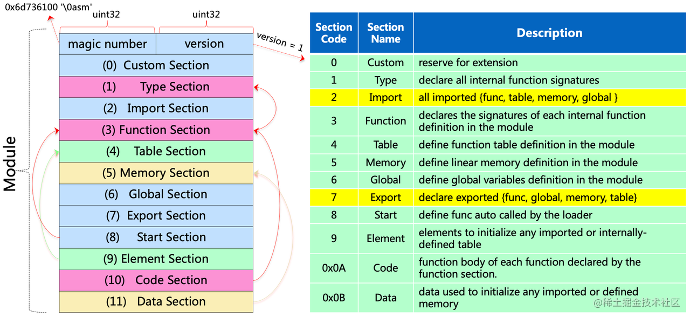

# WebAssembly 模块解析

WebAssembly本质上也是一种语言格式，而且其在二进制格式外还支持文本格式，它也是可人工编程的。与其它语言一样，它包含变量、函数、指令等基础概念

## 基础概念

### 模块(Modules)

模块是WebAssembly的基本单元；一个模块内部包含了完成其功能所需的函数、线性内存、全局变量以及表的完整定义；此外，模块还是通过导入功能从外部执行环境引入对象，同时，可以通过导出功能提供外部执行环境可用的对象，从而实现与外部的双向交互

模块作为一个程序的静态表示，它需要经过加载、解码、验证之后进行实例化，从而得到该程序的动态表示，我们称之为一个WebAssembly实例(instance)。WebAssembly模块的实例化在宿主语言或是独立的虚拟机中完成：比如在Js环境中，WebAssembly可以通过 WebAssembly.instantiate 或者 new WebAssembly.Instance 等函数接口实现，一般而言，一个WebAssembly实例包括一个操作数和一块可变的线性内存，与原生(native)程序中的栈和堆相对应

### 类型(Types)

在WebAssembly生态中，一个基本设定就是WebAssembly使用通用的硬件能力，并在此之上构建一个虚拟的指令集架构(ISA)。遵循这个设定，WebAssembly提供了四种基本变量类型，分别时 `i32`、`i64`、`f32`、`f64`，用来表示两种长度的整数和浮点数。其中整型数值不区分有符号和无符号，但是针对整型的操作符通常分为 `signed`和`unsigned` 两种版本，以各自的方式对数值进行理解和进一步的操作

在4种基本类型之外，MVP之后的WebAssembly核心规范吸收了Fixed-width SIMD[4] 和 Reference Type[5] 两个提案，支持向量类型 v128 和引用类型。前者可以表示不同类型的打包数据，如 2 个 i64 或 f64、4 个 i32 或 f32 以及 8 个 16 位的整型。后者则可以表示各类函数或者来自宿主的实体（如一个对象的指针）

### 变量(Varables)

WebAssembly 的变量按照作用域，可以分为局部变量（local）和全局变量（global）两种。
局部变量只存在于一个函数内部，并在函数开始时进行声明。局部变量总是可变的，并与函数的参数共用索引空间，通过 i32 类型的 index 来访问。比如，指令 local.get 0 即表示加载序号为 0 的局部变量，如果该函数有参数的话，该指令表示加载第一个参数，否则加载第一个局部变量。
全局变量可声明为可变或不可变的。与局部变量类似，通过序号和指令 global.get 或者 global.set 进行访问。此外，global 可以由外部引入，或者被导出到外部

### 函数(Functions)

函数是 WebAssembly 指令的组织单位——每一条指令都必须属于某个函数。每一个函数都会接受一系列特定类型的参数，并返回一系列特定类型的值。值得注意的是，WebAssembly 函数可以返回多个值，而非局限于单返回值。在 WebAssembly 的规范中，函数并不允许嵌套定义。

### 指令(Instructions)

基于一个栈式的机器构建其计算模型，是WebAssembly的一个重要特征。因此，WebAssembly的指令均围绕着一个隐士的擦欧总数栈进行设计——通过压入和弹出的操作进行数据的操作。如前述的局部变量获取指令 `local.get index`，就是加载第index个局部变量到操作数栈栈顶

考虑到 WebAssembly 产物将频繁地通过网络进行传输，如是的设计与基于寄存器的指令集相比可以得到体积更小的产物，因而可以减少网络延迟

### 陷阱(Traps)

在某些情况下，如遇到一条 unreachable 指令，会出现一个陷阱。它会马上中断 WebAssembly 指令的执行，并且返回到宿主，因为 WebAssembly 内部无法处理陷阱。通常情况下，宿主会捕获 WebAssembly 陷阱，并进入处理例程。如 JavaScript 环境中，遭遇因 unreachable 指令产生的 WebAssembly 陷阱，JS 引擎会抛出一个 RuntimeError

### 表(Tables)

WebAssembly 的表是一系列元素的向量，其中元素类型目前只支持前述的引用类型`funcref | externref`。表在定义时，要求提供存储的元素类型和初始大小，并可以选择性地指定最大大小。Table 主要作用就是可以动态地根据所提供的 index 来获取目标元素。比如，可以借助 Table 在运行时决定调用某个函数，使用 `call_indirect` 实现间接调用，从而模拟函数指针

### 线性内存（Linear memory）

顾名思义，线性内存表示一个连续字节数组，作为 WebAssembly 程序的主要内存空间

一个 WebAssembly模块暂时只允许定义至多一个memory，并可以通过 import/export 跟其它实例共享(但并非所有引擎都支持)。与表类似，在定义线性内存时，要求提供初始大小，并可以选择性的指定最大大小，其单位是页(page 大小为64kb)。在WebAssembly程序的运行过程中，可以通过指令 `grow_memory` 动态地扩展线性内存地大小

通过`load/store`指令，并提供 `i32` 类型地偏移值参数，WebAssembly 程序可以完成对线性内存地读写。当然，会导致越界访问地偏移值会被动态的检测所拦截，并产生一个陷阱。考虑到线性内存是独立且纯粹的，与指令空间、执行栈、WebAssembly 引擎的元数据结构等均处于分离状态，故错误甚至恶意的 WebAssembly 代码最多只能破坏自身的 memory。这样的沙盒属性，对于安全运行通过网络传输、不受信任的 WebAssembly 代码至关重要

## 模块结构

WebAssembly 的二进制格式是WebAssembly的抽象语法的密集线性编码。和文本格式一样，产物是由抽象语法生成的，最终产生的终端符号是字节。包含二进制格式WebAssembly模块的文件的推荐扩展名是".wasm"，推荐的媒体类型是"application/wasm"

### 部分(Sections)

一个完整的 WebAssembly 模块包含 12 个部分，部分和文本格式的域概念相近；部分是可选的，模块中省略的部分相当于该部分存在空内容；
WebAssembly 模块段结构示意图


```css
magic = 0x00 0x61 0x73 0x6D
version = 0x01 0x00 0x00 0x00
1 type section        用到的所有函数类型(类型部分由 id 以及一个函数类型向量组成)
2 import section      所有的导入项
3 function section    索引表，内部函数所对应的签名索引
4 table section       定义的所有表
5 memory section      定义的所有内存
6 global section      定义的所有全局变量信息
7 export section      所有的导入项
8 start section       起始函数索引，加载模块后会自动执行起始函数(起始部分的 id 为 8，它能表示一个可选的开始函数)
9 element section     表初始化数据 (它由多个元素段（element segments）组成。元素段的二进制格式有 8 种，开头用一个 u32 整数来区分。u32 的第 0 位表示被动（passive）或声明性（declarative）段，第 1 位表示主动（active）段存在显式表索引（explicit table index），并以其他方式区分被动和声明性段，第 2 位表示使用元素类型和元素表达式，而不是元素类型和元素索引。在 WebAssembly 的未来版本中可能会添加更多的元素类型)
10 code section       存储内部函数的局部变量信息和字节码(它包括了一个代码向量。向量里的每个元素是一段代码，每段代码包括代码长度，函数的局部变量和函数体表达式。与其他部分一样，解码不需要代码大小，但可用于在浏览二进制文件时跳过函数。如果大小与相应函数代码的长度不匹配，则模块格式错误)
11 data section       内存初始化数据(它由数据向量组成。表示数据的二进制格式有 3 种，用开头的 u32 整数区分。位 0 表示被动段，位 1 表示主动段的显式内存索引的存在。在当前版本的 WebAssembly 中，在单个模块中最多可以定义或导入一个内存，因此所有有效的活动数据段都有一个 0 的内存值)
12 data count section data section 中的数据段数，为了简化单边验证(它由一个可选的 u32 数字组成，表示数据部分中数据段（data segment）的数量。如果此计数与数据段向量的长度不匹配，则模块格式错误)
```

## 文本格式

Wasm 文本格式（WebAssembly Text Format 主要是为了方便理解和分析 Wasm 模块，以 .wat 为后缀。可以使用 wabt（WebAssembly Binary Toolkit） 工具中的汇编器 wat2wasm 将 wat 转为 wasm，反汇编器 wasm2wat 将 wasm 转为 wat。

虽然 WebAssembly 是一种类汇编的指令格式，但是它的文本格式和汇编语言的指令-寄存器有些许不同—— WebAssembly 采用 S-表达式（S-expression 或是 sexp）作为文本组织形式。

Sexp 是一种通过人类可读的文本形式表达半结构化数据的约定，它既可以用于表示代码，也能够用于表示数据。因此，使用了 sexp 的语言天然的存在数据和逻辑的一致性。例如 Lisp 强大的 macro system 就得益于此。

简而言之，sexp 是一棵 AST 的先序遍历表示。

Wasm 文本格式是一个树的结构，每个节点用 ( 和 ) 括起来，( 后面跟着这个节点的类型，后面是它的子节点或属性，文本格式的根节点是 module，它的结构与二进制格式相似

### 词法格式

WebAssembly 文本由字符串构成，每个字符都是一个合法的 Unicode [8]。首先我们看一个最简单的 WebAssembly 模块——空 module

```wasm
(modele)
;; 这是一个行注释
(;
这是一个块注释
;)
```

### 值(Values)

词法是属性语法定义的产物，每个词法单元都必须有意义，因此不允许空白存在。词法中存在五种值：整数（Integers）、浮点数（Floating-Point）、字符串（Strings）、名称（Names）、标识符（Identifiers）

其中，前三种值很好理解，是我们编程中常用的词法规范。其中，整数包含正负符号，十进制数字，十六进制数字；浮点数包含数字，小数点，十六进制数字和自然底数 e/E；字符串包含了字符，转义符，引号，换行符，制表符，以及\u{hexnum}表示字符 Unicode 编码

词法的后两种值则略微有点难以理解。首先是名称，名称的常见组织形式是字符串，在 WebAssembly 导出函数时，函数会有特定的名称。其他时候，名称则很少被提到；其次是标识符，标识符可以看做是变量的名字，包含两个词法单元—— id 和 idchar。id 通常是$和多个 idchar 拼接

```wasm
(func $add ...)
...
(export "add" (func $add)) ;; add是一个名称，$add是一个id，'a', 'd', '$'都是 idchar
```

### 类型（Types）

WebAssembly 是强类型的，因此文本格式中，值都具有其特定的类型

类型词法，其中包括：数字（Number）、向量（Vector）、引用（Reference）、值（Value）、函数（Function）、限定（Limits）、内存（Memory）、表（Table）和全局（Global）类型

- 数字类型包括32和64位的整型 `i32 i64` 和 浮点型 `f32 f64`
- 向量类型则是 128位长度的向量 v128，可以解释为整型或者浮点型数据
- 引用类型包括函数引用 `funcref` 或者外部引用 `externref`。所有的引用类型都是不透明的，用户无法观测到大小或者是位模式(bit pattern)，引用类型的值可以存在表里
- 值类型则是数字，向量，引用类型的统称。它没有自己的特定的类型标识符，仅仅用于词法定义上
- 函数类型能够表示完整的函数文本。函数词法定义中，用到了值类型作为占位标识符

```js
(module
  (type (;0;) (func (param i32)))
  (type (;1;) (func))
  (import "imports" "imported_func" (func (;0;) (type 0)))
  (func (;1;) (type 1)
    i32.const 88
    call 0
  )
  (export "exported_func" (func 1))
)
```

## 在线编译工具

[WasmExplorer](https://mbebenita.github.io/WasmExplorer/)
