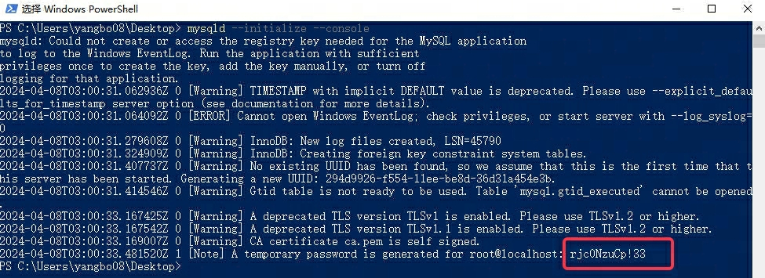

# mysql

## 下载安装

[下载地址](https://dev.mysql.com/downloads/mysql/) 选择对应系统和版本的下载
[下载地址2](https://downloads.mysql.com/archives/community/)

将安装包解压到你要安装的目录，将 bin 目录添加至环境变量

### 配置my.ini

在根目录下新建一个 my.ini 文件，内容如下：(basedir和datadir配置为自己sql安装目录的地址)

```ini
[mysqld]
; 设置3306端口
port=3306
; 设置mysql的安装目录
basedir="D:/software/code/MySQLServer5.7/sql/"
; 设置mysql数据库的数据的存放目录
datadir=D:/software/code/MySQLServer5.7/sql/Data
; 允许最大连接数
max_connections=200
; 允许连接失败的次数。这是为了防止有人从该主机试图攻击数据库系统
max_connect_errors=10
; 服务端使用的字符集默认为UTF8
character-set-server=utf8
; 创建新表时将使用的默认存储引擎
default-storage-engine=INNODB
; 默认使用“mysql_native_password”插件认证
default_authentication_plugin=mysql_native_password
[mysql]
; 设置mysql客户端默认字符集
default-character-set=utf8
[client]
; 设置mysql客户端连接服务端时默认使用的端口
port=3306
default-character-set=utf8
```

自动创建

```shell
mysqld --initialize-insecure --user=mysql
```

### 初始化数据库

以管理员身份 运行 cmd，切换至安装目录的 bin 目录下，输入如下命令

```shell
mysqld --initialize --console
# 默认的服务名就是 mysql，也可以指定服务名
mysqld --initialize --console 服务名
```

执行成功后，会显示 root 的初始密码，如下图，这个密码需要保存下来



安装服务

```shell
mysqld --install
```

如果提示 Install/Remove of the Service Denied 请打开cmd的时候选择“用管理员身份打开”

启动服务

```shell
net start mysql
```

## 登录数据库

mysql -u root -p

## 创建数据库
