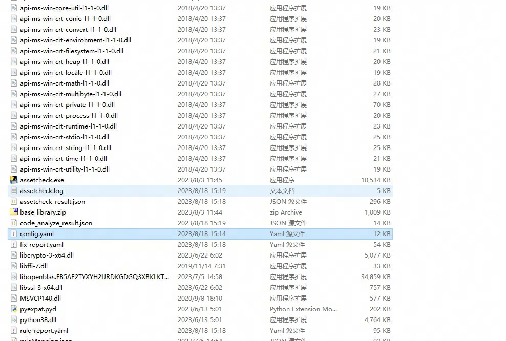
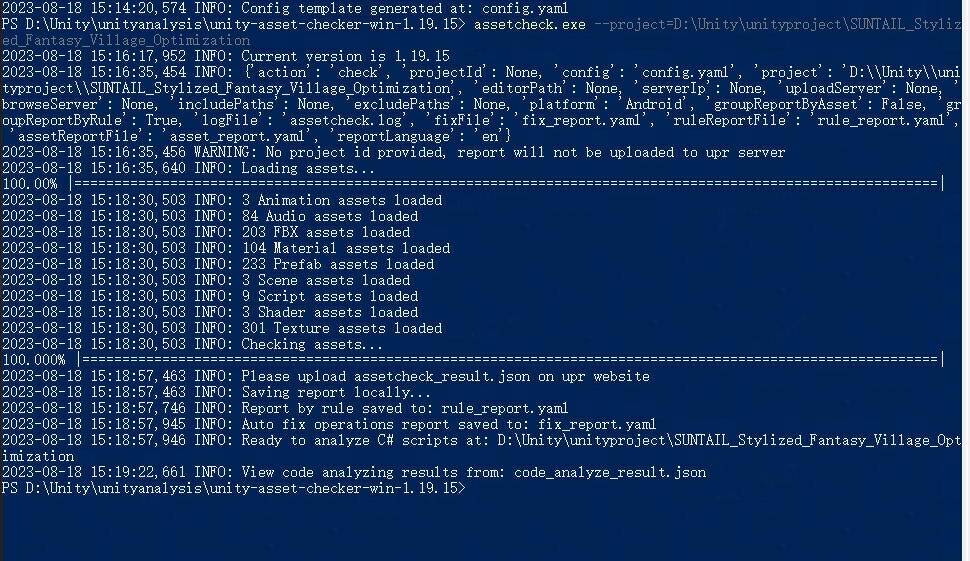
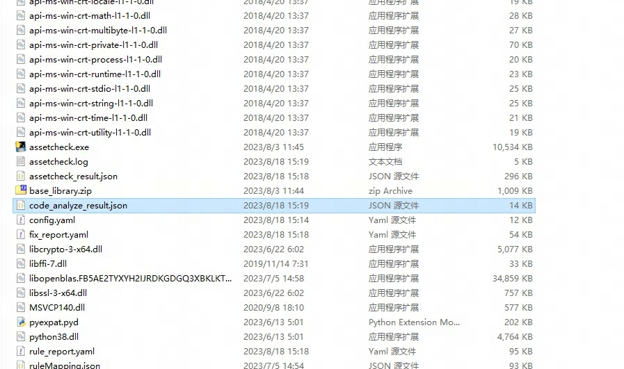
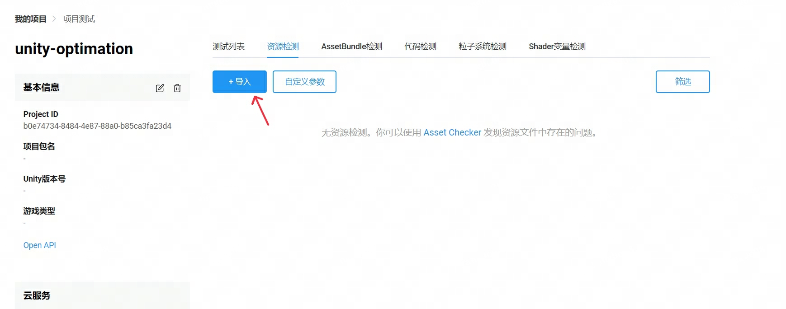
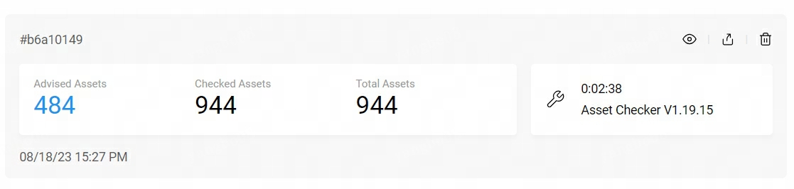

# AssetChecker 使用方式

## 下载地址

[download](https://upr.unity.cn/instructions/assetchecker#UserManual)

## 使用步骤（windows）

1. 生成配置文件

解压缩下载的压缩包，然后cmd引入到解压路径下使用命令 assetcheck.exe generate-config 生成配置文件（需配置环境变量）。命令运行结束后会生成config.yaml文件，如下：

2. 检测Unity工程

同样在命令行敲入命令 assetcheck.exe --project=<project_path> 回车然后等待，因为是第一次运行所以运行时间可能会很久，根据项目的大小不同而不同，运行完后会在assetcheck.exe同级目录下生成名为assetcheck_result.json的检测结果。操作过程截图如下：

3. 在Unity URP官网创建项目(同UPR创建步骤)，并导入assetcheck_result.json

4. 查看报告

