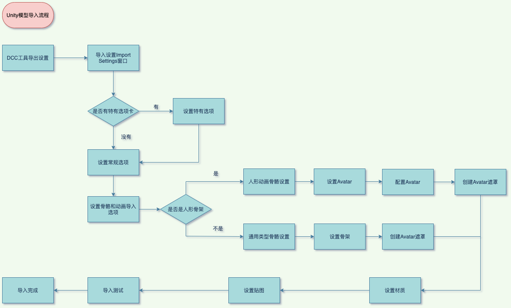

# 模型导入流程

## DDC模型导出
- Unity 支持多种标准和专有模型文件格式（DCC）。Unity 内部使用 .fbx 文件格式作为其导入链。最佳做法尽可能使用 .fbx 文件格式，并且不应在生产中使用专有文件格式。
- 优化原始导入模型文件，删除不需要的数据
  - 统一单位
  - 导出的网格必须是多边形拓扑网格，不能是贝塞尔曲线、样条曲线、NURBS、NURMS、细分曲面等
  - 烘培Deformers，在导出之前，确保变形体被烘培到网格模型上，如骨骼形变烘培到蒙皮权重上
  - 不建议模型使用到的纹理随模型导出，会降低引擎导入资源效率以及资源目录变得难管理
  - 如果你需要导入blend shape normals，必须要指定光滑组smooth groups
  - DCC导出面板设置, 不建议携带场景信息导出，如不建议导出摄像机、灯光、材质等信息，因为这些的信息与Unity内默认都不同。除非你自己为某DCC做过自定义导出插件。

## 原始模型文件对性能的影响点(美术制作开发标准)
- 最小化面数（尽量不要通过增加面数来加强细节），不要使用微三角形（在编辑器中多观察，指的是一个三角面只包含个位数像素，如果出现了需要用lod或让美术进行调节），分布尽量均匀
  - 对性能的影响：微三角面会增加绘制的三角形数量，从而增加GPU的工作量，降低渲染性能。
  - 对内存的影响：微三角面需要占用更多的内存空间，因为它会增加网格数据的大小。
  - 对贴图的影响：微三角面会使得UV贴图变得更加复杂，导致UV贴图的失真和变形。
  - 对物理引擎的影响：微三角面会对物理引擎的性能和稳定性造成影响。

- 合理的网络拓扑和平滑组，尽可能形成闭包，而不是没有焊接的面去组合。会导致产生额外的三角形和边，以及可能会引起引擎烘焙错误
- 尽量少的使用材质个数
- 尽可能少的使用蒙皮网格
- 尽可能少的骨骼数量
- FK与IK节点分离，导出时删除IK骨骼节点，因为unity不支持

## 模型导入设置中的一些选项

- Scene中关于Import的选项，一般没有特殊需求可以不开启
- Meshes网格设置
  - Mesh Compression，会节省磁盘空间，但不会节省内存空间，适合激进的情况，需要观察开启后是否正常运行，开启此选项要尽可能使模型制作规范，最好是闭包模型
  - Read/White，开启后会增加一个副本，一份在内存一份在显存，只有需要运行时修改模型才建议开启，skinmesh也需要开启（否则动画会出问题）
  - Optimize Mesh和Generate Colliders一般保持默认，除非要禁止优化或者需要网格级别碰撞
- Geometry设置
  - Index Format ：如果确认网格顶点数不超过65535，可以使用十六位索引
  - Normal、Tangents相关设置：印象中与法线光滑有关，如果要模型描边可以用。不需要法线、切线时可以关闭
  - 光照第二套uv生成：如果不需要光照烘焙可以关闭

## 模型优化
尽可能的将网格合并到一起
尽可能使用共享材质
不要使用网格碰撞体
不必要不要开启网格读写
使用合理的LOD级别
Skin Weights受骨骼影响个过多
合理压缩网格
不需要rigs和BlendShapes尽量关闭
如果可能，禁用法线或切线
多套模型
